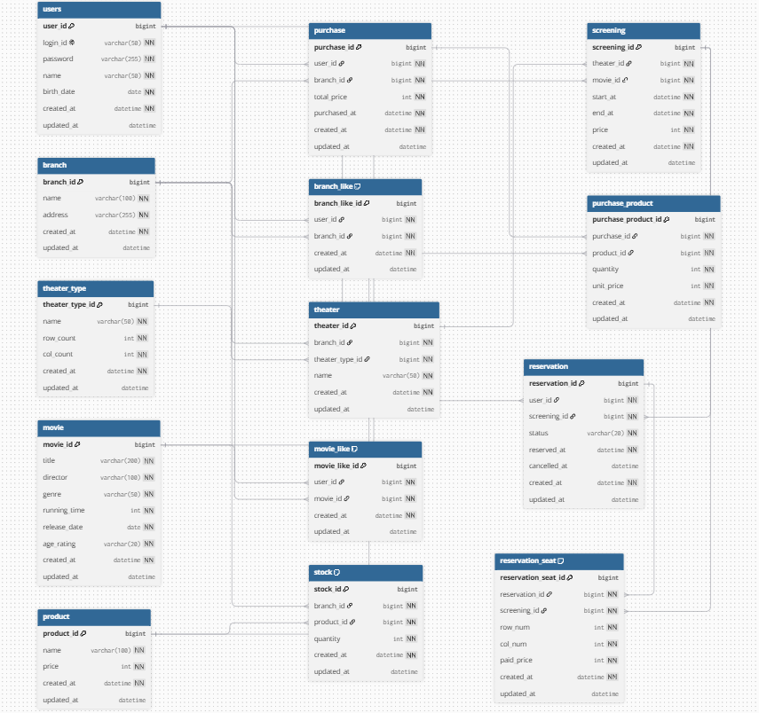

# spring-cgv-24th
CEOS 24기 백엔드 스터디 - CGV 클론 코딩 프로젝트

## ERD 


## 테이블 정의

<details>
<summary><strong>user (회원)</strong></summary>

| 컬럼 | 타입 | 설명 |
|---|---|---|
| user_id | bigint (PK) | 식별자 |
| login_id | varchar(50) | 로그인 ID, 유니크 |
| password | varchar(255) | 암호화 저장 |
| name | varchar(50) | 이름 |
| birth_date | date | 생년월일 (관람 등급 판단용) |
| created_at | datetime | 가입일시 |

**관계**
- `reservation` 1:N — 회원 한 명이 예매를 여러 건 합니다
- `purchase` 1:N — 회원 한 명이 구매를 여러 건 합니다
- `movie_like` 1:N — 회원 한 명이 영화를 여러 개 찜합니다
- `branch_like` 1:N — 회원 한 명이 지점을 여러 개 찜합니다

</details>

<details>
<summary><strong>branch (영화관 지점)</strong></summary>

| 컬럼 | 타입 | 설명 |
|---|---|---|
| branch_id | bigint (PK) | 식별자 |
| name | varchar(100) | 지점명 (예: CGV 홍대) |
| address | varchar(255) | 주소 |

**관계**
- `theater` 1:N — 지점 하나에 상영관이 여러 개 있습니다
- `stock` 1:N — 지점 하나가 상품별 재고를 여러 개 보유합니다
- `purchase` 1:N — 지점 하나에서 구매가 여러 건 발생합니다
- `branch_like` 1:N — 지점 하나를 여러 회원이 찜합니다

</details>

<details>
<summary><strong>theater_type (상영관 종류)</strong></summary>

| 컬럼 | 타입 | 설명 |
|---|---|---|
| theater_type_id | bigint (PK) | 식별자 |
| name | varchar(50) | 종류명 (IMAX, 4DX, 일반관) |
| row_count | int | 좌석 행 수 |
| col_count | int | 좌석 열 수 |

**관계**
- `theater` 1:N — 종류 하나를 여러 상영관이 공유합니다

좌석 배치를 이 테이블이 보유합니다. "종류가 같으면 좌석이 동일하다"는
요구사항에 따라 상영관마다 배치를 저장하지 않습니다.

</details>

<details>
<summary><strong>theater (상영관)</strong></summary>

| 컬럼 | 타입 | 설명 |
|---|---|---|
| theater_id | bigint (PK) | 식별자 |
| branch_id | bigint (FK) | 소속 지점 |
| theater_type_id | bigint (FK) | 상영관 종류 |
| name | varchar(50) | 관 이름 (예: 3관) |

**관계**
- `branch` N:1 — 상영관 여러 개가 지점 하나에 속합니다
- `theater_type` N:1 — 상영관 여러 개가 같은 종류를 참조합니다
- `screening` 1:N — 상영관 하나에서 회차가 여러 번 열립니다

</details>

<details>
<summary><strong>movie (영화)</strong></summary>

| 컬럼 | 타입 | 설명 |
|---|---|---|
| movie_id | bigint (PK) | 식별자 |
| title | varchar(200) | 제목 |
| director | varchar(100) | 감독 |
| genre | varchar(50) | 장르 |
| running_time | int | 상영 시간(분) |
| release_date | date | 개봉일 |
| age_rating | varchar(20) | 관람 등급 |

**관계**
- `screening` 1:N — 영화 하나가 여러 회차로 상영됩니다
- `movie_like` 1:N — 영화 하나를 여러 회원이 찜합니다

</details>

<details>
<summary><strong>screening (상영 회차)</strong></summary>

| 컬럼 | 타입 | 설명 |
|---|---|---|
| screening_id | bigint (PK) | 식별자 |
| theater_id | bigint (FK) | 상영관 |
| movie_id | bigint (FK) | 영화 |
| start_at | datetime | 상영 시작 시각 |
| end_at | datetime | 상영 종료 시각 |
| price | int | 해당 회차 가격 |

**관계**
- `theater` N:1 — 회차 여러 개가 상영관 하나에서 열립니다
- `movie` N:1 — 회차 여러 개가 같은 영화를 상영합니다
- `reservation` 1:N — 회차 하나에 예매가 여러 건 있습니다
- `reservation_seat` 1:N — 중복 예매 방지용으로 직접 참조합니다

예매의 실제 대상은 영화가 아니라 이 회차입니다. 가격을 영화가 아닌 회차에
둔 것은 조조·심야 등 상영 조건에 따라 가격이 달라질 수 있기 때문입니다.

</details>

<details>
<summary><strong>reservation (예매)</strong></summary>

| 컬럼 | 타입 | 설명 |
|---|---|---|
| reservation_id | bigint (PK) | 식별자 |
| user_id | bigint (FK) | 예매자 |
| screening_id | bigint (FK) | 예매한 회차 |
| status | varchar(20) | RESERVED / CANCELLED |
| reserved_at | datetime | 예매 시각 |
| cancelled_at | datetime (null) | 취소 시각 |

**관계**
- `user` N:1 — 여러 예매가 회원 한 명에 속합니다
- `screening` N:1 — 여러 예매가 회차 하나에 묶입니다
- `reservation_seat` 1:N — 예매 한 건에 좌석이 여러 개 있습니다

한 번의 예매에 여러 좌석이 선택될 수 있으므로 헤더-디테일 구조로
분리했습니다. 이 테이블은 "예매 행위"를 나타냅니다.

</details>

<details>
<summary><strong>reservation_seat (예매 좌석)</strong></summary>

| 컬럼 | 타입 | 설명 |
|---|---|---|
| reservation_seat_id | bigint (PK) | 식별자 |
| reservation_id | bigint (FK) | 소속 예매 |
| screening_id | bigint (FK) | 회차 (유니크 제약용 중복 저장) |
| row_num | int | 좌석 행 위치 |
| col_num | int | 좌석 열 위치 |
| paid_price | int | 결제 시점 가격 |

**제약**: (screening_id, row_num, col_num) 유니크 — 중복 예매 방지

**관계**
- `reservation` N:1 — 여러 좌석이 예매 한 건에 속합니다
- `screening` N:1 — 유니크 제약을 위해 부모의 screening_id를 중복 저장합니다

좌석 테이블이 없으므로 위치를 행·열 숫자로 저장합니다.
`paid_price`는 회차 가격이 변경되어도 과거 결제 금액이 유지되도록
예매 시점 값을 복사한 것입니다.

</details>

<details>
<summary><strong>product (매점 상품)</strong></summary>

| 컬럼 | 타입 | 설명 |
|---|---|---|
| product_id | bigint (PK) | 식별자 |
| name | varchar(100) | 상품명 |
| price | int | 정가 |

**관계**
- `stock` 1:N — 상품 하나가 지점별 재고를 가집니다
- `purchase_product` 1:N — 상품 하나가 여러 구매 항목에 포함됩니다

"모든 영화관의 매점 메뉴는 같아요"에 따라 전 지점 공통으로 하나씩 존재합니다.

</details>

<details>
<summary><strong>stock (재고)</strong></summary>

| 컬럼 | 타입 | 설명 |
|---|---|---|
| stock_id | bigint (PK) | 식별자 |
| branch_id | bigint (FK) | 지점 |
| product_id | bigint (FK) | 상품 |
| quantity | int | 수량 |

**제약**: (branch_id, product_id) 유니크

**관계**
- `branch` N:1 — 여러 재고 항목이 지점 하나에 속합니다
- `product` N:1 — 여러 재고 항목이 상품 하나를 가리킵니다

지점과 상품의 N:M 관계를 푼 중간 테이블입니다. `quantity`라는 부가 속성이
있으므로 단순 연결이 아닌 독립 엔티티로 다룹니다.

</details>

<details>
<summary><strong>purchase (매점 구매)</strong></summary>

| 컬럼 | 타입 | 설명 |
|---|---|---|
| purchase_id | bigint (PK) | 식별자 |
| user_id | bigint (FK) | 구매자 |
| branch_id | bigint (FK) | 구매 지점 |
| total_price | int | 총 결제 금액 |
| purchased_at | datetime | 구매 시각 |

**관계**
- `user` N:1 — 여러 구매가 회원 한 명에 속합니다
- `branch` N:1 — 여러 구매가 지점 하나에서 발생합니다
- `purchase_product` 1:N — 구매 한 건에 상품 항목이 여러 개 있습니다

예매와 동일한 헤더-디테일 구조입니다. 환불이 없으므로 상태 컬럼을 두지 않았습니다.

</details>

<details>
<summary><strong>purchase_product (구매 상품)</strong></summary>

| 컬럼 | 타입 | 설명 |
|---|---|---|
| purchase_product_id | bigint (PK) | 식별자 |
| purchase_id | bigint (FK) | 소속 구매 |
| product_id | bigint (FK) | 상품 |
| quantity | int | 수량 |
| unit_price | int | 구매 시점 단가 |

**관계**
- `purchase` N:1 — 여러 상품 항목이 구매 한 건에 속합니다
- `product` N:1 — 여러 구매 항목이 상품 하나를 가리킵니다

</details>

<details>
<summary><strong>movie_like (영화 찜)</strong></summary>

| 컬럼 | 타입 | 설명 |
|---|---|---|
| movie_like_id | bigint (PK) | 식별자 |
| user_id | bigint (FK) | 회원 |
| movie_id | bigint (FK) | 영화 |
| created_at | datetime | 찜한 시각 |

**제약**: (user_id, movie_id) 유니크 — 중복 찜 방지

**관계**
- `user` N:1 — 여러 찜 항목이 회원 한 명에 속합니다
- `movie` N:1 — 여러 찜 항목이 영화 하나를 가리킵니다

</details>

<details>
<summary><strong>branch_like (지점 찜)</strong></summary>

| 컬럼 | 타입 | 설명 |
|---|---|---|
| branch_like_id | bigint (PK) | 식별자 |
| user_id | bigint (FK) | 회원 |
| branch_id | bigint (FK) | 지점 |
| created_at | datetime | 찜한 시각 |

**제약**: (user_id, branch_id) 유니크

**관계**
- `user` N:1 — 여러 찜 항목이 회원 한 명에 속합니다
- `branch` N:1 — 여러 찜 항목이 지점 하나를 가리킵니다

</details>

---

## 다대다 관계 처리

개념적으로 N:M인 관계는 모두 중간 테이블로 분해했습니다.

| 개념적 관계 | 중간 테이블 | 부가 속성 |
|---|---|---|
| 회원 ↔ 영화 | `movie_like` | created_at |
| 회원 ↔ 지점 | `branch_like` | created_at |
| 지점 ↔ 상품 | `stock` | quantity |
| 구매 ↔ 상품 | `purchase_product` | quantity, unit_price |

JPA의 `@ManyToMany`는 조인 테이블에 부가 속성을 둘 수 없고 생성되는
쿼리를 예측하기 어렵습니다. 위 네 관계 모두 부가 속성이 필요하므로
중간 테이블을 독립 엔티티로 정의했습니다.

---

## 설계 판단 과정

### 용어 분리: 지점 vs 상영관

요구사항의 "영화관"이 두 의미로 쓰이고 있었습니다. CGV 홍대점 같은 **지점**(`branch`)과 그 안에서 실제로 영화를 트는 **상영관**(`theater`)을 한 테이블로 묶으면 이후 관계가 전부 꼬입니다. 특별관·일반관은 속성이 동일하므로 테이블을 나누지 않고 `theater_type`으로 종류를 구분했습니다.

### 좌석 설계

"종류가 같다면 좌석은 동일해요"와 "직사각형, 중간에 비어있는 곳 없음" 두 단서로 설계를 결정했습니다. 좌석 테이블을 만들지 않고 `theater_type`에 `row_count`, `col_count`만 두었습니다. 지점 30개 × 상영관 8개여도 배치는 종류 수만큼만 저장됩니다.

트레이드오프: 범위 벗어난 좌석을 DB가 막지 못하므로 `TheaterType.isValidSeat()`로 애플리케이션에서 검증합니다. 좌석별 속성이 생기면 구조 변경이 필요합니다.

### 예매/구매를 두 테이블로 분리

한 번의 예매에 여러 좌석이 선택됩니다. 단일 테이블로 좌석마다 한 행씩 저장하면 같은 사람이 같은 회차를 두 번 나눠 예매한 경우를 구분하지 못해 취소 처리가 불가능합니다.

- `reservation` — 예매 행위 (누가, 언제, 어느 회차, 상태)
- `reservation_seat` — 선택한 좌석들 (행, 열, 가격)

매점 구매도 같은 상황이므로 `purchase` / `purchase_product`에 동일 구조를 적용했습니다.

### 가격을 시점별로 복사 저장

정가는 `screening.price`, `product.price`에 두되, 결제 시점 금액은 `reservation_seat.paid_price`, `purchase_product.unit_price`에 복사합니다. 원본 가격을 UPDATE하면 과거 결제 기록의 금액까지 바뀌기 때문입니다. 정규화 관점의 중복이지만 **과거 사실은 변하지 않아야 한다**는 원칙을 우선했습니다.

### 중복 예매 방지

`reservation_seat`에 `(screening_id, row_num, col_num)` 유니크 제약을 걸었습니다. 애플리케이션 로직만으로는 동시 요청을 완전히 막을 수 없어 DB 차원의 최종 안전망이 필요합니다.

이 제약은 취소와 충돌합니다. 취소된 좌석 행이 남으면 다른 사람이 같은 자리를 예매할 때 제약에 걸립니다. **취소 시 `reservation_seat` 행을 삭제하는 방식**을 택했고, 그 결과 어느 좌석을 취소했는지에 대한 이력은 남지 않습니다.

---

## 한계 및 범위 밖으로 둔 것

### 구조적 한계

- **좌석 범위 검증**: 상영관 크기를 벗어난 좌석 예매를 DB가 막지 못합니다.
  좌석을 개별 행으로 저장하지 않은 선택의 결과이며, 애플리케이션에서
  `theater_type`의 행·열과 비교해야 합니다.
- **취소 이력**: 취소 시 좌석 행을 삭제하므로 어느 좌석이 취소되었는지
  추적할 수 없습니다. 필요하다면 별도 로그 테이블이 있어야 합니다.
- **회차 정보 중복**: `reservation_seat.screening_id`는 부모의 값과 항상
  일치해야 하지만 DB가 이를 보장하지 않습니다. 애플리케이션이 지켜야 합니다.
- **나이 제한 검증**: `movie.age_rating`과 생년월일 비교는 애플리케이션
  책임입니다.

### 의도적으로 제외한 것

- **잔여 좌석 수**: 실제 CGV는 회차별 잔여 좌석을 표시합니다. 매번
  계산하면 목록 조회 시 부담이 있어 반정규화 컬럼을 두는 방식이 일반적이나,
  예매·취소마다 정확한 갱신이 필요하고 동시성 문제가 따릅니다.
- **좌석 선점(hold)**: 실제 서비스는 좌석 선택 시 임시 점유를 걸고 일정
  시간 후 해제합니다. 별도 테이블과 만료 처리가 필요합니다. 현재 설계는
  유니크 제약으로 중복만 방지하며, 사용자 경험 측면에서는 조회 시점에
  비관적 락을 거는 방식이 더 낫습니다.
- **다중 장르·출연진**: 실제로는 영화 하나에 여러 장르와 다수의 배우가
  있으나 별도 테이블이 필요합니다. 현재는 `genre` 단일 컬럼으로 두었습니다.
- **좌석 등급, 할인·쿠폰, 결제 수단, 리뷰·평점**: 요구사항 범위 밖입니다.

---

## 추가 질문 정리

### Dirty Checking은 왜 모든 컬럼을 UPDATE할까요 — @DynamicUpdate

Dirty Checking이 변경을 감지하면 변경된 필드만 골라 UPDATE하는 것이 아니라 **엔티티의 모든 컬럼**을 포함한 UPDATE 문을 실행합니다. JPA 구현체가 엔티티마다 단 하나의 고정된 UPDATE 쿼리를 미리 캐싱해두기 때문입니다. 매번 변경된 컬럼만 담은 쿼리를 만들면 DB의 prepared statement 캐시를 활용하기 어렵습니다.

컬럼 수가 많고 일부 컬럼만 자주 바뀌는 엔티티라면 `@DynamicUpdate`로 개선할 수 있습니다.

```java
@Entity
@DynamicUpdate
public class Reservation extends BaseTimeEntity { ... }
```

`@DynamicUpdate`를 붙이면 변경된 컬럼만 포함한 UPDATE 문을 생성합니다. 단, 쿼리가 매번 달라지므로 prepared statement 캐시 효율이 떨어집니다. 컬럼 수가 적거나 대부분 컬럼이 함께 바뀌는 엔티티라면 기본 동작이 더 효율적입니다.

### Flush가 발생하는 시점

Flush는 영속성 컨텍스트의 변경 사항을 DB에 반영하는 작업입니다. 트랜잭션 commit과 달리 flush 자체는 DB에 쿼리를 보내는 것일 뿐, 트랜잭션은 아직 유지됩니다.

발생 시점은 세 가지입니다.

1. **`em.flush()` 직접 호출** — 명시적으로 즉시 flush합니다.
2. **트랜잭션 commit 시** — commit 직전에 자동 flush 후 commit합니다.
3. **JPQL 쿼리 실행 직전** — FlushMode가 `AUTO`(기본값)일 때, JPQL 실행 전 영속성 컨텍스트와 DB의 정합성을 맞추기 위해 자동 flush합니다.

`@Transactional(readOnly = true)`는 내부적으로 FlushMode를 `MANUAL`로 설정합니다. 읽기 전용 트랜잭션에서는 변경이 없으므로 flush 자체를 막아 불필요한 dirty checking 비용을 제거합니다.

### 영속성 컨텍스트 · 엔티티 매니저 · 트랜잭션은 항상 1:1로 대응할까요

항상 1:1은 아닙니다. Spring JPA의 기본 전략은 **트랜잭션 범위 영속성 컨텍스트**입니다. 트랜잭션 하나가 시작되면 영속성 컨텍스트가 하나 생성되고, 트랜잭션이 끝나면 영속성 컨텍스트도 종료됩니다. 이 범위 안에서는 같은 식별자로 조회하면 항상 같은 인스턴스를 반환합니다(1차 캐시).

엔티티 매니저와 트랜잭션도 기본적으로 1:1이지만 실제 동작은 다릅니다. **`SimpleJpaRepository`처럼 싱글톤 빈에 주입된 `EntityManager`는 실제 객체가 아니라 Spring이 `SharedEntityManagerCreator`로 만든 프록시입니다.** 이 프록시가 메서드 호출 시점에 현재 스레드에 바인딩된 실제 `EntityManager`를 찾아 위임합니다. 싱글톤이지만 각 요청(트랜잭션)마다 다른 `EntityManager`가 동작하는 이유입니다.

확장된 영속성 컨텍스트(OSIV 등)에서는 여러 트랜잭션에 걸쳐 하나의 영속성 컨텍스트가 유지될 수도 있습니다.

### SQL JOIN과 JPQL JOIN의 기준 차이

SQL은 **테이블 간 물리적 컬럼**을 기준으로 조인합니다. ON 절에 조인 조건을 직접 명시해야 합니다.

```sql
-- SQL: 조인 조건을 직접 작성
SELECT * FROM reservation r
JOIN screening s ON r.screening_id = s.screening_id
```

JPQL은 **객체의 연관관계 필드**를 기준으로 조인합니다. FK 설정이 이미 엔티티 매핑에 선언되어 있으므로 ON 절 없이 필드명만 씁니다.

```java
// JPQL: 연관관계 필드명으로 조인
SELECT r FROM Reservation r JOIN r.screening s
```

`r.screening`은 `Reservation` 엔티티의 연관관계 필드입니다. Hibernate가 이 매핑 정보를 읽어 적절한 SQL ON 절을 자동 생성합니다. `JOIN FETCH`는 JPQL에만 있는 개념으로, SQL로는 평범한 INNER JOIN으로 번역되지만 JPA 차원에서 연관 엔티티를 즉시 초기화합니다.

### 프록시 (Proxy)

**프록시란 무엇인가요**

`@ManyToOne(fetch = LAZY)` 설정 시 연관 엔티티를 즉시 조회하지 않고 실제 데이터가 필요한 순간까지 미룹니다. 이때 JPA는 실제 엔티티 대신 **프록시 객체**를 반환합니다. 프록시는 실제 엔티티 클래스를 상속해 Hibernate가 런타임에 생성한 가짜 객체로, 처음에는 id만 들고 있다가 다른 필드에 접근하는 순간 DB에서 실제 데이터를 조회(초기화)합니다.

**프록시와 N+1 문제의 관계**

LAZY 로딩으로 프록시를 받은 후 루프에서 각 프록시를 초기화하면 N번의 추가 SELECT가 발생합니다.

```java
List<Reservation> list = reservationRepository.findAll();  // SELECT 1번
for (Reservation r : list) {
    r.getScreening().getStartAt();  // 프록시 초기화 → SELECT N번
}
```

fetch join으로 연관 엔티티를 미리 함께 로딩하거나, `@BatchSize`로 IN 절 배치 조회하는 것이 해결책입니다.

**Hibernate Proxy vs Spring AOP Proxy**

| | Hibernate Proxy | Spring AOP Proxy |
|---|---|---|
| 생성 방식 | CGLIB로 엔티티 클래스를 상속 | CGLIB 상속 또는 JDK 동적 프록시(인터페이스) |
| 목적 | LAZY 로딩 (DB 조회 지연) | AOP 적용 (트랜잭션, 로깅 등) |
| 생성 시점 | 연관 엔티티 조회 시 | 빈 등록 시 |
| 클래스명 예시 | `Screening$HibernateProxyXXX` | `ReservationService$$SpringCGLIB$$0` |

둘 다 CGLIB 바이트코드 조작 기술을 활용하지만 목적과 생성 주체가 다릅니다.

### CGLIB
1주차 발표 때 질문 받았던 사항이고 제대로 알아보지 않아 추가 정리해보았습니다.

CGLIB(Code Generation Library)는 런타임에 바이트코드를 조작해 **클래스의 서브클래스를 동적으로 생성**하는 라이브러리입니다. Spring은 `@Transactional` 같은 AOP 기능을 적용할 때 대상 클래스를 상속한 CGLIB 프록시 클래스를 만들어 빈으로 등록합니다.

컨트롤러에서 `@RequiredArgsConstructor`로 주입받는 서비스 객체는 실제 `ReservationService`가 아니라 CGLIB가 만든 프록시입니다.

```java
// ReservationController
private final ReservationService reservationService;

// 실제 타입 확인
System.out.println(reservationService.getClass().getName());
// → com.ceos24.cgv.service.ReservationService$$SpringCGLIB$$0
```

프록시는 `ReservationService`를 상속했으므로 외부에서는 일반 객체와 구분이 되지 않습니다. 메서드가 호출되면 프록시가 트랜잭션 시작/종료 같은 부가 로직을 끼워 넣은 뒤 원본 메서드로 위임합니다.

CGLIB 프록시가 생성되려면 클래스에 기본 생성자가 필요하고 메서드가 `final`이면 안 됩니다. `final` 메서드는 오버라이드할 수 없어 프록시가 끼어들지 못합니다.

### SimpleJpaRepository의 EntityManager 주입이 동작하는 방식

`SimpleJpaRepository`는 싱글톤 빈입니다. 그런데 생성자 주입으로 `EntityManager`를 받습니다. `EntityManager`는 요청(트랜잭션)마다 생성되는 객체인데, 싱글톤에 한 번만 주입하면 어떻게 요청마다 다른 세션이 동작할까요?

답은 **주입되는 `EntityManager` 자체가 프록시**이기 때문입니다. Spring은 `SharedEntityManagerCreator`가 만든 프록시 `EntityManager`를 주입합니다.

```java
// SimpleJpaRepository (Spring Data JPA 내부)
public SimpleJpaRepository(JpaEntityInformation<T, ?> entityInformation, EntityManager entityManager) {
    this.em = entityManager;  // 실제로는 프록시가 주입됨
}
```

`this.em.find(...)` 같이 호출하면 프록시가 현재 스레드에 바인딩된 트랜잭션 컨텍스트를 조회하고, 거기서 실제 `EntityManager`를 꺼내 위임합니다. 싱글톤이지만 각 요청이 자신의 영속성 컨텍스트를 갖게 되는 이유입니다.

### fetch join 사용 시 알아두어야 할 것들

**DISTINCT를 빠뜨리면 생기는 중복**

1:N 관계를 fetch join하면 1 쪽 행이 N 개만큼 중복되어 반환됩니다. `Reservation` 1건에 `ReservationSeat` 3개가 있으면 쿼리 결과는 `Reservation` 행 3개입니다.

```java
// DISTINCT 없을 때: Java List에 같은 Reservation이 3번 들어옴
SELECT r FROM Reservation r JOIN FETCH r.seats

// DISTINCT 있을 때: Reservation 1건으로 중복 제거
SELECT DISTINCT r FROM Reservation r JOIN FETCH r.seats
```

Hibernate 6(Spring Boot 3.x)부터는 컬렉션 fetch join 시 자동으로 중복을 제거하지만, 명시적으로 쓰는 편이 의도를 드러냅니다.

**HHH000104 — fetch join과 페이징을 동시에 쓰면 안 됩니다**

```
HHH000104: firstResult/maxResults specified with collection fetch; applying in memory!
```

컬렉션 fetch join + 페이징(`setFirstResult` / `setMaxResults`)을 동시에 사용하면 DB에서 페이징을 적용할 수 없습니다. Hibernate는 전체 데이터를 메모리에 올린 후 Java에서 페이징을 처리하며, 데이터가 많을수록 OOM 위험이 커집니다.

해결책은 ToOne 관계만 fetch join하고 컬렉션은 `@BatchSize` 또는 `hibernate.default_batch_fetch_size`로 IN 절 배치 로딩하거나, 부모 페이징 후 자식을 별도 쿼리로 분리하는 것입니다.

**fetch join에서 발생하는 3가지 에러**

*(1) HHH000104* — 위의 페이징 문제와 동일합니다. 예외가 아닌 경고지만 운영 환경에서 치명적입니다.

*(2) owner of the fetched association was not present in the select list*

```
query specified join fetching, but the owner of the fetched association was not present in the select list
```

fetch join한 연관 엔티티의 소유자(부모)가 SELECT 절에 없을 때 발생합니다.

```java
// 잘못된 예: Screening은 select하지 않고 theater를 fetch join
SELECT s.movie FROM Screening s JOIN FETCH s.theater
```

fetch join의 소유자(`Screening`)가 SELECT에 없으므로 Hibernate가 `theater`를 어디에 붙여야 할지 알 수 없습니다. SELECT 절에 루트 엔티티를 포함해야 합니다.

*(3) MultipleBagFetchException*

```
org.hibernate.loader.MultipleBagFetchException: cannot simultaneously fetch multiple bags
```

`List` 타입 컬렉션 2개 이상을 동시에 fetch join하면 카테시안 곱이 발생합니다. Hibernate는 이를 막기 위해 예외를 던집니다.

```java
// 예외 발생: List 컬렉션 2개를 동시에 fetch join
SELECT r FROM Reservation r
JOIN FETCH r.seats
JOIN FETCH r.someOtherList
```

해결책은 컬렉션 중 하나를 `Set`으로 변경하거나, fetch join을 하나만 유지하고 나머지는 `@BatchSize`로 지연 로딩하는 것입니다.

---

## 배운점 및 느낀점

### ORM과 JPA — 엔티티가 상태를 스스로 지킨다

JPA를 쓰면 객체를 DB 행처럼 다루고 싶어지는 유혹이 생깁니다. `@Setter`를 열어두고 서비스에서 필드를 직접 건드리는 방식입니다. 이렇게 하면 "어떤 이유로 이 필드가 바뀌었는지"를 코드에서 추적할 수 없게 됩니다.

대신 엔티티에 의도가 드러나는 메서드를 두고, 상태 변경은 전부 그 메서드를 통하게 했습니다. 생성자는 `private` + `@Builder`, 기본 생성자는 `@NoArgsConstructor(PROTECTED)`로 외부에서 빈 객체가 만들어지지 않도록 막았습니다.

```java
// Reservation.java
public void cancel() {
    if (this.status == ReservationStatus.CANCELLED) {
        throw new CustomException(ErrorCode.ALREADY_CANCELLED);
    }
    this.status = ReservationStatus.CANCELLED;
    this.cancelledAt = LocalDateTime.now();
    this.seats.clear();
}
```

`seats.clear()` 한 줄로 자식 행이 DELETE됩니다. `cascade = ALL`, `orphanRemoval = true` 설정 덕분에 서비스에서 별도로 삭제 쿼리를 부를 필요가 없습니다. 수정한 엔티티를 따로 `save()`하지 않아도 트랜잭션 커밋 시 dirty checking이 변경을 감지해 UPDATE를 실행합니다.

### 로딩 전략과 N+1 문제 — fetch join으로 조회 형태에 맞춘다

모든 `@ManyToOne`을 `LAZY`로 설정했습니다. 기본값인 `EAGER`는 연관 엔티티를 항상 끌어오므로, 필요하지 않은 조인이 늘 실행됩니다. `LAZY`는 실제로 접근하는 순간 SELECT를 날리는데, 루프 안에서 접근하면 행 수만큼 쿼리가 나가는 N+1 문제가 생깁니다.

해결책은 조회 API의 응답 형태를 먼저 정하고, 필요한 연관만 fetch join으로 한 번에 가져오는 것입니다.

```java
// ReservationRepository.java
@Query("""
        SELECT DISTINCT r FROM Reservation r
        JOIN FETCH r.user
        JOIN FETCH r.screening s
        JOIN FETCH s.movie
        JOIN FETCH s.theater t
        JOIN FETCH t.branch
        LEFT JOIN FETCH r.seats
        WHERE r.id = :id
        """)
Optional<Reservation> findByIdWithDetails(@Param("id") Long id);
```

`DISTINCT`는 `r.seats` LEFT JOIN으로 인한 부모 행 중복 제거용입니다. 컬렉션 fetch join이 2개 이상이면 `MultipleBagFetchException`이 발생하므로, 그 경우에는 각각 별도 쿼리로 조회한 뒤 조립해야 합니다. 회차 목록의 잔여좌석 카운트는 IN 절 + GROUP BY로 한 번에 집계해(`countGroupedByScreeningIds`) N+1을 방지했습니다.

### REST API — 자원 URL + HTTP 메서드 + 상태 코드

REST는 URL이 자원을 가리키고, 행위는 HTTP 메서드로 표현하는 설계입니다. `/reservations/cancel/{id}` 같은 동사 URL 대신 `/reservations/{id}`에 DELETE를 보내는 방식입니다.

```java
// ReservationController.java
@PostMapping
@ResponseStatus(HttpStatus.CREATED)
public ReservationResponse create(@Valid @RequestBody ReservationCreateRequest req) {
    return reservationService.create(req);
}

@DeleteMapping("/{id}")
@ResponseStatus(HttpStatus.NO_CONTENT)
public void cancel(@PathVariable Long id) {
    reservationService.cancel(id);
}
```

`ResponseEntity`로 감싸지 않고 record DTO를 직접 반환한 뒤, 상태 코드는 `@ResponseStatus`로 표현했습니다. 요청 검증은 `@Valid` + record 필드의 `@NotNull`/`@Min`으로 컨트롤러 진입 직후에 끝냅니다. 검증이 실패하면 `MethodArgumentNotValidException`이 발생하고 전역 핸들러가 400으로 처리합니다.

### 예외 처리 — 도메인 예외를 하나로 모아 응답 형식을 통일

서비스와 도메인은 `CustomException(ErrorCode)`만 던지고, `@RestControllerAdvice`인 `GlobalExceptionHandler`가 HTTP 응답으로 변환합니다. `IllegalStateException` 같은 표준 예외를 직접 던지면 응답 형식을 통제할 수 없습니다.

```java
// GlobalExceptionHandler.java
@ExceptionHandler(CustomException.class)
public ResponseEntity<ErrorResponse> handleCustom(CustomException e) {
    ErrorCode code = e.getErrorCode();
    log.warn("[CustomException] {}: {}", code.name(), e.getMessage());
    return ResponseEntity.status(code.getHttpStatus())
                         .body(ErrorResponse.of(code));
}
```

`ErrorCode` enum이 `HttpStatus`와 메시지를 함께 들고 있습니다. 새 오류를 추가할 때 enum에 한 줄만 추가하면 핸들러 코드는 변경하지 않아도 됩니다. 핸들러는 도메인 오류 / 검증 오류 / 예상치 못한 오류 3단계로 나눠 로그 레벨(`warn` vs `error`)도 구분합니다.

### Spring MVC 흐름 — DispatcherServlet → Controller → Service → Repository

요청은 `DispatcherServlet`이 받아서 URL과 HTTP 메서드로 핸들러를 고르고, `@RequestMapping`이 달린 컨트롤러 메서드로 전달합니다. 컨트롤러는 HTTP 관심사(검증, DTO 매핑)만 담당하고 비즈니스 로직은 서비스로 위임합니다.

필터와 인터셉터는 이번 주차 코드에 아직 없습니다. 다음 주 Spring Security 도입 시 인증 처리를 필터에, 로깅을 인터셉터에 넣을 예정입니다.

### 레이어드 아키텍처 — 의존 방향을 한쪽으로

Controller → Service → Repository 단방향 의존입니다. 상위 계층은 하위를 알지만 하위는 상위를 모릅니다. 이 원칙에서 세 가지 규칙이 파생됩니다.

첫째, 컨트롤러가 엔티티를 보면 안 됩니다. 서비스는 항상 DTO를 반환합니다.

```java
// ReservationService.java
public ReservationResponse getById(Long id) {
    Reservation r = reservationRepository.findByIdWithDetails(id)
            .orElseThrow(() -> new CustomException(ErrorCode.RESERVATION_NOT_FOUND));
    return ReservationResponse.from(r);
}
```

둘째, 엔티티→DTO 변환은 DTO의 정적 팩토리(`ReservationResponse.from`)가 소유합니다. 서비스는 조립 순서만 정하고 매핑 규칙은 DTO 파일 안에 있어, 응답 형태가 바뀌어도 서비스 코드는 변하지 않습니다.

셋째, 트랜잭션 경계는 서비스 계층이 책임집니다. 클래스 레벨에 `@Transactional(readOnly = true)`를 두고 쓰기 메서드에만 `@Transactional`을 추가해 기본값을 오버라이드합니다. 읽기와 쓰기의 트랜잭션을 명시적으로 분리함으로써 불필요한 flush와 dirty checking 비용을 막습니다.

### 서비스 단위 테스트 — Mock으로 비즈니스 로직만 검증한다

이전 프로젝트에서는 테스트 코드를 거의 작성해본 적이 없었습니다. 이번에 처음으로 단위 테스트를 제대로 작성해보면서, 테스트가 단순히 "동작 확인용"이 아니라 코드 설계를 검증하는 수단이라는 걸 느꼈습니다.

서비스 단위 테스트는 `@ExtendWith(MockitoExtension.class)`와 `@Mock` / `@InjectMocks`를 조합해 외부 의존성(DB, 다른 서비스)을 전부 Mock으로 대체합니다. 덕분에 순수하게 비즈니스 로직만 빠르게 검증할 수 있습니다.

```java
// ReservationServiceTest.java
@Test
void 없는_회차면_SCREENING_NOT_FOUND() {
    given(screeningRepository.findByIdWithTheaterType(1L)).willReturn(Optional.empty());

    assertThatThrownBy(() -> service.create(reqOf(1L, 1L, new int[]{1, 1})))
            .isInstanceOf(CustomException.class)
            .extracting("errorCode").isEqualTo(ErrorCode.SCREENING_NOT_FOUND);
    verify(userRepository, never()).findById(any());
}
```

`BDDMockito.given().willReturn()`으로 의존 객체의 동작을 사전에 정의하고, `assertThatThrownBy().extracting()`으로 예외 타입과 에러코드를 한 번에 검증합니다. `verify(userRepository, never())`는 회차 조회가 실패하면 회원 조회 자체가 호출되지 않아야 한다는 것을 보장합니다. 성공 케이스뿐 아니라 이런 "호출되면 안 된다"는 보장도 테스트로 표현할 수 있다는 점이 인상적이었습니다.

저장된 객체의 내부 상태를 검증할 때는 `ArgumentCaptor`를 활용합니다. `reservationRepository.saveAndFlush()`에 넘겨진 `Reservation` 객체를 직접 꺼내서 좌석 수, 각 좌석의 `paidPrice` 등을 확인할 수 있습니다.

`@Setter` 없이 `private` 생성자만 허용하는 엔티티에 테스트용 id를 넣어야 할 때는 `ReflectionTestUtils.setField()`를 사용했습니다. 운영 코드의 불변 설계를 깨지 않으면서 테스트에서만 필드를 강제 주입하는 방법입니다.

### 컨트롤러 통합 테스트 — 실제 HTTP 요청처럼 end-to-end 검증한다

서비스 단위 테스트가 비즈니스 로직을 검증한다면, 컨트롤러 통합 테스트는 요청이 들어와서 응답이 나가기까지의 전체 흐름을 검증합니다. 공통 설정은 추상 베이스 클래스에 모아두고 각 테스트 클래스가 상속합니다.

```java
// ControllerIntegrationTest.java
@SpringBootTest
@Transactional
public abstract class ControllerIntegrationTest {

    protected MockMvc mockMvc;

    @Autowired protected EntityManager em;
    @Autowired private WebApplicationContext wac;

    @BeforeEach
    void setUpMockMvc() {
        mockMvc = MockMvcBuilders.webAppContextSetup(wac).build();
    }

    protected <T> T persist(T entity) {
        em.persist(entity);
        return entity;
    }

    protected void flushAndClear() {
        em.flush();
        em.clear();
    }
}
```

`@Transactional`을 베이스 클래스에 붙여두면 테스트가 끝난 뒤 자동으로 롤백됩니다. 각 테스트가 서로의 데이터를 오염시키지 않으므로 독립성을 보장합니다.

`flushAndClear()`는 `em.flush() + em.clear()`의 조합입니다. flush로 변경 사항을 DB에 반영한 뒤 clear로 1차 캐시를 비우면, 이후 조회가 캐시 대신 실제 DB에서 읽어오므로 "실제로 저장됐는지"를 검증할 수 있습니다. 특히 좌석 현황 조회처럼 DB에서 집계한 결과를 확인할 때 반드시 필요했습니다.

실제 테스트 메서드는 `MockMvc`로 HTTP 요청을 보내고 `jsonPath`로 응답 JSON을 검증합니다.

```java
// ReservationControllerTest.java
@Test
void 예매_생성_성공() throws Exception {
    mockMvc.perform(post("/api/reservations")
                    .contentType(MediaType.APPLICATION_JSON)
                    .content("""
                            {"screeningId":%d,"userId":%d,"seats":[{"rowNum":3,"colNum":3},{"rowNum":3,"colNum":4}]}
                            """.formatted(screening.getId(), user.getId())))
            .andExpect(status().isCreated())
            .andExpect(jsonPath("$.status").value("RESERVED"))
            .andExpect(jsonPath("$.seats.length()").value(2))
            .andExpect(jsonPath("$.totalPrice").value(28000));
}
```

테스트 데이터 생성은 `TestFixtures` 클래스에 정적 팩토리 메서드로 모아두었습니다. 테스트마다 Builder를 반복 작성하지 않고 `TestFixtures.branch("강남점")` 한 줄로 의미 있는 이름의 픽스처를 만들 수 있어 가독성이 높아졌습니다. 
