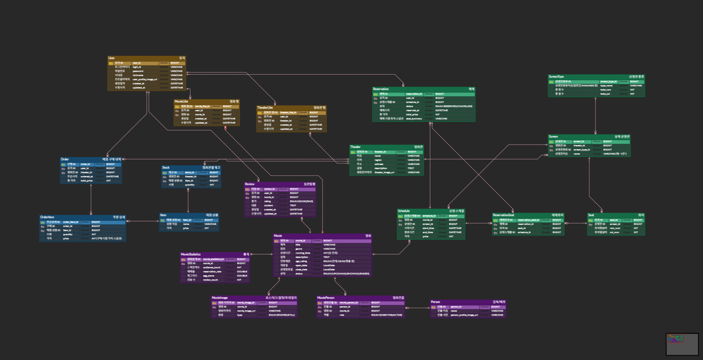

## 🎬 CGV 클론코딩 서비스 소개

CGV의 핵심 서비스를 클론코딩한 프로젝트입니다.  
영화관 조회/찜, 영화 조회/찜, 영화 예매 및 취소, 매점 구매 6가지 핵심 기능을 구현했으며, 실제 CGV 서비스 화면을 참고하여 DB 모델링을 진행했습니다.

<details>
<summary><h2>ERD</h2></summary>


📎 [ERDCloud에서 보기](https://www.erdcloud.com/d/W8KHbPARz5j4dP2Ay)

## 1. 전체 엔티티 연관관계 정리

### 1-1. 유저

| 엔티티 | 설명 |
|---|---|
| `User` | 로그인 아이디(`loginId`) 기반 회원 정보. `createdAt`은 `BaseTimeEntity` 상속으로 자동 관리 |

### 1-2. 영화관 / 상영관 / 좌석

| 관계 | 타입 | 설명 | FK |
|---|---|---|---|
| Theater - Screen | 1 : N | 하나의 영화관은 여러 상영관을 가진다 | `Screen.theaterId` |
| ScreenType - Screen | 1 : N | 하나의 상영관 타입(일반관/IMAX 등)은 여러 상영관에 적용될 수 있다 | `Screen.screenTypeId` |
| Screen - Seat | 1 : N | 하나의 상영관은 여러 좌석을 가진다 | `Seat.screenId` |
| Theater - TheaterLike | 1 : N | 하나의 영화관은 여러 사용자에게 찜될 수 있다 (User와 TheaterLike를 통한 N:M) | `TheaterLike.theaterId` |

**설계 포인트 —**
"특별관/일반관 종류가 같으면 좌석이 동일하다"는 요구사항 때문에 처음엔 Seat를 ScreenType에 직접 연결하는 방식을 고려했으나, 이 경우 물리적으로 다른 상영관(예: 강남 IMAX 1관, 용산 IMAX 2관)이 동일한 Seat row를 공유하게 되어 좌석 점유 상태를 정확히 표현할 수 없는 문제가 있었습니다. 따라서 **Seat는 Screen에 직접 종속**시키고, "같은 타입이면 좌석 배치가 동일하다"는 요구사항은 **좌석 생성 시점의 로직**(ScreenType의 `totalRow × totalCol` 값을 참조해 생성)으로 보장하는 방식을 택했습니다.

### 1-3. 영화

| 관계 | 타입 | 설명 | FK |
|---|---|---|---|
| Movie - MovieImage | 1 : N | 하나의 영화는 여러 장의 포스터/스틸컷 이미지를 가진다 (`type`으로 POSTER/STILL 구분) | `MovieImage.movieId` |
| Movie - MovieStatistics | 1 : 1 | 하나의 영화는 하나의 통계 정보(예매율, 누적관객수, 에그지수)를 가진다 | `MovieStatistics.movieId` |
| Movie - MoviePerson | 1 : N | 하나의 영화에는 여러 감독/배우 정보가 연결될 수 있다 | `MoviePerson.movieId` |
| Person - MoviePerson | 1 : N | 한 인물은 여러 영화에 연결될 수 있다 (Movie와 Person이 MoviePerson을 통한 N:M) | `MoviePerson.personId` |
| Movie - MovieLike | 1 : N | 하나의 영화는 여러 사용자에게 찜될 수 있다 (User와 MovieLike를 통한 N:M) | `MovieLike.movieId` |
| Movie - Review | 1 : N | 하나의 영화에는 여러 리뷰가 작성될 수 있다 | `Review.movieId` |
| User - Review | 1 : N | 하나의 유저는 여러 영화에 리뷰를 작성할 수 있다 | `Review.userId` |

**설계 포인트 —**
실제 CGV 서비스를 참고해 상세페이지 구성 요소(포스터/스틸컷, 감독/배우, 예매율·누적관객수·에그지수, 실관람평)를 모두 반영하여 모델링을 진행했습니다. 다만 **API 구현은 미션에 명시된 6가지 기능 범위로 한정**했고, Review/Person은 Domain·Repository 계층까지만 구현했습니다.

**MovieStatistics를 Movie와 분리한 이유:**
예매율, 누적관객수, 에그지수 등은 정적인 영화 정보(제목, 줄거리 등)와 달리 계속 갱신되는 집계성 데이터라는 점에서 성격이 다르다고 판단해 별도 테이블로 분리했습니다. 등록/수정 API는 PATCH 하나로 upsert(있으면 갱신, 없으면 생성) 방식으로 구현했습니다.

### 1-4. 상영/예매

| 관계 | 타입 | 설명 | FK |
|---|---|---|---|
| Movie - Schedule | 1 : N | 하나의 영화는 여러 상영 회차를 가질 수 있다 | `Schedule.movieId` |
| Screen - Schedule | 1 : N | 하나의 상영관에서는 여러 상영 회차가 존재할 수 있다 | `Schedule.screenId` |
| User - Reservation | 1 : N | 하나의 유저는 여러 예매를 할 수 있다 | `Reservation.userId` |
| Schedule - Reservation | 1 : N | 하나의 상영 회차에는 여러 예매가 발생할 수 있다 | `Reservation.scheduleId` |
| Reservation - ReservationSeat | 1 : N | 하나의 예매는 여러 좌석을 포함할 수 있다 | `ReservationSeat.reservationId` |
| Seat - ReservationSeat | 1 : N | 하나의 좌석은 여러 회차에서 반복적으로 예매될 수 있다 | `ReservationSeat.seatId` |
| Schedule - ReservationSeat | 1 : N | 하나의 상영 회차에는 여러 예약 좌석 정보가 존재할 수 있다 | `ReservationSeat.scheduleId` |

**ReservationSeat에 scheduleId를 중복 저장한 이유**

`ReservationSeat`에는 이미 `reservationId`가 있고, `Reservation`에도 `scheduleId`가 있어 언뜻 중복처럼 보이지만, 이는 의도적인 비정규화입니다.

1. **동일 상영 회차의 동일 좌석 중복 예매 방지**: "같은 상영 회차(scheduleId)에서 같은 좌석(seatId)은 한 번만 예약 가능해야 한다"는 무결성을 DB 레벨에서 `UNIQUE(schedule_id, seat_id)` 제약으로 강제하려면, `ReservationSeat` 테이블 자체가 두 컬럼을 모두 갖고 있어야 합니다. `Reservation`을 조인해야만 회차를 알 수 있다면 단일 테이블 기준 유니크 제약을 만들 수 없습니다.
2. **팩토리 메서드로 불일치 가능성 차단**: `ReservationSeat.create(reservation, seat)`는 파라미터로 schedule을 별도로 받지 않고, 내부에서 `reservation.getSchedule()`을 그대로 사용하도록 구현하여 "예매의 상영 회차와 예매좌석의 상영 회차가 다르게 저장되는" 실수를 원천 차단했습니다.

**취소 시 ReservationSeat를 삭제하는 이유**
좌석 점유 여부는 `ReservationSeat`의 존재 여부로 판단하므로, 예매가 취소되면 해당 좌석이 다시 예매 가능한 상태로 돌아가야 합니다. 따라서 `Reservation.status`는 `CANCELLED`로 남기되(예매 이력 보존), `ReservationSeat` row는 삭제하여 좌석 재예매를 가능하게 했습니다. 다만 이 경우 취소된 예매를 조회했을 때 "어떤 좌석을 예매했었는지"를 알 수 없게 되는 문제가 있어, `Reservation`에 `seatSummary`(예: "A1, A2") 필드를 두어 예매 시점의 좌석 정보를 스냅샷으로 별도 보존했습니다.

**예매 취소 시간 제약**
실제 CGV 정책(상영 시작 20분 전까지 온라인 취소 가능)을 참고하여, 예매는 상영 시작 전까지, 취소는 상영 시작 20분 전까지만 가능하도록 서비스 로직에서 검증합니다.

### 1-5. 매점

| 관계 | 타입 | 설명 | FK |
|---|---|---|---|
| Item - Stock | 1 : N | 하나의 매점 메뉴는 여러 영화관에서 재고로 관리된다 | `Stock.itemId` |
| Theater - Stock | 1 : N | 하나의 영화관은 여러 매점 상품의 재고를 가진다 (Item과 Theater가 Stock을 통한 N:M) | `Stock.theaterId` |
| User - Order | 1 : N | 하나의 유저는 여러 매점 주문을 할 수 있다 | `Order.userId` |
| Theater - Order | 1 : N | 하나의 영화관에서는 여러 매점 주문이 발생할 수 있다 | `Order.theaterId` |
| Order - OrderItem | 1 : N | 하나의 주문은 여러 상품 항목을 포함할 수 있다 | `OrderItem.orderId` |
| Item - OrderItem | 1 : N | 하나의 상품은 여러 주문 항목에 포함될 수 있다 | `OrderItem.itemId` |

**설계 포인트 — Item(공통 메뉴)과 Stock(지점별 재고) 분리**
"모든 영화관의 매점 메뉴는 같지만, 재고는 지점별로 다르다"는 요구사항을 반영해 상품 마스터(`Item`)와 지점별 재고(`Stock`)를 분리했습니다.

**재고 차감의 동시성 처리**
재고 확인 후 차감하는 방식(select-then-update)은 동시 주문 시 재고가 음수가 될 수 있는 문제가 있어, `UPDATE ... SET quantity = quantity - ? WHERE quantity >= ?` 형태의 **조건부 UPDATE 쿼리**로 재고 차감을 원자적으로 처리했습니다. 영향받은 row가 0개면 재고 부족으로 판단해 예외를 던지고 트랜잭션 전체를 롤백합니다.

**가격 스냅샷**
`OrderItem.price`에는 주문 시점의 `Item.price`를 그대로 복사해 저장합니다. 이는 이후 매점 가격이 변동되더라도 과거 주문 내역의 결제 금액이 바뀌지 않도록 하기 위함입니다.

**"재고는 항상 1 이상" 요구사항 해석**

이 문구를 "재고 등록 시점"과 "구매로 인한 소진 시점" 두 가지로 나누어 해석했습니다.

- **등록 시점**: `Stock` 생성 시 `@Min(1)` 검증을 걸어, 재고를 0이나 음수로 초기 등록하는 것은 허용하지 않습니다.
- **구매(소진) 시점**: 정상적인 구매 누적으로 재고가 0이 되는 것은 "품절" 상태로 간주해 허용합니다. "재고는 항상 1 이상"을 "구매 후에도 항상 최소 1개가 남아있어야 한다"는 의미로 해석하면 마지막 남은 재고를 영원히 판매할 수 없는 매점이 되어 버리기 때문에, 이 문구는 데이터 정합성 관점(재고가 음수로 관리되거나, 처음부터 0으로 등록되는 경우가 없다는 것)의 규칙으로 해석했습니다.
- 재고 차감은 `UPDATE ... SET quantity = quantity - ? WHERE quantity >= ?` 형태의 조건부 UPDATE로 처리하여, 요청 수량만큼 남아있을 때만 차감이 성공하고 0까지는 정상적으로 소진될 수 있습니다.

## 2. 유니크 제약 조건 정리

| 테이블 | 제약 | 목적 |
|---|---|---|
| ReservationSeat | `UNIQUE(schedule_id, seat_id)` | 동일 회차에서 동일 좌석 중복 예매 방지 |
| Seat | `UNIQUE(screen_id, row_num, col_num)` | 같은 상영관 안에 동일 좌표(예: A1)의 좌석이 중복 생성되는 것 방지 |
| MovieLike | `UNIQUE(user_id, movie_id)` | 한 사용자가 같은 영화를 여러 번 찜하는 것 방지 |
| TheaterLike | `UNIQUE(user_id, theater_id)` | 한 사용자가 같은 영화관을 여러 번 찜하는 것 방지 |
| Stock | `UNIQUE(theater_id, item_id)` | 한 영화관에 같은 상품의 재고 row가 중복 생성되는 것 방지 |
| MovieStatistics | `UNIQUE(movie_id)` | 하나의 영화에 하나의 통계만 존재하도록 보장 (1:1 관계) |
| User | `UNIQUE(login_id)` | 로그인 아이디 중복 가입 방지 |

## 3. 서비스 로직에서 추가로 검증하는 부분

DB 제약만으로는 표현할 수 없어 서비스 계층에서 별도로 검증한 항목입니다.

- **좌석-상영관 일치 검증**: 예매 요청의 좌석들이 해당 상영 회차(`Schedule`)가 속한 상영관(`Screen`)의 좌석이 맞는지 확인
- **예매/취소 가능 시간 검증**: 상영 시작 전(예매), 상영 시작 20분 전(취소)까지만 허용
- **동시 예매 방어(2단계)**: 애플리케이션 레벨에서 좌석 점유 여부를 우선 조회해 명확한 에러 메시지(`SEAT_ALREADY_RESERVED`)를 반환하고, 동시 요청이 이 검증을 함께 통과하는 극단적 케이스는 DB 유니크 제약 위반(`DataIntegrityViolationException`)을 전역 예외 처리기에서 409로 변환해 최종 방어
- **재고 검증 및 원자적 차감**: 조건부 UPDATE 쿼리로 재고 부족 상황을 동시성 이슈 없이 처리
- **동일 상품 중복 주문 라인 병합**: 하나의 주문 요청에 같은 상품이 여러 줄로 들어와도 수량을 합산해 하나의 `OrderItem`으로 저장
- **본인 소유 데이터 검증**: 예매 상세조회/취소, 주문 상세조회는 요청한 사용자가 실제 소유자인지 확인 (`IsOwnedBy` 형태의 도메인 메서드로 구현)

## 4. 타임스탬프 설계 원칙

- **사건이 발생한 절대 시점**(User.createdAt, Reservation.reservedAt, Order.orderedAt 등) → `Instant` 사용
- **사람이 인지하는 로컬 시각**(Schedule.startTime/endTime — "9/14 19:30 상영") → `LocalDateTime` 사용
- **날짜만 의미 있는 값**(Movie.openDate/closeDate) → `LocalDate` 사용

</details>

<br>

<details>
<summary><h2>❓ 질문 정리</h2></summary>

### 1. `@JoinColumn`을 명시하지 않으면 어떻게 될까?

`@JoinColumn`을 생략해도 JPA가 기본 규칙에 따라 외래 키 컬럼명을 생성합니다.

예를 들어 `Member`에 다음과 같은 필드가 있다면 다음과 같이 동작합니다.

```java
@ManyToOne
private Team team;
```

기본적으로 **필드명 + `_` + 참조하는 PK 컬럼명**을 조합하여 `team_id`와 같은 형태의 외래 키를 사용합니다.

따라서 생략해도 동작하지만, 실제 테이블의 컬럼명을 명확히 표현하고 예상하지 못한 매핑을 방지하려면 `@JoinColumn(name = "team_id")`처럼 직접 명시하는 편이 좋습니다.

---

### 2. 양방향 매핑이 항상 좋을까?

항상 좋은 것은 아닙니다.

양방향 매핑을 사용하면 `Member -> Team`뿐만 아니라 `Team -> Member`로도 객체를 탐색할 수 있어 편리합니다. 하지만 양쪽 객체의 상태를 항상 동기화해야 한다는 문제가 있습니다.

예를 들어 다음과 같습니다.

```java
team.getMembers().add(member);
```

만 호출하고

```java
member.setTeam(team);
```

을 호출하지 않았다면 객체상으로는 `Team`에 `Member`가 존재하지만, `Member`에서는 `Team`이 `null`인 불일치 상태가 될 수 있습니다.

또한 엔티티를 그대로 JSON으로 변환하면 서로를 계속 참조하면서 순환 참조 문제가 발생할 수 있습니다.

따라서 기본적으로 단방향으로 설계하고, 반대 방향 탐색이 실제로 필요한 경우에만 양방향 관계를 추가하는 편이 좋습니다. 양방향으로 설계한다면 연관관계 편의 메서드를 함께 만들어 양쪽 상태를 동기화하는 것이 좋습니다.

---

### 3. PK 참조 vs UUID 참조

둘 중 하나만 선택하기보다는 **내부 DB에서는 Long PK를 사용하고, 외부 API에서는 UUID 같은 별도의 식별자를 사용하는 방식**이 적절합니다.

```java
@Id
@GeneratedValue(strategy = GenerationType.IDENTITY)
private Long id;

@Column(nullable = false, unique = true, updatable = false)
private String publicId;
```

Long 타입 PK는 크기가 작고 인덱스 관리에도 유리하기 때문에 내부 PK/FK로 사용하기 좋습니다.

반대로 API에서 `/members/1`, `/members/2`처럼 PK를 그대로 노출하면 다른 리소스의 ID를 쉽게 추측할 수 있고, DB의 내부 식별자가 외부에 그대로 드러난다는 단점이 있습니다.

따라서 내부 연관관계에서는 Long PK를 사용하고, 사용자에게 노출되는 값은 UUID/ULID 같은 별도의 식별자로 분리하는 방식이 역할도 명확하고 관리하기 편합니다.

---

### 4. `Team.members`만 수정하면 DB에도 반영될까?

반영되지 않습니다.

```java
@OneToMany(mappedBy = "team")
private List<Member> members;
```

여기서 `mappedBy`가 붙은 `Team.members`는 연관관계의 주인이 아닙니다.

실제 외래 키인 `team_id`는 `Member` 테이블이 가지고 있기 때문에 DB의 연관관계를 변경하려면 연관관계의 주인인 `Member.team`을 변경해야 합니다.

따라서 아래처럼 컬렉션에만 추가하면 다음과 같은 문제가 있습니다.

```java
team.getMembers().add(member);
```

메모리상의 `Team.members`는 변경되지만 외래 키는 변경되지 않습니다.

따라서 보통 다음과 같이 양쪽을 함께 변경하는 연관관계 편의 메서드를 만들어 사용합니다.

```java
public void setTeam(Team team) {
    this.team = team;
    team.getMembers().add(this);
}
```

---

### 5. `mappedBy` 없이 양쪽 모두에 `@JoinColumn`을 걸면 어떻게 될까?

양쪽 모두 같은 외래 키를 관리하려고 하기 때문에 문제가 발생할 수 있습니다.

예를 들어 `Member.team`과 `Team.members` 모두 `team_id`를 관리한다고 선언하면 JPA는 두 매핑을 하나의 양방향 관계가 아니라 각각 외래 키를 관리하는 독립적인 관계로 인식할 수 있습니다.

이 상태에서 양쪽에 서로 다른 값을 넣으면 다음과 같은 문제가 발생합니다.

```java
member.setTeam(teamA);
teamB.getMembers().add(member);
```

`Member` 쪽에서는 `team_id = teamA.id`를, `Team` 쪽에서는 `team_id = teamB.id`를 반영하려 하므로 서로 충돌하는 상태가 됩니다.

같은 값을 넣더라도 불필요한 SQL이 발생하거나 매핑 충돌의 원인이 될 수 있습니다.

따라서 양방향 관계에서는 **외래 키를 가진 쪽을 연관관계의 주인으로 두고, 반대쪽에는 `mappedBy`를 지정하는 방식**이 가장 명확합니다.

---

## Proxy 관련 질문

### 6-1. Proxy란?

Proxy는 실제 객체를 바로 가져오는 대신 실제 객체를 대신하는 **대리 객체**입니다.

JPA에서 지연 로딩을 사용하면 연관된 엔티티를 처음부터 모두 조회하지 않고 우선 Proxy 객체를 넣어둘 수 있습니다.

```java
Member member = em.find(Member.class, 1L);

// LAZY인 경우 이 시점에는 Team의 실제 데이터가
// 아직 조회되지 않았을 수 있다.
Team team = member.getTeam();
```

이후 실제 데이터가 필요한 시점에 Proxy가 초기화되면서 DB 조회가 발생합니다.

즉 Proxy를 이용하면 객체의 연관관계는 유지하면서 실제 데이터는 필요한 시점에 조회할 수 있습니다. 이것이 지연 로딩의 핵심입니다.

---

### 6-2. Proxy와 N+1 문제는 어떤 관계가 있을까?

Proxy를 사용한 지연 로딩은 **조회 시점을 늦춰줄 뿐, 필요한 쿼리의 개수를 자동으로 줄여주지는 않습니다.**

예를 들어 Member 100개를 한 번의 쿼리로 조회한 뒤 다음 코드처럼 연관 엔티티에 접근할 수 있습니다.

```java
for (Member member : members) {
    System.out.println(member.getTeam().getName());
}
```

각 Member의 Team 데이터에 접근하면 Proxy가 하나씩 초기화되면서 추가 쿼리가 계속 발생할 수 있습니다.

결국

- Member 목록 조회 1번
- 연관 데이터 조회 최대 N번

위와 같은 N+1 문제가 발생할 수 있습니다.

따라서 `LAZY`로 설정하는 것만으로 N+1 문제가 해결되지는 않으며, 필요한 경우 fetch join, `@EntityGraph`, Batch Fetching 같은 방법을 함께 사용해야 합니다.

---

### 6-3. Hibernate Proxy와 Spring AOP Proxy의 차이는?

둘 다 Proxy라는 이름을 사용하지만 목적은 다릅니다.

**Hibernate Proxy**는 JPA의 지연 로딩을 구현하기 위해 사용됩니다. 연관 엔티티를 바로 조회하지 않고 대리 객체를 두었다가 실제 값이 필요할 때 DB에서 조회합니다.

반면 **Spring AOP Proxy**는 객체의 메서드 호출을 가로채 앞뒤에 부가 기능을 적용하기 위해 사용합니다. 대표적으로 `@Transactional`이 있습니다.

예를 들어 다음과 같습니다.

```java
@Transactional
public void reserve() {
    ...
}
```

를 호출하면 Spring AOP Proxy가 메서드 호출을 가로채 트랜잭션 시작과 종료 처리를 수행합니다.

정리하면 Hibernate Proxy는 **엔티티의 지연 로딩**, Spring AOP Proxy는 **메서드 호출에 부가 기능을 적용하는 것**이 주요 목적이라는 차이가 있습니다.

---

### 6-4. 양방향 매핑 + `@OneToOne` + `nullable=true`에서 Proxy 문제가 발생하는 이유는?

세션 자료에는 당시 상황의 전체 코드가 나와 있지 않기 때문에, `@OneToOne`의 일반적인 Lazy Loading 문제를 기준으로 정리했습니다.

특히 양방향 `@OneToOne`에서 연관관계의 주인이 아닌 쪽은 자신의 테이블에 FK가 없습니다.

이때 관계가 optional, 즉 `nullable=true`라면 Hibernate 입장에서는 **연관된 객체가 실제로 존재하는지, 아니면 `null`인지 현재 엔티티의 정보만으로 판단하기 어렵습니다.**

Proxy를 생성하려면 연관 객체가 존재한다는 전제가 필요하지만, 실제로는 관계 자체가 없어 `null`일 수도 있습니다. 이를 확인하려면 결국 반대쪽 테이블을 조회해야 합니다.

따라서 이러한 `@OneToOne` 구조에서는 기대한 것처럼 단순하게 지연 로딩이 동작하지 않거나 추가 조회가 발생할 수 있습니다.

즉 `@OneToOne`에서 `LAZY`를 사용한다고 해서 모든 방향에서 무조건 Proxy만 생성되고 조회가 미뤄지는 것은 아니라는 점에 주의해야 합니다.

---

### 7. 그럼 항상 지연 로딩이 좋을까?

항상 좋은 것은 아닙니다.

연관 데이터를 거의 항상 같이 사용하는 상황이라면 매번 따로 조회하는 것보다 한 번에 가져오는 방식이 더 효율적일 수도 있습니다.

다만 엔티티 자체의 FetchType을 `EAGER`로 설정하면 필요하지 않은 상황에서도 항상 연관 엔티티를 조회하게 되어 예상하지 못한 N+1 문제가 발생할 수 있습니다.

따라서 기본적인 연관관계는 `LAZY`로 두고,

```java
select m
from Member m
join fetch m.team
```

처럼 **실제로 연관 데이터가 필요한 쿼리에서 fetch join이나 EntityGraph 등을 통해 함께 조회하도록 명시하는 방식**이 더 유연합니다.

---

### 8. fetch join과 페이징을 같이 사용하면 어떤 문제가 발생할까?

`ManyToOne`처럼 단일 객체를 fetch join하는 경우보다 `OneToMany` 같은 **컬렉션 fetch join에서 문제가 발생합니다.**

예를 들어 Team 하나에 Member가 여러 명 있다면 SQL JOIN 결과에서는 Team 데이터가 Member 수만큼 중복됩니다.

```text
TeamA - Member1
TeamA - Member2
TeamA - Member3
TeamB - Member4
...
```

이 상태에서 DB의 `LIMIT`, `OFFSET`을 바로 적용하면 의도한 "Team 10개"가 아니라 "JOIN 결과 row 10개"를 기준으로 데이터가 잘리게 됩니다.

따라서 Hibernate는 상황에 따라 데이터를 먼저 조회한 뒤 메모리에서 페이징을 수행할 수 있으며, 데이터가 많아지면 성능 저하와 메모리 사용량 증가 문제가 발생할 수 있습니다.

따라서 컬렉션 fetch join과 페이징이 함께 필요한 경우에는 보통 다음과 같은 방법을 사용합니다.

1. 먼저 부모 엔티티의 ID를 페이징해서 가져오고
2. 해당 ID들을 기준으로 연관 데이터를 다시 조회하거나
3. Batch Fetching을 이용하는 방식

위와 같은 방법으로 해결할 수 있습니다.

---

### 9. Dirty Checking의 UPDATE는 모든 컬럼을 업데이트하는데 개선이 필요할까?

Hibernate는 기본적으로 Dirty Checking으로 변경된 엔티티를 발견하면 UPDATE문에 여러 컬럼을 함께 포함시킬 수 있습니다.

예를 들어 `username`만 수정했더라도 다음과 같은 형태의 쿼리가 생성될 수 있습니다.

```sql
UPDATE member
SET username = ?, email = ?, age = ?
WHERE id = ?
```

이 방식은 UPDATE SQL의 형태가 일정하여 SQL을 재사용하기 쉽다는 장점이 있으므로 무조건 나쁜 것은 아닙니다.

하지만 컬럼이 많은 테이블에서 일부 값만 자주 변경된다면 불필요한 컬럼까지 UPDATE문에 포함될 수 있습니다.

Hibernate에서는 이 경우 `@DynamicUpdate`를 사용할 수 있습니다.

```java
@Entity
@DynamicUpdate
public class Member {
    ...
}
```

그러면 실제로 변경된 컬럼을 기준으로 UPDATE SQL을 생성합니다.

다만 수정되는 컬럼에 따라 SQL 형태가 달라질 수 있으므로 모든 엔티티에 무조건 적용하기보다는 컬럼 수와 수정 패턴을 고려하여 필요한 곳에 적용하는 것이 적절합니다.

---

### 10. flush는 언제 발생할까?

대표적으로 다음과 같은 상황에서 발생합니다.

- `em.flush()`를 직접 호출한 경우
- 트랜잭션이 commit되기 직전
- JPQL 쿼리를 실행하기 전 필요한 경우

flush는 영속성 컨텍스트를 비우는 것이 아니라 **영속성 컨텍스트의 변경 내용을 DB와 동기화하는 과정**입니다.

따라서 flush가 실행되어도 1차 캐시에 있던 엔티티가 사라지지 않습니다. 영속성 컨텍스트를 실제로 비우는 작업은 `clear()`입니다.

---

### 11. 영속성 컨텍스트와 EntityManager, EntityManager와 Transaction은 항상 1:1일까?

항상 1:1로 대응하는 것은 아닙니다.

JPA에서 EntityManager는 영속성 컨텍스트를 통해 엔티티를 관리하지만, 실제 관계는 환경과 영속성 컨텍스트의 생명주기에 따라 달라질 수 있습니다.

특히 Spring에서는 Repository가 싱글톤이어도 요청이나 트랜잭션마다 서로 다른 실제 EntityManager를 사용할 수 있습니다. Repository에 실제 EntityManager 하나를 고정해서 넣는 것이 아니라, 현재 트랜잭션에 맞는 EntityManager로 연결해주는 Proxy를 주입하기 때문입니다.

또한 하나의 EntityManager에서도 순차적으로 여러 트랜잭션을 수행할 수 있으며, extended persistence context처럼 하나의 영속성 컨텍스트가 여러 트랜잭션에 걸쳐 유지되는 경우도 있습니다.

따라서 개념적으로 무조건

```text
영속성 컨텍스트 : EntityManager : Transaction = 1 : 1 : 1
```

이라고 고정해서 생각하기보다는 각각의 생명주기가 다를 수 있다고 이해하는 것이 적절합니다.

---

## 추가로 생각해보기

### 12-1. `SimpleJpaRepository`는 싱글톤인데 EntityManager를 생성자 주입받아도 괜찮을까?

Repository가 싱글톤이기 때문에 EntityManager도 하나만 주입되어 여러 요청이 같은 EntityManager를 공유하는 것처럼 보일 수 있습니다.

하지만 실제로 Spring이 주입하는 것은 **특정 EntityManager 자체가 아니라 EntityManager를 대신하는 Proxy**입니다.

```text
SimpleJpaRepository
        ↓
EntityManager Proxy
        ↓
현재 Transaction에 연결된 실제 EntityManager
```

Repository 객체 자체는 싱글톤으로 하나만 존재하지만, 메서드가 실행될 때 Proxy가 현재 트랜잭션에 연결된 실제 EntityManager를 찾아 작업을 위임합니다.

따라서 여러 요청이 싱글톤 Repository를 동시에 사용해도 동일한 실제 EntityManager 하나를 무조건 공유하는 구조는 아닙니다.

---

### 12-2. fetch join에서 `distinct`를 사용하지 않으면 어떤 문제가 생길까?

특히 `OneToMany` 컬렉션을 fetch join하면 JOIN 결과에서 부모 엔티티가 자식 개수만큼 반복될 수 있습니다.

예를 들어 TeamA에 Member가 3명이라면 SQL 결과는 다음과 같습니다.

```text
TeamA - Member1
TeamA - Member2
TeamA - Member3
```

조회하려는 Team은 하나이지만 SQL 결과에서는 3개의 row가 생성됩니다.

이 때문에 JPA/Hibernate 버전과 조회 방식에 따라 조회 결과에서 동일한 부모 엔티티 참조가 중복되는 문제가 발생할 수 있습니다.

JPQL에서는 이런 경우 다음과 같이 작성할 수 있습니다.

```java
select distinct t
from Team t
join fetch t.members
```

위와 같이 `distinct`를 사용할 수 있습니다.

다만 `distinct`를 사용한다고 해서 JOIN으로 발생하는 row 자체가 없어지는 것은 아닙니다. 컬렉션 fetch join 자체가 결과 row 수를 증가시킬 수 있으므로 데이터 양이 많은 경우에는 이 점도 함께 고려해야 합니다.

---

### 12-3. fetch join 관련 에러 3가지

#### a. `HHH000104: firstResult/maxResults specified with collection fetch; applying in memory!`

컬렉션 fetch join과 페이징을 동시에 사용했을 때 발생할 수 있는 경고입니다.

JOIN으로 인해 하나의 부모 엔티티가 여러 row로 만들어지기 때문에 DB에서 단순하게 `LIMIT/OFFSET`을 적용하면 부모 엔티티 기준의 정확한 페이지를 만들기 어렵습니다.

따라서 Hibernate가 DB에서 페이징하지 않고 데이터를 가져온 뒤 메모리에서 페이징할 수 있으며, 데이터가 많으면 심각한 성능 문제가 발생할 수 있습니다.

**해결 방법**
- 컬렉션 fetch join과 직접적인 페이징을 피합니다.
- 부모 엔티티를 먼저 페이징한 뒤 별도 쿼리로 연관 데이터를 조회합니다.
- Batch Fetching을 활용합니다.

---

#### b. `query specified join fetching, but the owner of the fetched association was not present in the select list`

fetch join의 대상이 되는 연관관계의 **owner가 SELECT 결과에 포함되어 있지 않을 때** 발생합니다.

fetch join은 조회한 엔티티의 연관 데이터를 함께 채워주는 기능이기 때문에, 정작 해당 엔티티를 SELECT하지 않으면 fetch한 데이터를 넣어줄 대상이 없습니다.

예를 들어 다음과 같은 형태에서 발생할 수 있습니다.

```java
select t
from Member m
join fetch m.team t
```

위 쿼리는 Member의 `team`을 fetch하면서 정작 owner인 Member를 조회 결과에서 제외한 경우입니다.

따라서 다음과 같이 owner인 Member를 조회해야 합니다.

```java
select m
from Member m
join fetch m.team
```

DTO Projection이 목적이라면 fetch join 대신 일반 join을 사용하는 방법도 있습니다.

---

#### c. `MultipleBagFetchException: cannot simultaneously fetch multiple bags`

Hibernate에서 `List` 형태의 여러 컬렉션을 동시에 fetch join하려고 할 때 발생할 수 있습니다.

예를 들어 다음과 같습니다.

```java
Team -> List<Member>
Team -> List<Project>
```

두 컬렉션을 동시에 fetch join하면 SQL에서는 Member와 Project가 곱해지면서 Cartesian Product 형태가 됩니다.

Member가 10명이고 Project가 10개라면 하나의 Team에 대해 최대 100개의 row가 만들어질 수 있습니다.

Hibernate는 이런 결과에서 여러 Bag 컬렉션을 정상적으로 구성하기 어렵기 때문에 `MultipleBagFetchException`을 발생시킵니다.

**해결 방법**
- 여러 컬렉션을 한 번에 fetch join하지 않고 쿼리를 나눕니다.
- 필요한 경우 컬렉션 중 하나를 `Set` 등 다른 구조로 변경할 수 있는지 검토합니다.
- Batch Fetching을 사용해 여러 컬렉션을 나눠서 로딩합니다.

단순히 `distinct`를 추가한다고 해결되는 문제는 아닙니다.

</details>
