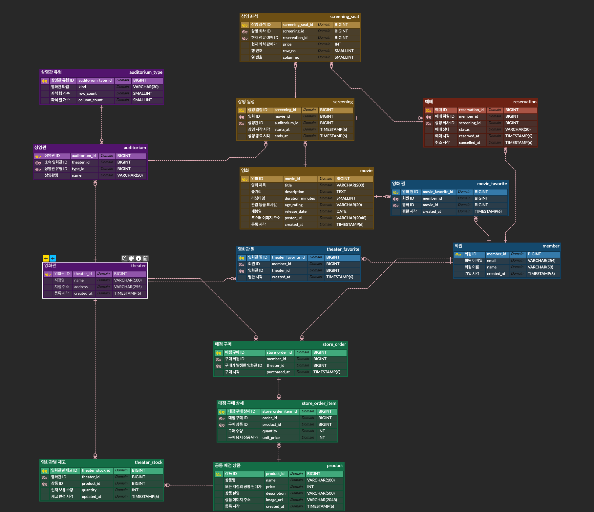

# spring-cgv-24th
CEOS 24기 백엔드 스터디, CGV 클론 코딩 프로젝트

## 프로젝트 자료


- [DB 설계서 및 API 명세서 노션 페이지](https://app.notion.com/p/goodyintroduce/CEOS-CGV-3dadfc0b63a180869fc9ff0364c5f5cc?source=copy_link)

---
## 세션 중간중간에 있었던 ❓ 질문에 답하기

### Dirty Checking과 UPDATE

> Dirty Checking으로 인한 UPDATE는 변경 여부와 상관없이 모든 컬럼을 업데이트합니다. 개선이 필요할까요? 개선한다면 어떤 방법이 있을까요?

Dirty Checking은 변경된 엔티티를 찾는 과정입니다. **값이 바뀌지 않았다면 `UPDATE` 자체가 실행되지 않습니다.** 다만 Hibernate는 기본적으로 변경된 엔티티의 `UPDATE` 문에 변경되지 않은 컬럼도 함께 포함합니다.

실제로 불필요한 컬럼 갱신이 성능 문제를 일으킨다면 `@DynamicUpdate`로 변경된 컬럼만 갱신할 수 있습니다. 대신 변경 조합마다 SQL이 달라져 SQL 재사용과 JDBC 배치 효율이 떨어질 수 있으므로, 먼저 실행 SQL과 성능을 확인하는 편이 좋습니다. 동시 수정 충돌은 별개의 문제이므로 필요하면 `@Version`으로 낙관적 락을 적용합니다.

### flush가 발생하는 시점

> flush의 발생하는 시점은 언제일까요?

- `em.flush()`  직접 호출
- 트랜잭션 commit 시
- JPQL 쿼리 실행 직전

기본 `AUTO` 모드에서는 직접 `flush()`를 호출할 때와 트랜잭션 커밋 전에 변경 사항이 DB로 전송됩니다. JPQL/HQL 쿼리 직전에는 **그 쿼리 결과에 미반영 변경 사항이 영향을 줄 수 있을 때** 자동으로 flush합니다. 따라서 모든 JPQL 실행 전에 반드시 flush하는 것은 아닙니다. `EntityManager`의 네이티브 SQL 쿼리 실행 전에도 자동 flush가 일어날 수 있습니다.

flush는 SQL을 실행해 영속성 컨텍스트와 DB를 동기화하는 과정이며, **트랜잭션 커밋은 아닙니다.** flush 후에도 롤백하면 변경 사항은 취소됩니다. `COMMIT` 같은 flush 모드에서는 쿼리 전 자동 flush 동작이 달라집니다.

### 영속성 컨텍스트와 트랜잭션의 관계

> 영속성 컨텍스트와 엔티티 매니저, 엔티티 매니저와 트랜잭션은 항상 1:1로 대응할까요?

직접 생성한 `EntityManager`는 각각 별도의 영속성 컨텍스트를 가집니다. 하지만 주입받은 `EntityManager`가 공유 프록시라면 같은 참조가 트랜잭션마다 다른 실제 `EntityManager`와 영속성 컨텍스트에 접근할 수 있습니다. 컨테이너 관리 방식에서는 같은 트랜잭션과 영속성 단위에 속한 여러 `EntityManager` 참조가 하나의 영속성 컨텍스트를 공유할 수도 있습니다.

`EntityManager`와 트랜잭션도 항상 1:1은 아닙니다. 확장 영속성 컨텍스트나 직접 관리하는 `EntityManager`는 여러 트랜잭션에 걸쳐 살아 있을 수 있고, 한 JTA 트랜잭션에는 여러 `EntityManager`가 참여할 수 있습니다.

### 양방향 매핑

> 양방향 매핑이 항상 좋을까요?

항상 좋지는 않습니다. 양방향 매핑은 양쪽에서 연관 객체를 탐색해야 할 때 편리하지만, 두 객체의 관계를 함께 맞춰야 하는 관리 부담이 생깁니다. DB의 외래 키는 **연관 관계의 주인 쪽**이 관리하므로, 반대쪽 컬렉션만 바꾸면 DB 관계가 변경되지 않습니다. 한쪽 방향으로만 조회한다면 단방향 매핑이 더 단순하고, 양방향이 필요하다면 연관 관계를 설정하는 메서드에서 양쪽 값을 함께 갱신하는 편이 좋습니다.

### PK 참조와 UUID 참조

> PK 참조 vs UUID 참조

| 비교 기준 | 숫자 PK 참조 | UUID 참조 |
| --- | --- | --- |
| 대표 타입 | `BIGINT` | `UUID`, `BINARY(16)` 등 |
| 저장 공간 | 보통 8바이트로 작음 | 바이너리 기준 16바이트로 더 큼 |
| 생성 방식 | 주로 DB의 Identity·Sequence 사용 | 애플리케이션에서 분산 생성 가능 |
| 인덱스·조인 | 인덱스가 작고 비교 비용이 낮음 | 인덱스와 외래 키가 커져 상대적으로 비용이 증가함 |
| 삽입 성능 | 순차 증가 값은 인덱스 지역성이 좋음 | 랜덤 UUID v4는 지역성이 낮고, 시간 순 UUID v7은 이를 개선함 |
| 외부 노출 | 값이 짧고 다루기 쉽지만 순서를 추측하기 쉬움 | 식별자를 추측하기 어렵지만 접근 권한 검증을 대신하지는 못함 |
| 적합한 경우 | 단일 DB 중심 시스템, 내부 연관관계 | 분산 시스템, 클라이언트 선발급, 시스템 간 데이터 병합 |

두 방식은 반드시 하나만 선택해야 하는 관계가 아닙니다. **내부 관계는 숫자 PK로 연결하고, 외부 API나 시스템 간 교환에는 별도의 UUID를 쓰는 방식**도 가능합니다. UUID 자체를 PK로 삼을 수도 있으며, 선택 기준은 식별자를 어디에서 생성하고 공유해야 하는지와 조회 및 저장 비용입니다.

### `mappedBy` 없는 양방향 매핑

> mappedBy 없이, 양쪽 모두에 @JoinColumn을 걸면 어떻게 될까요?

`mappedBy`가 없으면 Hibernate는 양쪽을 하나의 양방향 관계로 연결하지 못하고, **각각 별개의 단방향 연관관계이자 연관관계의 주인**으로 해석합니다. 매핑 방식에 따라 외래 키나 조인 테이블이 중복으로 생성될 수 있으며, 한쪽을 변경해도 다른 쪽의 관계가 자동으로 맞춰지지 않아 서로 다른 데이터를 가리킬 수 있습니다.

양쪽 `@JoinColumn`이 같은 DB 컬럼을 가리키면 하나의 컬럼에 두 매핑이 쓰기를 시도해 중복 컬럼 매핑 오류가 발생할 수도 있습니다. 한쪽에 `insertable = false, updatable = false`를 지정하면 쓰기 충돌은 피할 수 있지만, 정상적인 양방향 매핑을 대신하는 방법은 아닙니다.

양방향 관계에서는 **한쪽만 연관관계의 주인**으로 정해야 합니다. 외래 키를 관리하는 쪽에 `@JoinColumn`을 두고, 반대쪽에는 주인 엔티티의 필드명을 가리키는 `mappedBy`를 사용합니다.

```java
// 연관관계의 주인
@ManyToOne(fetch = FetchType.LAZY)
@JoinColumn(name = "team_id")
private Team team;

// 연관관계의 반대쪽
@OneToMany(mappedBy = "team")
private List<Member> members = new ArrayList<>();
```

### 프록시란?

> Proxy란?

**Proxy**는 실제 객체를 대신해 먼저 놓이는 대리 객체입니다. Hibernate는 지연 로딩 대상 엔티티의 식별자만 가진 프록시를 두고, 데이터가 필요한 시점에 조회하여 초기화합니다.

### 프록시와 N+1 문제

> Proxy와 N+1 문제의 관계

프록시가 N+1의 직접적인 원인은 아닙니다. 부모 목록 1회 조회 후 각 부모의 지연 로딩 연관 객체를 차례로 사용하면 추가 조회가 부모 수만큼 발생할 수 있습니다. 필요한 관계를 fetch join이나 `@EntityGraph`로 한 번에 읽거나, 배치 로딩으로 조회 횟수를 줄일 수 있습니다.

### Hibernate Proxy와 Spring AOP Proxy

> Hibernate Proxy와 Spring AOP Proxy의 차이?

**Hibernate Proxy**는 엔티티의 지연 로딩을 위한 것이고, **Spring AOP Proxy**는 메서드 호출을 가로채 트랜잭션이나 부가 기능을 적용하기 위한 것입니다. 둘 다 프록시라는 형태를 쓰지만 목적과 초기화 시점이 다릅니다.

### 양방향 `@OneToOne`의 프록시 문제

> 양방향 매핑 + `@OneToOne` + `nullable=true`에서의 프록시 문제는 왜 발생했나? @Diggindie

특히 `@OneToOne(mappedBy = ...)`인 **반대쪽**은 자신의 테이블에 외래 키가 없습니다. 연관 엔티티가 없을 수도 있다면(`nullable=true`), Hibernate는 프록시를 둘 대상이 있는지와 그 식별자가 무엇인지 부모 행만 보고 알 수 없습니다. 그래서 연관 엔티티의 존재 여부를 확인하는 추가 조회가 발생하고 지연 로딩이 기대대로 작동하지 않을 수 있습니다. 외래 키를 가진 쪽에서 단방향으로 조회하거나, 필요할 때 명시적으로 fetch하고, 양방향 지연 로딩이 꼭 필요하면 바이트코드 향상을 고려할 수 있습니다.

### 지연 로딩은 항상 좋은가?

지연 로딩은 사용하지 않는 연관 객체를 불필요하게 읽지 않도록 해주지만, **필요한 데이터를 언제·몇 번 조회할지**까지 자동으로 최적화하지는 않습니다. 목록에서 연관 객체를 하나씩 사용하면 N+1 조회가 생길 수 있고, 영속성 컨텍스트가 닫힌 뒤 초기화되지 않은 객체를 사용하면 `LazyInitializationException`이 발생합니다.

따라서 연관 관계는 지연 로딩을 기본으로 두되, 조회 목적에 따라 필요한 데이터만 fetch join, 엔티티 그래프, 배치 로딩 또는 DTO 조회로 미리 가져오는 것이 좋습니다. 매번 꼭 필요한 작은 관계라면 즉시 로딩도 고려할 수 있지만, 엔티티에 고정된 즉시 로딩은 다른 조회에서도 적용되므로 쿼리별로 가져올 대상을 정하는 편이 유연합니다.

### 컬렉션 fetch join과 페이징

> fetch join을 사용하면서 페이징을 적용할 때 발생하는 문제에 대해 알아보아요!

**단일 연관 객체(`@ManyToOne`, `@OneToOne`)의 fetch join**은 대체로 DB 페이징과 함께 사용할 수 있습니다. 문제는 **컬렉션 fetch join**입니다. 부모 1개가 자식 여러 개와 조인되면 SQL 결과에 부모 행이 반복됩니다. DB에서 이 결과를 그대로 `LIMIT/OFFSET`으로 자르면 부모의 컬렉션이 일부만 로딩될 수 있어, Hibernate는 전체 결과를 가져온 뒤 메모리에서 페이징할 수 있습니다. 데이터가 많을수록 메모리와 응답 시간이 크게 늘어납니다.

보통은 **부모 ID를 먼저 DB에서 페이징**하고, 해당 ID의 부모와 컬렉션을 두 번째 쿼리에서 fetch join합니다. 이때 첫 쿼리의 정렬 순서를 최종 결과에도 유지해야 합니다. 다른 방법으로는 부모만 페이징한 뒤 컬렉션을 배치 로딩하는 방식이 있습니다.

### 싱글톤 Repository와 `EntityManager`

> `SimpleJpaRepository`는 싱글톤인데, 매번 다른 `EntityManager`를 어떻게 생성자 주입으로 받을 수 있을까요?

`SimpleJpaRepository` 같은 싱글톤에 주입되는 것은 보통 **실제 `EntityManager`가 아니라 공유 프록시**입니다. 프록시 참조는 그대로 유지되지만, 메서드 호출은 현재 트랜잭션에 연결된 실제 `EntityManager`로 전달됩니다. 따라서 생성자 주입과 트랜잭션별 영속성 컨텍스트가 양립합니다. `EntityManager`를 요청이나 DB 연결마다 생성한다고 이해할 필요는 없습니다.

### 컬렉션 fetch join과 `distinct`

> fetch join 할 때 distinct를 안하면 생길 수 있는 문제

컬렉션 fetch join에서는 한 부모가 자식 수만큼 SQL 행에 나타납니다. **Hibernate 5 등 예전 버전**에서는 `distinct`가 없으면 결과 목록에 같은 부모 엔티티가 중복될 수 있었습니다. **Hibernate 6 이상**은 fetch join으로 생긴 중복 부모를 결과 목록에서 자동 제거하므로, 이를 위해 `distinct`를 추가할 필요는 없습니다. 다만 SQL 조인 행 자체가 늘어나는 비용은 남고, 컬렉션을 조인한 `count` 쿼리에는 별도로 `count(distinct 부모.id)`가 필요할 수 있습니다.

### fetch join 경고와 오류

> fetch join을 할 때 생기는 3가지 메시지의 원인과 해결 방법

#### 컬렉션 페이징 경고

> `HHH000104: firstResult/maxResults specified with collection fetch; applying in memory!`

컬렉션 fetch join과 페이징을 함께 사용해 DB 페이징 대신 메모리 페이징이 적용된다는 경고입니다. 부모 ID를 먼저 페이징한 뒤 컬렉션을 조회하거나 배치 로딩을 사용합니다. Hibernate 버전에 따라 경고 코드가 달라질 수 있습니다.

#### fetch join 대상 엔티티 누락

> `query specified join fetching, but the owner of the fetched association was not present in the select list`

**fetch join 대상 연관 필드를 가진 엔티티가 조회 결과에 없는** 쿼리입니다. 예를 들어 DTO나 컬럼만 `select`하면서 `join fetch`를 사용한 경우입니다. 엔티티를 조회하도록 바꾸거나, DTO 조회와 `count` 쿼리에서는 일반 `join`을 사용하고 `fetch`를 제거합니다.

#### 여러 bag 컬렉션 동시 fetch

> `org.hibernate.loader.MultipleBagFetchException: cannot simultaneously fetch multiple bags`

순서 정보가 없는 `List` 같은 **bag 컬렉션 여러 개를 동시에 fetch join**하려는 경우입니다. 컬렉션을 각각 다른 쿼리에서 읽거나 배치 로딩합니다. 도메인 의미에 맞는다면 `Set` 또는 `@OrderColumn`으로 매핑을 바꿀 수도 있지만, 여러 컬렉션을 한 번에 조인할 때 생기는 행 수 증가까지 해결되지는 않습니다.
