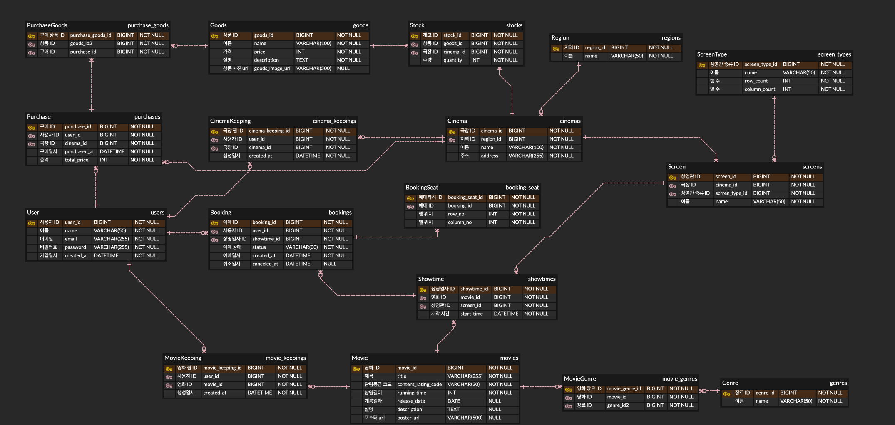

# spring-cgv-24th
CEOS 24기 백엔드 스터디 - CGV 클론 코딩 프로젝트

## ERD

[ERD Cloud 가서 보기](https://www.erdcloud.com/d/aBzYHMExGpfHZXSEE)

- 실제 CGV를 구경하다 보니 테이블이 조금 비대해졌습니다...
- 테이블들의 PK값은 변하지 않도록 별개의 단일 id를 만드는 방식으로 통일했습니다.
  - `@GeneratedValue(strategy = GenerationType.IDENTITY)`
  - 복합키도 사용할 수 있지만, 나중에 로직 단의 코드가 복잡해질 것이라 생각했는데, 리뷰어 분들은 어떻게 생각하시는지 궁금합니다!
- 테이블을 짤 때 가장 고민이 많았던 부분은 예매 관련 부분이었습니다.
  - 현재의 구조에서 예매와 관련된 테이블들은 다음과 같습니다.
    - `Booking`: 예매
    - `BookingSeat`: 예매 시 선택한 좌석(들)
    - `Showtime`: 상영일정, 즉 어떤 영화가 어떤 상영관에서 언제 상영되는지
  - 여기서 `Booking`과 `BookingSeat`가 연결되어 있고, `Booking`과 `Showtime`이 연결되어 있습니다.
  - 하지만 여기서 문제가 발생합니다!
    - 현재의 `BookingSeat`는 행과 열을 저장하지만, 상영일자(`Showtime`)를 저장하지는 않습니다. 그렇기 때문에 DB 단에서 (showtime_id, row_no, column_no)를 한번에 UNIQUE로 처리하지 못합니다.
    - 물론 로직 상으로 처리할 수는 있지만 DB 단에서는 중복예매가 가능하다는거죠.
    - 여기서 제가 생각해본 해결방법은 2가지 였습니다.
      1. `BookingSeat`와 `Showtime` 연결
         → 하지만 이 방식을 사용하면 연결이 돌고 돌아 Booking의 showtime_id와 BookingSeat의 showtime_id이 불일치 할 수 도 있는 상황이 발생합니다.
      2. `BookingSeat`와 `Showtime` 사이에 `ShowtimeSeat` 생성
         → 이 방법은 DB 상으로는 나름..? 깔끔해보이지만 ShowtimeSeat라는게 상영일자가 새로 생길때마다 모든 좌석에 대해 데이터가 생겨야 한다는 번거로움 + 불필요한 데이터 추가 라는 문제가 있습니다.
    - 그래서 저는 일단 이 문제를 미뤄뒀습니다. 하하 리뷰어 분들이 이마를 탁 칠만한 현명한 방법이 있을 것이라 생각합니다.

## 구현 코드
- 도메인 별로 개발을 해서 도메인형 구조로 코드를 짜보았습니다. 도메인 별로 개발을 하는데, `controller/`, `service/` 이런 식으로 계층형 구조를 쓰게 되면, 한 도메인과 관련된 코드를 쓰기 위해 모든 계층의 폴더를 열고 닫아야 하는것이 싫어서... 선택해보았습니다. 이 방법보다 계층형이 더 좋다! 하시는 분들의 의견도 궁금합니다.
- `createdAt` 필드가 중복되는 곳이 몇군데 있어서 `BaseEntity`로 JpaAuditing 기능을 분리하였습니다.
- 급하게 짠 코드들이 있어서... 아직 코드가 지저분합니다. 많은 잔소리와 지적... 부탁드립니다