# 1. DB 설계 설명
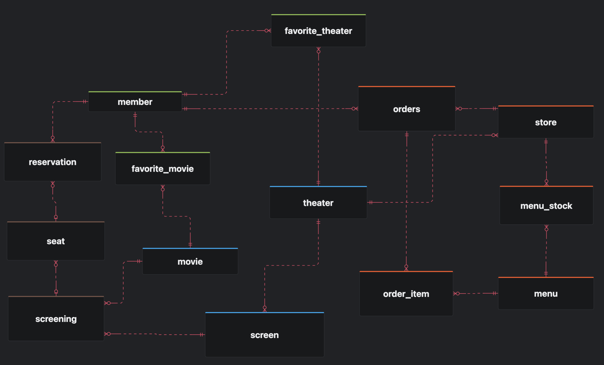

## 1-1. 테이블별 역할

| 테이블 | 역할 |
|---|---|
| member | 회원 |
| theater | 영화관 |
| screen | 상영관 (영화관에 속함) |
| screening | 상영 회차 (영화 + 상영관 + 시간) |
| seat | 좌석 (상영 회차에 속함) |
| reservation | 좌석 예약 |
| movie | 영화 |
| store | 매장 (영화관에 속함) |
| menu | 메뉴 |
| menu_stock | 매장별 메뉴 재고 |
| orders / order_item | 주문 / 주문 항목 |
| favorite_movie / favorite_theater | 찜한 영화 / 찜한 영화관 |

## 1-2. 테이블 관계

- theater 1 : N screen 1 : N screening 1 : N seat
- screening N : 1 movie
- seat 1 : 1 reservation N : 1 member
- theater 1 : 1 store
- store N : M menu (menu_stock으로 연결)
- member N : 1 orders 1 : N order_item N : 1 menu
- member N : M movie (favorite_movie), member N : M theater (favorite_theater)

## 1-3. 핵심 설계 포인트

1. seat를 screen이 아닌 screening에 종속시킴 —> 같은 물리적 좌석도 회차마다 예약 상태가 달라야 하므로
2. reservation.seat_id에 UNIQUE 제약 —> 동시 예약 경쟁 상황에서도 하나의 좌석에 하나의 예약만 존재하도록 DB 레벨에서 중복 예약을 차단
3. store.theater_id에 UNIQUE 제약 — 영화관 하나당 매장 하나라는 비즈니스 규칙을 DB 제약으로 강제
4. menu-store를 menu_stock 중간 테이블로 연결 — 같은 메뉴라도 매장마다 재고가 다르므로, 재고를 매장 단위로 독립 관리하기 위해 중간 테이블을 둠
5. order_item에 price, quantity를 별도 저장 — 메뉴를 참조만 하지 않고 주문 시점의 가격·수량을 저장해, 이후 메뉴 가격이 바뀌어도 과거 주문 내역이 변하지 않도록 설계


# 2. 추가 학습 내용 정리

## 2-1. Dirty Checking과 전체 컬럼 UPDATE

Hibernate는 엔티티마다 UPDATE SQL을 캐싱해서 재사용한다. 
이 SQL은 모든 컬럼을 SET 절에 포함하도록 미리 만들어지기 때문에, 
필드 하나만 바뀌어도 Dirty Checking이 감지하면 전체 컬럼이 UPDATE 대상이 된다.

따라서, 

- 컬럼 수가 많고 그중 일부만 자주 바뀌는 엔티티
- 컬럼에 DB 트리거가 걸려 있어, 변경되지 않은 컬럼까지 트리거가 동작하면 안 되는 경우

라면, 다음의 방법으로 효율을 높일 수 있다

### 개선 방법 — `@DynamicUpdate`

```java
@Entity
@DynamicUpdate
public class Member {
    @Id
    private Long id;
    private String name;
    private String email;
    private String phone;
    private String address;
}
```

위 코드처럼 엔티티 클래스에 `@DynamicUpdate`를 붙이면 Hibernate가 고정 SQL 대신, 
실제로 변경된 컬럼만 포함한 UPDATE 문을 매번 동적으로 생성한다.


### 주의할 점

| 상황 | 권장 여부 |
|---|---|
| 컬럼이 많고 일부 필드만 자주 변경 | `@DynamicUpdate` 적용 권장 |
| 컬럼이 적거나 대부분 필드가 함께 변경 | 기본(정적 UPDATE) 유지가 더 나을 수 있음 (동적 SQL 생성 비용 발생) |
| detached 엔티티를 `Session.update()`로 재부착 | `@SelectBeforeUpdate`를 함께 적용해야 `@DynamicUpdate`가 정상 동작 |


---

## 2-2. Flush가 발생하는 시점

Flush는 영속성 컨텍스트의 변경 내용을 실제 DB에 동기화하는 과정이다. 
아래 세 시점 모두 실제로 flush가 발생하는 시점이 맞다.

아래 예시에서 공통으로 쓰이는 tx는 트랜잭션을 다루는 EntityTransaction 타입 변수로,
EntityManager에서 아래와 같이 얻는다.

```java
EntityManager em = emf.createEntityManager();
EntityTransaction tx = em.getTransaction();
```

### ① `em.flush()` 직접 호출

```java
Member member = em.find(Member.class, 1L);
member.setName("변경된 이름");

em.flush();  // 이 시점에 즉시 UPDATE 쿼리 실행 (commit 전이라도)
```

이때 Dirty Checking의 기준이 되는 스냅샷도 flush된 값으로 함께 갱신된다. 
그래야 이후 다시 dirty checking을 할 때 방금 flush한 값을 기준으로 비교할 수 있다.

### ② 트랜잭션 commit 시

```java
tx.begin(); // 트랜잭션 시작
Member member = em.find(Member.class, 1L);
member.setName("변경된 이름");
tx.commit();  // 트랜잭션 커밋. 이 직전에 자동으로 flush 발생
```

### ③ JPQL 쿼리 실행 직전 (FlushMode.AUTO, 기본값)

```java
tx.begin(); // 트랜잭션 시작
Member member = em.find(Member.class, 1L);
member.setName("변경된 이름");

// 변경사항이 아직 DB에 반영되지 않았지만
// 아래 JPQL이 member 테이블을 조회하므로, 실행 직전 자동 flush 발생
List<Member> result = em.createQuery(
    "select m from Member m where m.name = :name", Member.class)
    .setParameter("name", "변경된 이름")
    .getResultList();
```

단, 항상 발생하는 것은 아니고, 실행하려는 쿼리가 아직 flush되지 않은 변경사항과 겹치는 테이블을 조회할 때만 선행 flush가 일어난다. 

아래와 같은 네이티브 SQL은 기본적으로 자동 flush 대상에서 제외된다.
```java
em.createNativeQuery("SELECT * FROM member WHERE name = ?")
  .setParameter(1, "변경된 이름")
  .getResultList();
```

네이티브 SQL은 Hibernate가 직접 파싱하는 JPQL과는 달리 그냥 문자열이라 Hibernate가 해당 SQL이 어떤 테이블을
건드리는지 알 수 없다. 그래서 기본적으로 자동 flush 대상에서 제외된다.
그 결과 네이티브 쿼리 실행 전 변경사항이 아직 DB에 반영되지 않아, stale(최신이 아닌) 데이터를 조회할 위험이 있다.
addSynchronizedEntityClass()로 동기화 대상 엔티티를 명시하거나, 쿼리 전 em.flush()를 직접 호출하여 해결해야 한다.

### FlushMode 정리

| 모드 | 동작 |
|---|---|
| `AUTO` (기본값) | commit 시 + 관련 쿼리 실행 직전에 flush |
| `COMMIT` | commit 시에만 flush |
| `MANUAL` | `flush()`를 명시적으로 호출할 때만 flush (읽기 전용 트랜잭션에 유리) |
| `ALWAYS` | 모든 쿼리 실행 전 매번 flush (공식 문서에서 "거의 항상 불필요"하다고 명시) |


---

## 2-3. 영속성 컨텍스트 · 엔티티 매니저 · 트랜잭션의 관계

결론부터 말하면, 셋이 항상 1:1은 아니다.

### 영속성 컨텍스트 ↔ 엔티티 매니저

Container-managed 환경에서는 영속성 컨텍스트 전파가 일어난다.

```java
// 동일한 JTA 트랜잭션 내에서
@Stateless
public class OrderService {
    @PersistenceContext
    EntityManager em1;   // 서로 다른 엔티티 매니저 인스턴스라도
}

@Stateless
public class PaymentService {
    @PersistenceContext
    EntityManager em2;   // 같은 트랜잭션 안이면 em1과 동일한 영속성 컨텍스트를 공유
}
```

- **Transaction-Scoped(기본값)** + Container-managed 
- → 여러 엔티티 매니저가 하나의 영속성 컨텍스트를 공유할 수 있음 (N:1)
- 
- **Application-managed** 엔티티 매니저 
- → 영속성 컨텍스트를 공유하지 않고 각자 독립적으로 가짐
- 
- **Extended(확장) 스코프** 
- → 특정 엔티티 매니저에 종속되어 생성·종료 시점을 함께함 (1:1에 가까움)

### 엔티티 매니저 ↔ 트랜잭션

```java
// Transaction-Scoped: 트랜잭션이 끝나면 영속성 컨텍스트도 함께 닫힘
tx.begin();
Member m = em.find(Member.class, 1L);
tx.commit();   // 여기서 영속성 컨텍스트 종료

tx.begin();    // 같은 em이라도 새로운 영속성 컨텍스트가 다시 생성됨
Member m2 = em.find(Member.class, 1L);
tx.commit();
```

반면 Extended 영속성 컨텍스트는 여러 트랜잭션에 걸쳐 존재할 수 있다.

```java
@Stateful
public class OrderEditor {
    @PersistenceContext(type = PersistenceContextType.EXTENDED)
    EntityManager em;
    // 이 em(영속성 컨텍스트)은 하나가 여러 트랜잭션에 걸쳐 유지될 수 있음
}
```

## 2-4. Proxy

### 2-4-1. Hibernate Proxy vs Spring AOP Proxy

| 구분 | Hibernate Proxy | Spring AOP Proxy |
|---|---|---|
| 목적 | 지연 로딩 | 횡단 관심사(트랜잭션, 로깅 등) 적용 |
| 대상 | JPA 엔티티 | 스프링 빈 |
| 구현 | 바이트코드 조작(cglib 등)으로 엔티티 상속 프록시 생성 | 인터페이스 구현 시 JDK 동적 프록시, 아니면 CGLIB |

둘 다 실제 객체 대신 동작을 가로채는 대리 객체이지만,
Hibernate Proxy는 데이터 접근 시점 제어가,
Spring AOP Proxy는 메서드 호출 가로채기가 목적이라는 점에서 근본적으로 다르다.

### 2-4-2. 양방향 매핑 + `@OneToOne` + `nullable=true`에서 프록시 문제

```java
@Entity
public class Member {
    @Id
    private Long id;

    @OneToOne(mappedBy = "member", fetch = FetchType.LAZY)
    private MemberProfile profile;   // 비주인 쪽 (nullable=true, 기본값)
}

@Entity
public class MemberProfile {
    @Id
    private Long id;

    @OneToOne(fetch = FetchType.LAZY)
    @JoinColumn(name = "member_id")
    private Member member;           // 주인 쪽 (FK 보유)
}
```
위와 같은 상황에서

```java
Member member = em.find(Member.class, 1L);
```
를 실행하면, FetchType.LAZY로 지정했음에도 member.profile은 실제로 즉시 로딩된다. 

왜일까?

Member(비주인) 쪽에는 profile 관련 컬럼이 테이블에 아예 없다. 
FK는 반대쪽인 MemberProfile 테이블에 있기 때문에,
Member를 조회하는 시점에는 이 회원에게 프로필이 있는지 없는지 Hibernate가 전혀 알 수 없는 것이다.

그런데 프록시는 "대상이 반드시 존재한다"를 전제로 만드는 빈 껍데기이기 때문에,
지금 이 자리에서 null로 둘지 프록시로 채울지 둘 중 하나로 확정해야 한다 (나중에 바꿀 수 없음).

그래서 Hibernate는 이 판단을 위해 MemberProfile 테이블을 조회해
"나를 참조하는 row가 있는지" 먼저 확인하는 SELECT를 추가로 날린다.
근데?? 이 확인 쿼리 자체가 이미 즉시 조회이기 때문에,
결과적으로 FetchType.LAZY를 지정해도 즉시 로딩처럼 동작하는 것이다.

---

## 2-5. Fetch Join + 페이징 문제

### 문제

컬렉션(1:N 관계인 comments)을 fetch join하면서 페이징(`setMaxResults`)을 동시에 걸면 문제가 생긴다.

```java
List<Post> posts = em.createQuery("""
    select p
    from Post p
    left join fetch p.comments
    order by p.createdOn
    """, Post.class)
    .setMaxResults(5)
    .getResultList();
```
분명히 5개만 가져오라고 `setMaxResults(5)`를 지정했지만, 
Hibernate는 이걸 그대로 실행하지 않고 경고를 띄운다.
```
WARN: HHH000104: firstResult/maxResults specified with collection fetch; applying in memory!
```
"in memory!"라는 말대로, DB에는 페이징 조건을 아예 전달하지 않고 
전체 데이터를 다 가져온 뒤 자바 메모리 안에서 5개만 잘라낸다는 뜻이다. 
실제 실행되는 SQL을 보면 이게 명확히 드러난다.

```sql
-- 실제 실행되는 SQL — LIMIT/OFFSET이 빠져 있음
SELECT p.id, p.created_on, p.title,
       c.id, c.post_id, c.review
FROM post p
LEFT OUTER JOIN post_comment c ON p.id = c.post_id
ORDER BY p.created_on
```

왜..?

컬렉션(1:N)을 fetch join하면 부모 1개에 자식 row가 여러 개 매핑된 결과셋이 만들어진다. 
이 상태에서 DB 레벨로 단순히 `LIMIT`을 걸면 자식 컬렉션 중간에서 결과가 잘려, 
부모 엔티티가 자식 데이터를 일부만 가진 채 반환될 수 있다. 
Hibernate는 데이터 일관성을 우선시하기 때문에, 
이 경우 SQL 레벨 페이징을 포기하고 전체 결과를 조회한 뒤 메모리에서 페이징을 수행한다. 

그 결과로 페이징 조건과 무관하게 전체 데이터가 매번 조회되는 엄청난 부작용이 생기는 것이다

### 해결 방법

**방법 1 — ID를 먼저 페이징 조회 후, 해당 ID로 fetch join**

```java
// 1단계: ID만 페이징 조회 (SQL 레벨 LIMIT 정상 적용)
List<Long> ids = em.createQuery("""
    select p.id
    from Post p
    order by p.createdOn
    """, Long.class)
    .setFirstResult(0)
    .setMaxResults(5)
    .getResultList();

// 2단계: 조회된 ID로 fetch join (컬렉션 전체를 가져와도 페이징 대상이 이미 5개로 고정됨)
List<Post> posts = em.createQuery("""
    select distinct p
    from Post p
    left join fetch p.comments
    where p.id in :ids
    order by p.createdOn
    """, Post.class)
    .setParameter("ids", ids)
    .getResultList();
```

**방법 2 — `@BatchSize`로 N+1 완화 (fetch join 대신 지연 로딩 유지)**

```java
@Entity
public class Post {
    @Id
    private Long id;

    @OneToMany(mappedBy = "post", fetch = FetchType.LAZY)
    @BatchSize(size = 100)
    private List<Comment> comments = new ArrayList<>();
}

// 부모는 정상적으로 SQL 레벨 페이징 적용
List<Post> posts = em.createQuery(
    "select p from Post p order by p.createdOn", Post.class)
    .setFirstResult(0)
    .setMaxResults(5)
    .getResultList();
// comments 접근 시 BatchSize 단위로 IN 절 묶어서 조회 (N+1 완화)
```

**방법 3 — 조기 감지를 위한 설정**

```properties
# 경고 로그 대신 예외를 발생시켜 실수를 조기에 발견
hibernate.query.fail_on_pagination_over_collection_fetch=true
```

# 3주차 README

## 1. **JWT를 활용한 인증 흐름 정리하기**

#### 1. JWT의 Header, Payload, Signature는 각각 어떤 역할을 하나요?

- Header: 토큰의 메타데이터(암호화 알고리즘과 토큰의 타입)를 담는다.
- Payload: 실제 전달하려는 Claim 데이터를 담는다. 유저 식별자(PK), 토큰 발급 및 만료 시간, 권한 등의 실질적인 정보를 포함한다. Base64로 인코딩될 뿐 암호화되지 않으므로 민감한 정보를 포함해서는 안 된다!
- Signature: 토큰의 위변조 여부를 검증한다. 서버가 가진 Secret Key를 이용하여 Header와 Payload를 암호화해 생성한다. Payload가 변조될 경우 서명이 일치하지 않아 서버에서 유효하지 않은 토큰으로 판단하고 차단한다.

#### 2. Access Token과 Refresh Token은 무엇이 다른가요?

- Access Token: 서버의 API 리소스에 접근할 때마다 헤더에 포함하여 전송하는 실질적인 자격 증명 수단이다. 탈취 위험을 최소화하기 위해 유효 기간을 짧게 설정한다.
- Refresh Token: 유효 기간이 길며, 만료된 Access Token을 새로 발급받기 위한 용도로만 사용한다. 탈취 시의 위험을 줄이기 위해 데이터베이스나 Redis에 저장하여 상태를 관리하며(RTR
  등), 일반적인 API 리소스 접근에는 사용할 수 없다!

#### 3. 쿠키와 세션, JWT는 각각 어떤 역할을 하나요?

- 쿠키: 브라우저(클라이언트) 단에 데이터를 저장하는 매체이다. 세션 ID를 보관할 수도 있고,
  JWT를 보관할 수도 있으며, 매 HTTP 요청 시 서버로 자동 전송된다.
- 세션: 유저의 상태를 서버의 메모리에 저장하는 방식이다. 브라우저에는 고유한 세션 ID만
  쿠키로 발급한다. 보안성은 높지만, 동시 접속자가 많아지면 서버 메모리 부하가 증가하고 다중
  서버(Scale-out 시) 환경에서 관리가 까다롭다.
- JWT: 유저의 정보를 암호화 및 서명하여 토큰 자체에 저장하는 Stateless한 인증 방식. 서버는 메모리에 상태를 저장하지 않으므로 서명 검증만으로 인증이 가능하여 서버 확장에 매우 유리하다.

#### 4. CGV 프로젝트의 Access Token에는 어떤 Claim이 필요한가요?

저는 현재 아래 5가지 클레임으로 토큰을 구성해봤습니다.

- iss (Issuer): 토큰 발급자. 현재 "http://localhost:8080"으로 고정되어 있으며, 파싱 시 requireIssuer()를 통해 발급자가 일치하는지 검증한다.
- sub (Subject): memberId를 담는다. 필터에서 이 값을 추출해 데이터베이스에서 회원 정보를 조회하는 데 사용한다.
- type: 해당 토큰이 Access Token인지 Refresh Token인지 구분하는 사용자 정의 클레임. Refresh Token을 헤더에 넣어 일반 API 리소스에 접근하는 것을 원천 차단하기 위해 추가하였음.
- iat (Issued At): 토큰이 발급된 시간 정보.
- exp (Expiration Time): 토큰의 만료 시간.

매번 memberId를 통해 DB를 조회하여 권한 확인 하는 과정을 개선하기 위해, Role 클레임을 넣어 DB 조회 없이 권한을 확인하게 한다거나, 블랙리스트 기능을 위한 jti(JWT ID) 등을 추가해도 좋을 것 같네요.

#### 5. JWT 검증 결과가 Authentication과 SecurityContext로 어떻게 연결되나요?

1. JwtAuthenticationFilter에서 토큰의 서명을 검증하고 memberId를 추출한다.
2. 추출한 정보로 CustomUserDetails 객체를 생성한 뒤, 이를 UsernamePasswordAuthenticationToken으로 래핑한다.
3. 생성된 Authentication 인증 객체를 스프링 시큐리티의 전역 저장소인 SecurityContextHolder 내의 SecurityContext에 저장한다.
4. 이후 컨트롤러 단에서 @AuthenticationPrincipal 어노테이션을 통해 SecurityContext에 저장된 유저 정보를 꺼내어 사용할 수 있다.

#### 6. 인증과 인가는 어떻게 다르며, 401과 403은 각각 언제 반환하나요?

- 인증 (Authentication)
    - 클라이언트가 누구인지 신원을 확인하는 과정이다.
    - 401 Unauthorized : 비로그인 상태, 토큰 미제공, 토큰 만료, 토큰 위변조 등 유효한 인증 자격 증명이 없을 때 반환한다.
- 인가 (Authorization)
    - 개념: 인증된 사용자가 특정 리소스에 접근할 수 있는 권한이 있는지 확인하는 과정이다.
    - 403 Forbidden : 정상적으로 로그인(인증)은 했으나, 일반 유저가 관리자 전용 기능에 접근하려는 등 요구되는 권한(Role)을 충족하지 못했을 때 반환한다.

#### (기타) CSRF를 비활성화한 이유

CSRF 공격은 브라우저가 요청마다 쿠키를 자동으로 첨부하는 특징을 악용하는 공격이다. 하지만 내 서버는 세션과 인증 쿠키를 사용하지 않는 Stateless 서버이며, 매 요청 시 클라이언트가 명시적으로 헤더에 토큰을 담아 보내야만 인증이 가능하므로 CSRF 공격으로부터 안전하다.

#### (기타) 공개 경로에서는 인가 거부가 일어나지 않을 수도 있다?

현재 JWT 검증 로직은 예외 발생 시 필터 계층에서 즉각적인 401 에러 응답을 반환하지 않고, 예외 원인을 `request attribute` 에 저장한 뒤 `AuthenticationEntryPoint` 로 위임하여 인가 단계에서 처리되도록 설계했다. 이러면 전체 영화 조회와 같이 `permitAll()` 로 설정된 공개 경로에 접근할 때 클라이언트가 만료되거나 잘못된 토큰을 전송하더라도 예외를 발생시키지 않고 인증 정보가 빈 익명 사용자로서 정상적인 조회를 보장할 수 있다.

## 2. 테스트 결과

- 올바른 로그인 정보

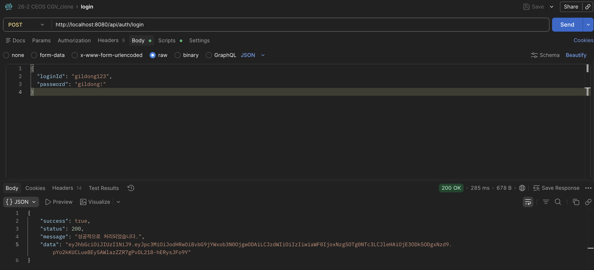

200 OK, Access Token 정상 발급

- 존재하지 않는 ID로 로그인

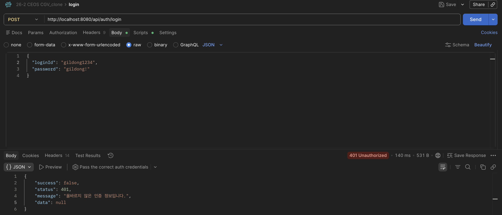

401 Unauthorized, 토큰 미발급

- 잘못된 비밀번호로 로그인

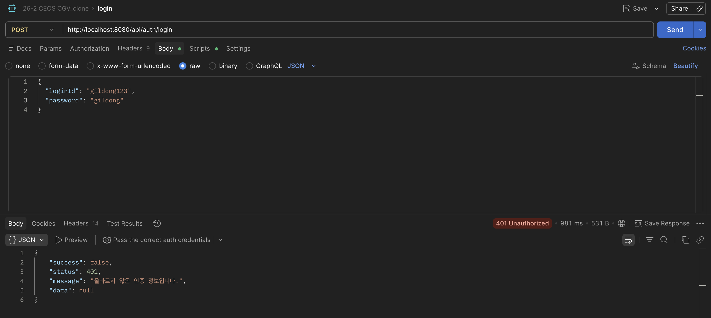

401 Unauthorized, 토큰 미발급

- 토큰 없이 공개 API 호출

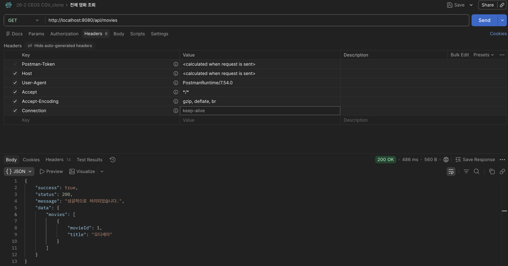

200 OK, 전체 영화 조회 등의 공개 API는 토큰 없이도 접근 가능하도록 설정

- 정상 토큰으로 보호된 API(찜한 영화 등록) 호출

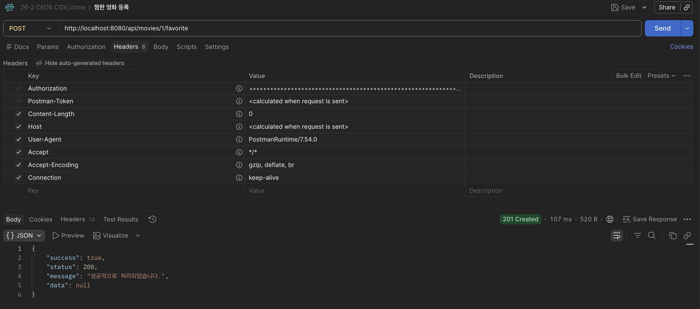

201 CREATED, 정상 호출

- 토큰 없이 보호된 API(찜한 영화로 등록) 호출

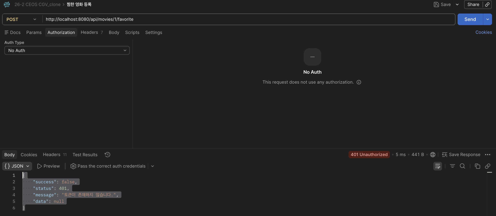

401 Unauthorized, 공통 응답 처리

- 만료된 토큰으로 보호된 API(찜한 영화로 등록) 호출

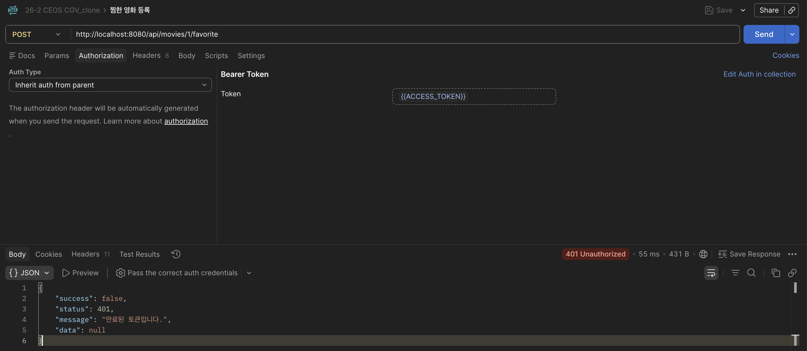

401 Unauthorized, “만료된 토큰입니다.”

- 변조된 토큰으로 보호된 API(찜한 영화로 등록) 호출

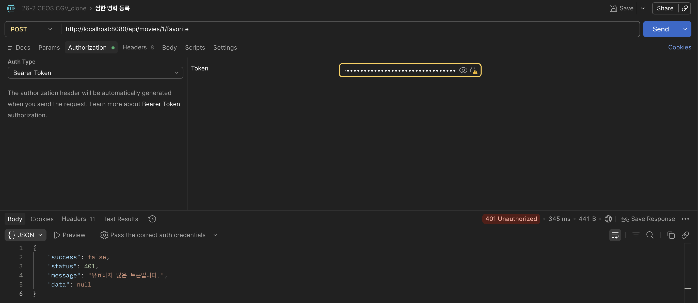

401 Unauthorized, “유효하지 않은 토큰입니다”

- 다른 키로 서명한 토큰

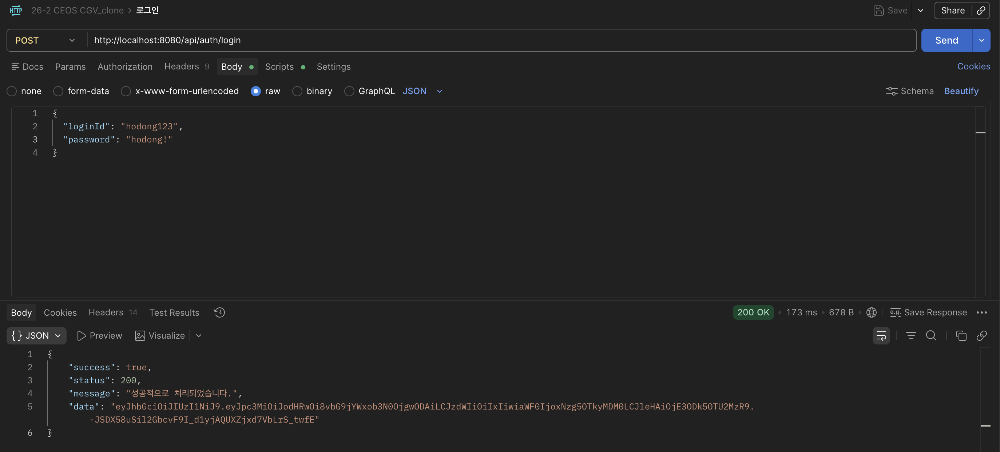

로그인하여 토큰을 발급받고,


환경변수로 등록된 시크릿 키를 변조(맨 앞에 1 추가)한 다음 찜한 영화 등록 요청을 보내면

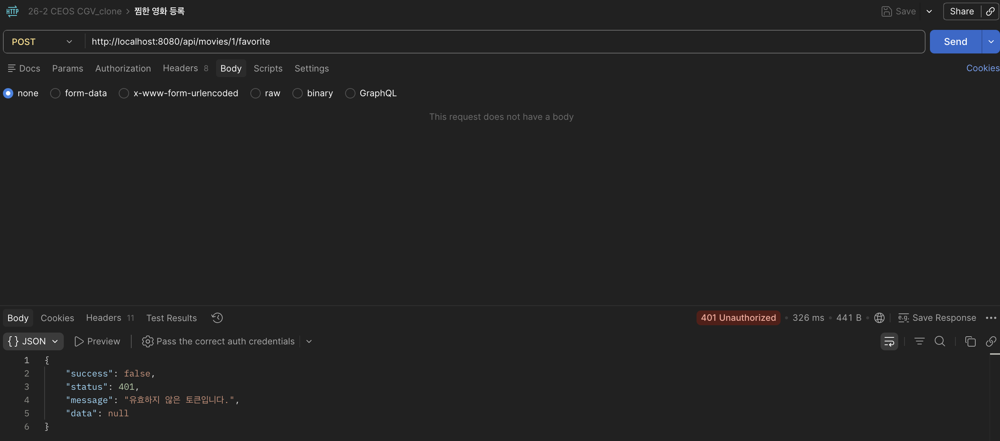

401 Unauthorized, “유효하지 않은 토큰입니다.”

- 일반 사용자로 관리자 API(영화 등록) 호출

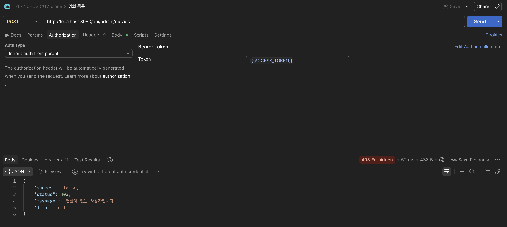

403 Forbidden, 공통 응답 Json

- 관리자로 관리자 API(영화 등록) 호출
    
  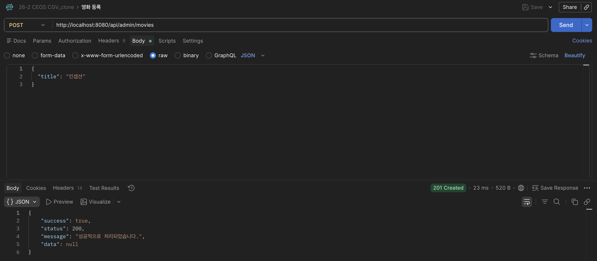


201 Created

- 정상 인증 요청 직후, 토큰 없이 보호된 API 호출

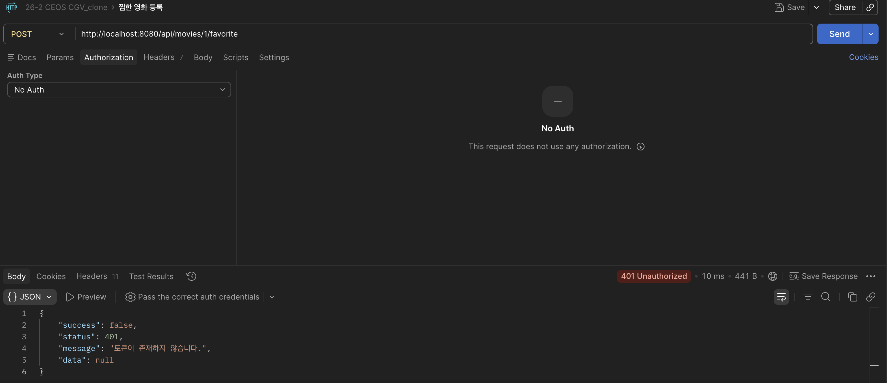

401 Unauthorized, “토큰이 존재하지 않습니다”

- 다른 사용자의 데이터 접근 (다른 사용자가 예매한 좌석 예매 취소 시도)

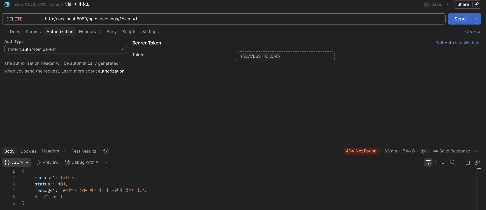

404 Not Found, "존재하지 않는 예매이거나 권한이 없습니다.”

- CORS 설정과 Preflight 요청

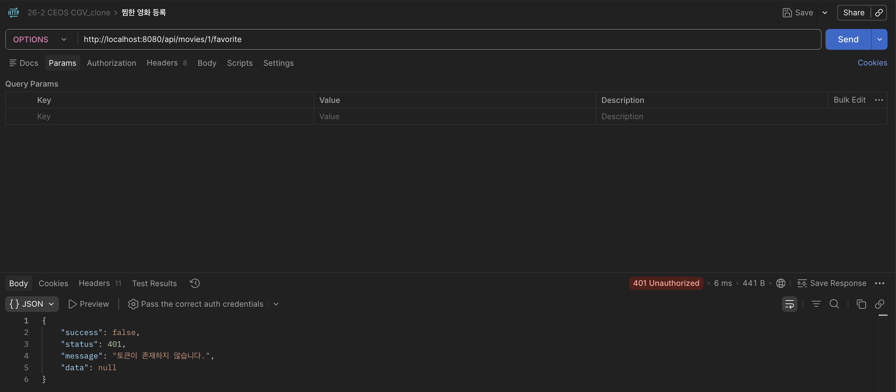

적용 전, 401 Unauthorized, “토큰이 존재하지 않습니다”

- OPTIONS 메서드
- 헤더 두 개 추가
    - Key: Origin, Value: http://localhost:3000
    - Key: Access-Control-Request-Method, Value: POST

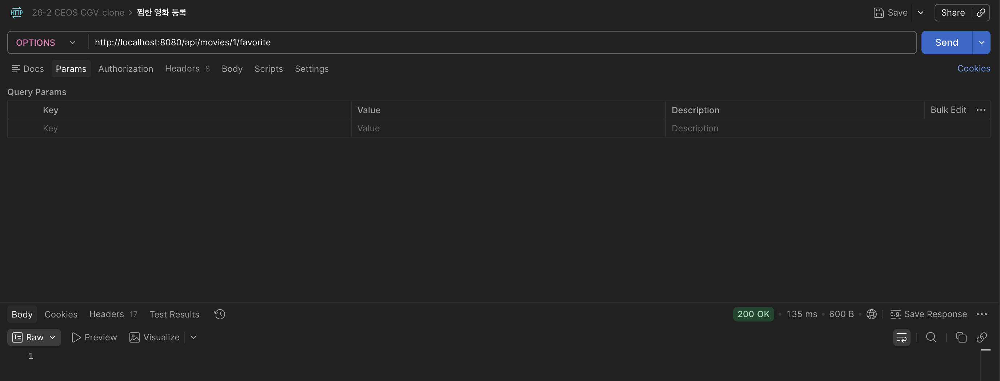

적용 후, 200 OK
