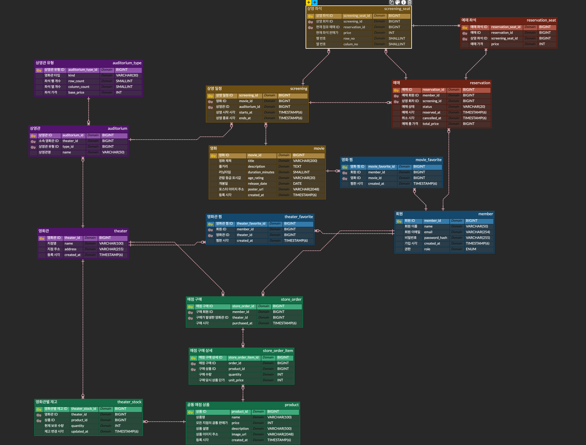
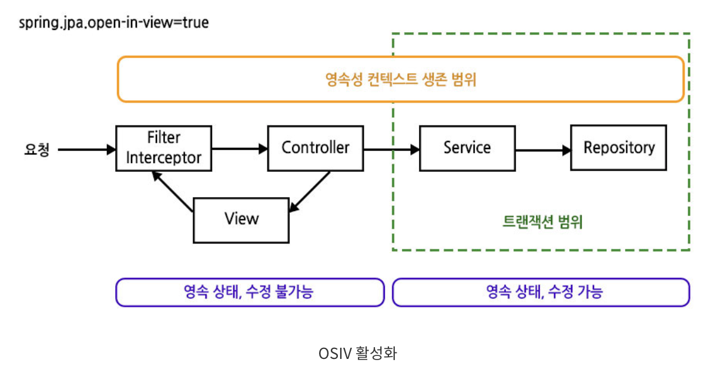
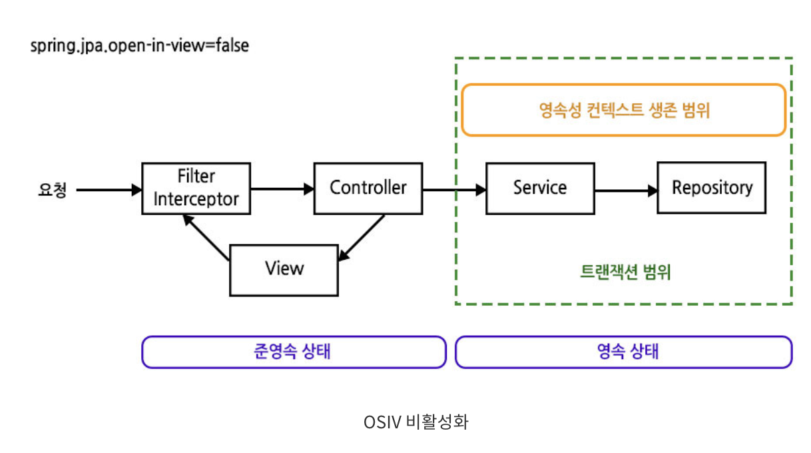

# spring-cgv-24th
CEOS 24기 백엔드 스터디, CGV 클론 코딩 프로젝트

## 프로젝트 자료

<details>
<summary>ERD</summary>



</details>

<details>
<summary> DB 설계서 </summary>

## CGV DB 설계서

현재 엔티티 코드 기준으로 작성했다. 테이블은 **15개**이며, 별도의 `seat` 테이블은 사용하지 않는다. 모든 테이블의 PK는 단일 `BIGINT AUTO_INCREMENT`이고, 실제 PK 컬럼명은 테이블마다 다르다.

### 테이블 목록

| 테이블명 | 역할 |
| --- | --- |
| `member` | 회원과 인증 정보 |
| `theater` | 영화관 지점 |
| `auditorium_type` | 상영관 유형, 공통 좌석 규격 및 기본 가격 |
| `auditorium` | 영화관 안의 실제 상영관 |
| `movie` | 영화 정보 |
| `screening` | 영화 상영 회차 |
| `screening_seat` | 회차별 좌석과 현재 예매 점유 |
| `reservation` | 예매, 총액 및 취소 상태 |
| `reservation_seat` | 예매 당시 좌석과 가격 이력 |
| `theater_favorite` | 영화관 찜 |
| `movie_favorite` | 영화 찜 |
| `product` | 모든 영화관의 공통 매점 상품 |
| `theater_stock` | 영화관별 상품 재고 |
| `store_order` | 매점 구매 |
| `store_order_item` | 구매 상품 상세 |

### 테이블 상세

#### 1. `member`

회원 정보와 로그인·인가 정보를 저장한다.

| 컬럼 | 타입 | 제약 | 설명 |
| --- | --- | --- | --- |
| `member_id` | BIGINT | PK, AUTO_INCREMENT | 회원 ID |
| `email` | VARCHAR(254) | NOT NULL, UNIQUE | 로그인 이메일 |
| `name` | VARCHAR(50) | NOT NULL | 회원 이름 |
| `password_hash` | VARCHAR(255) | NOT NULL, DEFAULT `!DISABLED!` | BCrypt 비밀번호 해시 |
| `role` | VARCHAR(20) | NOT NULL, DEFAULT `USER` | `USER`, `ADMIN` |
| `created_at` | TIMESTAMP(6) | NOT NULL, DEFAULT CURRENT_TIMESTAMP(6) | 가입 시각 |

#### 2. `theater`

CGV 지점 한 곳을 저장한다. 상영관과 재고가 이 지점에 속한다.

| 컬럼 | 타입 | 제약 | 설명 |
| --- | --- | --- | --- |
| `theater_id` | BIGINT | PK, AUTO_INCREMENT | 영화관 ID |
| `name` | VARCHAR(100) | NOT NULL | 지점명 |
| `address` | VARCHAR(255) | NOT NULL | 지점 주소 |
| `created_at` | TIMESTAMP(6) | NOT NULL, DEFAULT CURRENT_TIMESTAMP(6) | 등록 시각 |

#### 3. `auditorium_type`

상영관 종류별 공통 좌석 규격과 기본 좌석 가격을 저장한다. 일반관·특별관 분류와 표시명은 enum에서 관리한다.

| 컬럼 | 타입 | 제약 | 설명 |
| --- | --- | --- | --- |
| `auditorium_type_id` | BIGINT | PK, AUTO_INCREMENT | 상영관 유형 ID |
| `kind` | VARCHAR(30) | NOT NULL, UNIQUE | `GENERAL`, `IMAX`, `FOUR_DX` |
| `row_count` | SMALLINT | NOT NULL | 좌석 행 수 |
| `column_count` | SMALLINT | NOT NULL | 좌석 열 수 |
| `base_price` | INT | NOT NULL | 회차 좌석 생성에 사용할 기본 가격 |

`GENERAL`은 일반관, `IMAX`와 `FOUR_DX`는 특별관이다. 초기 데이터는 모두 8행 × 8열이며, 일반관은 14,000원, IMAX·4DX는 18,000원으로 등록한다.

#### 4. `auditorium`

영화관 안의 1관·2관 같은 실제 상영 공간을 저장한다.

| 컬럼 | 타입 | 제약 | 설명 |
| --- | --- | --- | --- |
| `auditorium_id` | BIGINT | PK, AUTO_INCREMENT | 상영관 ID |
| `theater_id` | BIGINT | FK → `theater.theater_id`, NOT NULL | 소속 영화관 |
| `type_id` | BIGINT | FK → `auditorium_type.auditorium_type_id`, NOT NULL | 상영관 유형 |
| `name` | VARCHAR(50) | NOT NULL | 상영관명, 예: 1관 |

#### 5. `movie`

영화 작품의 기본 정보를 저장한다. 상영 일정과 좌석 점유 상태는 이 테이블에 두지 않는다.

| 컬럼 | 타입 | 제약 | 설명 |
| --- | --- | --- | --- |
| `movie_id` | BIGINT | PK, AUTO_INCREMENT | 영화 ID |
| `title` | VARCHAR(200) | NOT NULL | 제목 |
| `description` | TEXT | NULLABLE | 줄거리 |
| `duration_minutes` | SMALLINT | NOT NULL | 러닝타임(분) |
| `age_rating` | VARCHAR(20) | NOT NULL | 관람 등급 표시값 |
| `release_date` | DATE | NULLABLE | 개봉일 |
| `poster_url` | VARCHAR(2048) | NULLABLE | 포스터 이미지 주소 |
| `created_at` | TIMESTAMP(6) | NOT NULL, DEFAULT CURRENT_TIMESTAMP(6) | 등록 시각 |

#### 6. `screening`

영화 한 편이 특정 상영관에서 상영되는 회차를 저장한다.

| 컬럼 | 타입 | 제약 | 설명 |
| --- | --- | --- | --- |
| `screening_id` | BIGINT | PK, AUTO_INCREMENT | 상영 회차 ID |
| `movie_id` | BIGINT | FK → `movie.movie_id`, NOT NULL | 상영 영화 |
| `auditorium_id` | BIGINT | FK → `auditorium.auditorium_id`, NOT NULL | 실제 상영관 |
| `starts_at` | TIMESTAMP(6) | NOT NULL | 시작 시각 |
| `ends_at` | TIMESTAMP(6) | NOT NULL | 종료 시각 |

**UNIQUE:** (`auditorium_id`, `starts_at`)

서비스는 시작 시각에 영화의 `duration_minutes`를 더해 종료 시각을 계산하고, 같은 상영관의 시간 구간이 겹치는지 확인한다.

#### 7. `screening_seat`

한 회차의 좌석 좌표, 확정된 가격, 현재 점유 예매를 저장한다. 좌석 배치를 위한 별도 `seat` 테이블은 없다.

| 컬럼 | 타입 | 제약 | 설명 |
| --- | --- | --- | --- |
| `screening_seat_id` | BIGINT | PK, AUTO_INCREMENT | 회차 좌석 ID |
| `screening_id` | BIGINT | FK → `screening.screening_id`, NOT NULL | 소속 회차 |
| `row_no` | SMALLINT | NOT NULL | 행 번호 |
| `column_no` | SMALLINT | NOT NULL | 열 번호 |
| `price` | INT | NOT NULL | 회차 좌석 생성 시 확정한 판매가 |
| `reservation_id` | BIGINT | FK → `reservation.reservation_id`, NULLABLE | 현재 이 좌석을 점유한 예매 |

**UNIQUE:** (`screening_id`, `row_no`, `column_no`)

회차 생성 시 상영관 유형의 `row_count × column_count` 좌석을 만들고 `base_price`를 각 좌석의 `price`에 복사한다. `reservation_id`가 `NULL`이면 현재 예매 가능한 좌석이다.

#### 8. `reservation`

예매 한 건의 회원, 상영 회차, 총액과 상태를 저장한다.

| 컬럼 | 타입 | 제약 | 설명 |
| --- | --- | --- | --- |
| `reservation_id` | BIGINT | PK, AUTO_INCREMENT | 예매 ID |
| `member_id` | BIGINT | FK → `member.member_id`, NOT NULL | 예매 회원 |
| `screening_id` | BIGINT | FK → `screening.screening_id`, NOT NULL | 예매한 상영 회차 |
| `status` | VARCHAR(20) | NOT NULL, DEFAULT `CONFIRMED` | `CONFIRMED`, `CANCELLED` |
| `reserved_at` | TIMESTAMP(6) | NOT NULL, DEFAULT CURRENT_TIMESTAMP(6) | 예매 시각 |
| `cancelled_at` | TIMESTAMP(6) | NULLABLE | 취소 시각 |
| `total_price` | BIGINT | NOT NULL | 예매 당시 좌석 가격 합계 |

한 예매가 여러 `screening_seat`을 점유할 수 있다. 취소 시 `status`와 `cancelled_at`을 변경하고 현재 점유 좌석의 `reservation_id`를 비우지만, `reservation_seat`의 이력은 유지한다.

#### 9. `reservation_seat`

예매 당시 선택한 좌석과 가격을 저장해 취소 후에도 예매 상세 이력을 보존한다.

| 컬럼 | 타입 | 제약 | 설명 |
| --- | --- | --- | --- |
| `reservation_seat_id` | BIGINT | PK, AUTO_INCREMENT | 예매 좌석 이력 ID |
| `reservation_id` | BIGINT | FK → `reservation.reservation_id`, NOT NULL | 소속 예매 |
| `screening_seat_id` | BIGINT | FK → `screening_seat.screening_seat_id`, NOT NULL | 예매한 회차 좌석 |
| `price` | INT | NOT NULL | 예매 당시 좌석 가격 |

**UNIQUE:** (`reservation_id`, `screening_seat_id`)

`screening_seat.reservation_id`는 현재 점유 상태이고, `reservation_seat`은 변경하지 않는 예매 이력이다.

#### 10. `theater_favorite`

회원이 영화관을 찜한 관계를 저장한다.

| 컬럼 | 타입 | 제약 | 설명 |
| --- | --- | --- | --- |
| `theater_favorite_id` | BIGINT | PK, AUTO_INCREMENT | 영화관 찜 ID |
| `member_id` | BIGINT | FK → `member.member_id`, NOT NULL | 찜한 회원 |
| `theater_id` | BIGINT | FK → `theater.theater_id`, NOT NULL | 찜한 영화관 |
| `created_at` | TIMESTAMP(6) | NOT NULL, DEFAULT CURRENT_TIMESTAMP(6) | 찜한 시각 |

**UNIQUE:** (`member_id`, `theater_id`)

#### 11. `movie_favorite`

회원이 영화를 찜한 관계를 저장한다.

| 컬럼 | 타입 | 제약 | 설명 |
| --- | --- | --- | --- |
| `movie_favorite_id` | BIGINT | PK, AUTO_INCREMENT | 영화 찜 ID |
| `member_id` | BIGINT | FK → `member.member_id`, NOT NULL | 찜한 회원 |
| `movie_id` | BIGINT | FK → `movie.movie_id`, NOT NULL | 찜한 영화 |
| `created_at` | TIMESTAMP(6) | NOT NULL, DEFAULT CURRENT_TIMESTAMP(6) | 찜한 시각 |

**UNIQUE:** (`member_id`, `movie_id`)

#### 12. `product`

모든 영화관에서 공통으로 제공하는 매점 상품과 가격을 저장한다.

| 컬럼 | 타입 | 제약 | 설명 |
| --- | --- | --- | --- |
| `product_id` | BIGINT | PK, AUTO_INCREMENT | 상품 ID |
| `name` | VARCHAR(100) | NOT NULL | 상품명 |
| `price` | INT | NOT NULL | 공통 판매가 |
| `description` | VARCHAR(500) | NULLABLE | 상품 설명 |
| `image_url` | VARCHAR(2048) | NULLABLE | 상품 이미지 주소 |
| `created_at` | TIMESTAMP(6) | NOT NULL, DEFAULT CURRENT_TIMESTAMP(6) | 등록 시각 |

지점별 메뉴 테이블은 두지 않고, 지점별 수량만 `theater_stock`에서 관리한다.

#### 13. `theater_stock`

한 영화관이 보유한 상품 한 종류의 현재 수량을 저장한다.

| 컬럼 | 타입 | 제약 | 설명 |
| --- | --- | --- | --- |
| `theater_stock_id` | BIGINT | PK, AUTO_INCREMENT | 재고 ID |
| `theater_id` | BIGINT | FK → `theater.theater_id`, NOT NULL | 재고를 보유한 영화관 |
| `product_id` | BIGINT | FK → `product.product_id`, NOT NULL | 상품 |
| `quantity` | INT | NOT NULL | 현재 수량 |
| `updated_at` | TIMESTAMP(6) | NOT NULL | 재고 변경 시각 |

**UNIQUE:** (`theater_id`, `product_id`)

엔티티는 `quantity >= 1`을 확인한다. 구매 시 재고 행을 잠그고 차감하며, 구매 후에도 최소 1개가 남아야 한다.

#### 14. `store_order`

회원이 특정 영화관 매점에서 진행한 구매 한 건을 저장한다.

| 컬럼 | 타입 | 제약 | 설명 |
| --- | --- | --- | --- |
| `store_order_id` | BIGINT | PK, AUTO_INCREMENT | 매점 구매 ID |
| `member_id` | BIGINT | FK → `member.member_id`, NOT NULL | 구매 회원 |
| `theater_id` | BIGINT | FK → `theater.theater_id`, NOT NULL | 구매 영화관 |
| `purchased_at` | TIMESTAMP(6) | NOT NULL | 구매 시각 |

#### 15. `store_order_item`

한 구매에 포함된 상품 한 종류의 수량과 구매 당시 단가를 저장한다.

| 컬럼 | 타입 | 제약 | 설명 |
| --- | --- | --- | --- |
| `store_order_item_id` | BIGINT | PK, AUTO_INCREMENT | 구매 상세 ID |
| `order_id` | BIGINT | FK → `store_order.store_order_id`, NOT NULL | 소속 구매 |
| `product_id` | BIGINT | FK → `product.product_id`, NOT NULL | 구매 상품 |
| `quantity` | INT | NOT NULL | 구매 수량 |
| `unit_price` | INT | NOT NULL | 구매 당시 상품 단가 |

**UNIQUE:** (`order_id`, `product_id`)

구매 합계는 각 상세의 `quantity × unit_price`를 합산한다.

### 관계 및 구현 규칙

| 관계 | 의미 |
| --- | --- |
| `theater` 1:N `auditorium` | 한 영화관에 여러 상영관 |
| `auditorium_type` 1:N `auditorium` | 같은 유형의 상영관이 좌석 규격과 기본 가격 공유 |
| `movie` 1:N `screening` | 한 영화에 여러 상영 회차 |
| `auditorium` 1:N `screening` | 한 상영관에 여러 상영 회차 |
| `screening` 1:N `screening_seat` | 회차별 직사각형 좌석 생성 |
| `screening` 1:N `reservation` | 한 회차에 여러 예매 |
| `member` 1:N `reservation` | 인증된 회원의 예매 소유권 연결 |
| `reservation` 1:N `screening_seat` | 현재 점유 좌석; 취소 후 연결 해제 |
| `reservation` 1:N `reservation_seat` | 예매 당시 좌석·가격 이력 |
| `screening_seat` 1:N `reservation_seat` | 취소 후에도 남는 좌석별 예매 이력 |
| `member`·`theater` → `theater_favorite` | 회원·영화관 찜 연결 |
| `member`·`movie` → `movie_favorite` | 회원·영화 찜 연결 |
| `theater`·`product` → `theater_stock` | 지점별 공통 상품 재고 |
| `member`·`theater` → `store_order` | 회원의 지점별 매점 구매 |
| `store_order` 1:N `store_order_item` | 구매별 상품 상세 |
| `product` 1:N `store_order_item` | 상품별 구매 상세 |

</details>

<details>
<summary> API 명세서 </summary>

## API 명세서


### 공통 규칙

- Base URL: `/api`
- 요청·응답 Content-Type: `application/json`
- 인증 방식: `Authorization: Bearer {accessToken}`
- 날짜: `YYYY-MM-DD`
- 날짜,시각: ISO 8601 형식의 `YYYY-MM-DDTHH:mm:ss`
- `로그인`은 유효한 Access Token이 필요하다는 뜻이며, `ADMIN`은 추가로 관리자 권한이 필요하다.

#### 성공 응답

```json
{
  "success": true,
  "code": "COMMON200",
  "message": "성공입니다.",
  "data": {}
}
```


#### 실패 응답

```json
{
  "success": false,
  "code": "COMMON400",
  "message": "잘못된 요청입니다."
}
```

| HTTP 상태 | 코드 | 의미                                |
| --- | --- |-----------------------------------|
| `400` | `COMMON400` | 요청 형식 또는 검증 실패                    |
| `401` | `TOKEN_NOT_EXIST401` | Access Token이 없음                  |
| `401` | `TOKEN_EXPIRED401` | Access Token이 만료됨                 |
| `401` | `TOKEN_INVALID401` | Access Token 형식/서명/Claim이 올바르지 않음 |
| `401` | `REFRESH_TOKEN_EXPIRED401` | Refresh Token이 만료됨 |
| `401` | `REFRESH_TOKEN_INVALID401` | Refresh Token 형식/서명/Claim이 올바르지 않거나 저장된 토큰과 일치하지 않음 |
| `403` | `ACCESS_DENIED403` | 필요한 권한이 없음                        |
| `500` | `COMMON500` | 처리되지 않은 서버 오류                     |

오류 응답의 `code`는 오류 식별자 뒤에 HTTP 상태 번호를 붙이는 형식으로 통일한다.
기존 `TOKEN_EXPIRED` 등의 응답 코드를 사용하는 클라이언트는 변경된 값을 기준으로 오류 분기를 수정해야 한다.

### API 목록

| 분류 | 기능 | Method | Endpoint | 인증 |
| --- | --- | --- | --- | --- |
| 인증 | 회원가입 | `POST` | `/api/auth/signup` | 불필요 |
| 인증 | 로그인 | `POST` | `/api/auth/login` | 불필요 |
| 관리자 | 관리자 권한 확인 | `GET` | `/api/admin/check` | ADMIN |
| 영화 | 영화 생성 | `POST` | `/api/movies` | ADMIN |
| 영화 | 영화 목록 조회 | `GET` | `/api/movies` | 불필요 |
| 영화 | 영화 상세 조회 | `GET` | `/api/movies/{movieId}` | 불필요 |
| 영화관 | 영화관 등록 | `POST` | `/api/theaters` | ADMIN |
| 영화관 | 영화관 목록 조회 | `GET` | `/api/theaters` | 불필요 |
| 영화관 | 영화관 상세 조회 | `GET` | `/api/theaters/{theaterId}` | 불필요 |
| 상영관 | 상영관 등록 | `POST` | `/api/theaters/{theaterId}/auditoriums` | ADMIN |
| 상영관 | 영화관별 상영관 조회 | `GET` | `/api/theaters/{theaterId}/auditoriums` | 불필요 |
| 상영 | 상영 회차 생성 | `POST` | `/api/screenings` | ADMIN |
| 상영 | 상영 회차 목록 조회 | `GET` | `/api/screenings` | 불필요 |
| 상영 | 상영 회차 상세 조회 | `GET` | `/api/screenings/{screeningId}` | 불필요 |
| 상영 | 회차별 좌석 조회 | `GET` | `/api/screenings/{screeningId}/seats` | 불필요 |
| 영화 찜 | 영화 찜 추가 | `POST` | `/api/movies/{movieId}/favorites` | 로그인 |
| 영화 찜 | 영화 찜 해제 | `DELETE` | `/api/movies/{movieId}/favorites` | 로그인 |
| 영화 찜 | 영화 찜 목록 조회 | `GET` | `/api/movies/favorites` | 로그인 |
| 영화관 찜 | 영화관 찜 추가 | `POST` | `/api/theaters/{theaterId}/favorites` | 로그인 |
| 영화관 찜 | 영화관 찜 해제 | `DELETE` | `/api/theaters/{theaterId}/favorites` | 로그인 |
| 영화관 찜 | 영화관 찜 목록 조회 | `GET` | `/api/theaters/favorites` | 로그인 |
| 예매 | 영화 예매 | `POST` | `/api/reservations` | 로그인 |
| 예매 | 영화 예매 취소 | `DELETE` | `/api/reservations/{reservationId}` | 로그인 |
| 매점 | 공통 매점 메뉴 조회 | `GET` | `/api/store/products` | 불필요 |
| 매점 | 영화관별 상품·재고 조회 | `GET` | `/api/theaters/{theaterId}/store/products` | 불필요 |
| 매점 | 영화관별 재고 등록·보충 | `PATCH` | `/api/theaters/{theaterId}/store/products/{productId}/stock` | ADMIN |
| 매점 | 매점 상품 구매 | `POST` | `/api/theaters/{theaterId}/store/orders` | 로그인 |

### 상세 명세

#### 인증

<details>
<summary><code>POST</code> <code>/api/auth/signup</code> — 회원가입</summary>

- **인증:** 불필요
- **성공:** `201 Created`

#### 요청 예시

```json
{
  "email": "member@example.com",
  "name": "홍길동",
  "password": "password123"
}
```
#### Response

```json
{
  "success": true,
  "code": "COMMON201",
  "message": "생성되었습니다.",
  "data": {
    "memberId": 1,
    "email": "member@example.com",
    "name": "홍길동",
    "role": "USER"
  }
}
```

**오류 코드**

| HTTP Status | 코드 | 상황 |
| --- | --- | --- |
| `409` | `MEMBER_EMAIL409` | 이미 사용 중인 이메일 |

</details>

<details>
<summary><code>POST</code> <code>/api/auth/login</code> — 로그인</summary>

- **인증:** 불필요
- **성공:** `200 OK`

| Request Body | 타입 | 필수 | 제약 |
| --- | --- | --- | --- |
| `email` | String | O | 이메일 형식 |
| `password` | String | O | 빈 문자열 불가 |

```json
{
  "email": "member@example.com",
  "password": "password123"
}
```

```json
{
  "success": true,
  "code": "COMMON200",
  "message": "성공입니다.",
  "data": {
    "accessToken": "eyJhbGciOiJIUzI1NiJ9..."
  }
}
```

**오류 코드**

| HTTP Status | 코드 | 상황 |
| --- | --- | --- |
| `401` | `AUTH401` | 이메일 또는 비밀번호가 올바르지 않음 |

</details>

#### 관리자

<details>
<summary><code>GET</code> <code>/api/admin/check</code> — 관리자 권한 확인</summary>

- **인증:** ADMIN
- **요청 본문·파라미터:** 없음
- **성공:** `200 OK`

```json
{
  "success": true,
  "code": "COMMON200",
  "message": "성공입니다.",
  "data": "관리자 권한이 확인되었습니다."
}
```

</details>

#### 영화

<details>
<summary><code>POST</code> <code>/api/movies</code> — 영화 생성</summary>

- **인증:** ADMIN
- **성공:** `201 Created`

| Request Body | 타입 | 필수 | 제약 |
| --- | --- | --- | --- |
| `title` | String | O | 최대 200자 |
| `description` | String | X | 줄거리 |
| `durationMinutes` | Integer | O | 1 이상 32,767 이하 |
| `ageRating` | String | O | 최대 20자 |
| `releaseDate` | String | X | `YYYY-MM-DD` |
| `posterUrl` | String | X | 최대 2,048자 |

```json
{
  "title": "예시 영화",
  "description": "영화 줄거리",
  "durationMinutes": 120,
  "ageRating": "12세 이상 관람가",
  "releaseDate": "2026-09-16",
  "posterUrl": "https://example.com/poster.jpg"
}
```

**응답 `data`:** 요청한 영화 정보에 생성된 `movieId`를 더한 객체

```json
{
  "movieId": 1,
  "title": "예시 영화",
  "description": "영화 줄거리",
  "durationMinutes": 120,
  "ageRating": "12세 이상 관람가",
  "releaseDate": "2026-09-16",
  "posterUrl": "https://example.com/poster.jpg"
}
```

</details>

<details>
<summary><code>GET</code> <code>/api/movies</code> — 영화 목록 조회</summary>

- **인증:** 불필요
- **요청 본문·파라미터:** 없음
- **성공:** `200 OK`

**응답 `data`:** 영화 객체 배열. `movieId` 오름차순으로 반환한다.

```json
[
  {
    "movieId": 1,
    "title": "예시 영화",
    "description": "영화 줄거리",
    "durationMinutes": 120,
    "ageRating": "12세 이상 관람가",
    "releaseDate": "2026-09-16",
    "posterUrl": "https://example.com/poster.jpg"
  }
]
```

</details>

<details>
<summary><code>GET</code> <code>/api/movies/{movieId}</code> — 영화 상세 조회</summary>

- **인증:** 불필요
- **성공:** `200 OK`

| Path Parameter | 타입 | 필수 | 설명 |
| --- | --- | --- | --- |
| `movieId` | Long | O | 영화 ID |

**응답 `data`:** 영화 객체

```json
{
  "movieId": 1,
  "title": "예시 영화",
  "description": "영화 줄거리",
  "durationMinutes": 120,
  "ageRating": "12세 이상 관람가",
  "releaseDate": "2026-09-16",
  "posterUrl": "https://example.com/poster.jpg"
}
```

**오류 코드**

| HTTP Status | 코드 | 상황 |
| --- | --- | --- |
| `404` | `MOVIE404` | 존재하지 않는 영화 |

</details>

#### 영화관

<details>
<summary><code>POST</code> <code>/api/theaters</code> — 영화관 등록</summary>

- **인증:** ADMIN
- **성공:** `201 Created`

| Request Body | 타입 | 필수 | 제약 |
| --- | --- | --- | --- |
| `name` | String | O | 최대 100자 |
| `address` | String | O | 최대 255자 |

```json
{
  "name": "CGV 강남",
  "address": "서울특별시 강남구 예시로 1"
}
```

**응답 `data`:** `{ "theaterId": 1, "name": "CGV 강남", "address": "서울특별시 강남구 예시로 1" }`

</details>

<details>
<summary><code>GET</code> <code>/api/theaters</code> — 영화관 목록 조회</summary>

- **인증:** 불필요
- **요청 본문·파라미터:** 없음
- **성공:** `200 OK`

**응답 `data`:** 영화관 객체 배열. `theaterId` 오름차순으로 반환한다.

```json
[
  {
    "theaterId": 1,
    "name": "CGV 강남",
    "address": "서울특별시 강남구 예시로 1"
  }
]
```

</details>

<details>
<summary><code>GET</code> <code>/api/theaters/{theaterId}</code> — 영화관 상세 조회</summary>

- **인증:** 불필요
- **성공:** `200 OK`

| Path Parameter | 타입 | 필수 | 설명 |
| --- | --- | --- | --- |
| `theaterId` | Long | O | 영화관 ID |

**응답 `data`:** `{ "theaterId": 1, "name": "CGV 강남", "address": "서울특별시 강남구 예시로 1" }`

**오류 코드**

| HTTP Status | 코드 | 상황 |
| --- | --- | --- |
| `404` | `THEATER404` | 존재하지 않는 영화관 |

</details>

#### 상영관

<details>
<summary><code>POST</code> <code>/api/theaters/{theaterId}/auditoriums</code> — 상영관 등록</summary>

- **인증:** ADMIN
- **성공:** `201 Created`

| Path Parameter | 타입 | 필수 | 설명 |
| --- | --- | --- | --- |
| `theaterId` | Long | O | 영화관 ID, 양수 |

| Request Body | 타입 | 필수 | 제약 |
| --- | --- | --- | --- |
| `name` | String | O | 최대 50자 |
| `kind` | String | O | `GENERAL`, `IMAX`, `FOUR_DX` |

```json
{
  "name": "1관",
  "kind": "GENERAL"
}
```

**응답 `data`:**

```json
{
  "auditoriumId": 1,
  "name": "1관",
  "kind": "GENERAL",
  "category": "GENERAL",
  "rowCount": 8,
  "columnCount": 8,
  "totalSeats": 64
}
```

**오류 코드**

| HTTP Status | 코드 | 상황 |
| --- | --- | --- |
| `404` | `THEATER404` | 존재하지 않는 영화관 |
| `404` | `AUDITORIUM_TYPE404` | 존재하지 않는 상영관 유형 |

</details>

<details>
<summary><code>GET</code> <code>/api/theaters/{theaterId}/auditoriums</code> — 영화관별 상영관 조회</summary>

- **인증:** 불필요
- **성공:** `200 OK`

| Path Parameter | 타입 | 필수 | 설명 |
| --- | --- | --- | --- |
| `theaterId` | Long | O | 영화관 ID |

**응답 `data`:** 상영관 객체 배열. `auditoriumId` 오름차순으로 반환한다.

```json
[
  {
    "auditoriumId": 1,
    "name": "1관",
    "kind": "GENERAL",
    "category": "GENERAL",
    "rowCount": 8,
    "columnCount": 8,
    "totalSeats": 64
  }
]
```

**오류 코드**

| HTTP Status | 코드 | 상황 |
| --- | --- | --- |
| `404` | `THEATER404` | 존재하지 않는 영화관 |

</details>

#### 상영 회차와 좌석

<details>
<summary><code>POST</code> <code>/api/screenings</code> — 상영 회차 생성</summary>

- **인증:** ADMIN
- **성공:** `201 Created`

| Request Body | 타입 | 필수 | 제약 |
| --- | --- | --- | --- |
| `movieId` | Long | O | 양수 |
| `auditoriumId` | Long | O | 양수 |
| `startsAt` | String | O | `YYYY-MM-DDTHH:mm:ss` |

```json
{
  "movieId": 1,
  "auditoriumId": 1,
  "startsAt": "2026-10-01T14:00:00"
}
```

종료 시각은 영화의 러닝타임으로 계산하고, 생성과 함께 상영관 규격만큼 회차 좌석을 만든다.

**응답 `data`:**

```json
{
  "screeningId": 1,
  "movieId": 1,
  "movieTitle": "예시 영화",
  "theaterId": 1,
  "theaterName": "CGV 강남",
  "auditoriumId": 1,
  "auditoriumName": "1관",
  "auditoriumKind": "GENERAL",
  "startsAt": "2026-10-01T14:00:00",
  "endsAt": "2026-10-01T16:00:00",
  "totalSeats": 64
}
```

**오류 코드**

| HTTP Status | 코드 | 상황 |
| --- | --- | --- |
| `404` | `MOVIE404` | 존재하지 않는 영화 |
| `404` | `AUDITORIUM404` | 존재하지 않는 상영관 |
| `409` | `SCREENING409` | 같은 상영관의 다른 회차와 상영 시간이 겹침 |
| `500` | `MOVIE_DURATION500` | 저장된 영화의 상영 시간이 올바르지 않음 |
| `500` | `AUDITORIUM_CONFIG500` | 저장된 상영관 좌석 규격이 올바르지 않음 |
| `500` | `TICKET_PRICE_CONFIG500` | 영화표 가격 설정이 없거나 올바르지 않음 |

</details>

<details>
<summary><code>GET</code> <code>/api/screenings</code> — 상영 회차 목록 조회</summary>

- **인증:** 불필요
- **요청 본문·파라미터:** 없음
- **성공:** `200 OK`

**응답 `data`:** 상영 회차 객체 배열. `startsAt`, `screeningId` 오름차순으로 반환한다.

</details>

<details>
<summary><code>GET</code> <code>/api/screenings/{screeningId}</code> — 상영 회차 상세 조회</summary>

- **인증:** 불필요
- **성공:** `200 OK`

| Path Parameter | 타입 | 필수 | 설명 |
| --- | --- | --- | --- |
| `screeningId` | Long | O | 상영 회차 ID |

**응답 `data`:** 상영 회차 생성 응답과 같은 구조

**오류 코드**

| HTTP Status | 코드 | 상황 |
| --- | --- | --- |
| `404` | `SCREENING404` | 존재하지 않는 상영 회차 |

</details>

<details>
<summary><code>GET</code> <code>/api/screenings/{screeningId}/seats</code> — 회차별 좌석 조회</summary>

- **인증:** 불필요
- **성공:** `200 OK`

| Path Parameter | 타입 | 필수 | 설명 |
| --- | --- | --- | --- |
| `screeningId` | Long | O | 상영 회차 ID |

**응답 `data`:** 행·열 순으로 정렬된 좌석 배열

```json
[
  {
    "screeningSeatId": 1,
    "rowNo": 1,
    "columnNo": 1,
    "price": 14000,
    "available": true
  }
]
```

**오류 코드**

| HTTP Status | 코드 | 상황 |
| --- | --- | --- |
| `404` | `SCREENING404` | 존재하지 않는 상영 회차 |

</details>

#### 영화 찜

<details>
<summary><code>POST</code> <code>/api/movies/{movieId}/favorites</code> — 영화 찜 추가</summary>

- **인증:** 로그인
- **성공:** `201 Created`

| Path Parameter | 타입 | 필수 | 설명 |
| --- | --- | --- | --- |
| `movieId` | Long | O | 영화 ID, 양수 |

**응답 `data`:** `{ "movieFavoriteId": 1, "movieId": 1 }`

**오류 코드**

| HTTP Status | 코드 | 상황 |
| --- | --- | --- |
| `404` | `MEMBER404` | 로그인한 회원을 찾을 수 없음 |
| `404` | `MOVIE404` | 존재하지 않는 영화 |
| `409` | `MOVIE_FAVORITE409` | 이미 찜한 영화 |

</details>

<details>
<summary><code>DELETE</code> <code>/api/movies/{movieId}/favorites</code> — 영화 찜 해제</summary>

- **인증:** 로그인
- **성공:** `200 OK`, `data` 없음

| Path Parameter | 타입 | 필수 | 설명 |
| --- | --- | --- | --- |
| `movieId` | Long | O | 영화 ID, 양수 |

**오류 코드**

| HTTP Status | 코드 | 상황 |
| --- | --- | --- |
| `404` | `MOVIE_FAVORITE404` | 해당 회원의 영화 찜이 존재하지 않음 |

</details>

<details>
<summary><code>GET</code> <code>/api/movies/favorites</code> — 영화 찜 목록 조회</summary>

- **인증:** 로그인
- **요청 본문·파라미터:** 없음
- **성공:** `200 OK`

**응답 `data`:** 최근 찜한 순서의 영화 객체 배열

**오류 코드**

| HTTP Status | 코드 | 상황 |
| --- | --- | --- |
| `404` | `MEMBER404` | 로그인한 회원을 찾을 수 없음 |

</details>

#### 영화관 찜

<details>
<summary><code>POST</code> <code>/api/theaters/{theaterId}/favorites</code> — 영화관 찜 추가</summary>

- **인증:** 로그인
- **성공:** `201 Created`

| Path Parameter | 타입 | 필수 | 설명 |
| --- | --- | --- | --- |
| `theaterId` | Long | O | 영화관 ID, 양수 |

**응답 `data`:** `{ "theaterFavoriteId": 1, "theaterId": 1 }`

**오류 코드**

| HTTP Status | 코드 | 상황 |
| --- | --- | --- |
| `404` | `MEMBER404` | 로그인한 회원을 찾을 수 없음 |
| `404` | `THEATER404` | 존재하지 않는 영화관 |
| `409` | `THEATER_FAVORITE409` | 이미 찜한 영화관 |

</details>

<details>
<summary><code>DELETE</code> <code>/api/theaters/{theaterId}/favorites</code> — 영화관 찜 해제</summary>

- **인증:** 로그인
- **성공:** `200 OK`, `data` 없음

| Path Parameter | 타입 | 필수 | 설명 |
| --- | --- | --- | --- |
| `theaterId` | Long | O | 영화관 ID, 양수 |

**오류 코드**

| HTTP Status | 코드 | 상황 |
| --- | --- | --- |
| `404` | `THEATER_FAVORITE404` | 해당 회원의 영화관 찜이 존재하지 않음 |

</details>

<details>
<summary><code>GET</code> <code>/api/theaters/favorites</code> — 영화관 찜 목록 조회</summary>

- **인증:** 로그인
- **요청 본문·파라미터:** 없음
- **성공:** `200 OK`

**응답 `data`:** 최근 찜한 순서의 영화관 객체 배열

**오류 코드**

| HTTP Status | 코드 | 상황 |
| --- | --- | --- |
| `404` | `MEMBER404` | 로그인한 회원을 찾을 수 없음 |

</details>

#### 예매

<details>
<summary><code>POST</code> <code>/api/reservations</code> — 영화 예매</summary>

- **인증:** 로그인
- **성공:** `201 Created`

| Request Body | 타입 | 필수 | 제약 |
| --- | --- | --- | --- |
| `screeningId` | Long | O | 상영 회차 ID, 양수 |
| `screeningSeatIds` | Long[] | O | 하나 이상의 서로 다른 좌석 ID |

```json
{
  "screeningId": 1,
  "screeningSeatIds": [1, 2]
}
```

**응답 `data`:**

```json
{
  "reservationId": 1,
  "screeningId": 1,
  "status": "CONFIRMED",
  "reservedAt": "2026-09-28T16:30:00",
  "screeningSeatIds": [1, 2],
  "totalPrice": 28000
}
```

**오류 코드**

| HTTP Status | 코드 | 상황 |
| --- | --- | --- |
| `400` | `COMMON400` | 좌석 ID가 중복되었거나 좌석 목록이 올바르지 않음 |
| `404` | `MEMBER404` | 로그인한 회원을 찾을 수 없음 |
| `404` | `SCREENING404` | 존재하지 않는 상영 회차 |
| `404` | `SEAT404` | 선택한 좌석이 해당 상영 회차에 존재하지 않음 |
| `409` | `SEAT409` | 이미 예매된 좌석 |
| `409` | `SCREENING_STARTED409` | 이미 시작된 상영 회차 |

</details>

<details>
<summary><code>DELETE</code> <code>/api/reservations/{reservationId}</code> — 영화 예매 취소</summary>

- **인증:** 로그인
- **성공:** `200 OK`, `data` 없음

| Path Parameter | 타입 | 필수 | 설명 |
| --- | --- | --- | --- |
| `reservationId` | Long | O | 예매 ID, 양수 |

취소하면 예매 상태와 취소 시각을 변경하고 현재 좌석 점유를 해제한다. 예매 당시 좌석·가격 이력은 유지한다.

**오류 코드**

| HTTP Status | 코드 | 상황 |
| --- | --- | --- |
| `403` | `RESERVATION403` | 로그인한 회원의 예매가 아님 |
| `404` | `RESERVATION404` | 존재하지 않는 예매 |
| `409` | `RESERVATION409` | 이미 취소된 예매 |
| `409` | `RESERVATION_CLOSED409` | 상영이 시작되어 취소할 수 없음 |

</details>

#### 매점

<details>
<summary><code>GET</code> <code>/api/store/products</code> — 공통 매점 메뉴 조회</summary>

- **인증:** 불필요
- **요청 본문·파라미터:** 없음
- **성공:** `200 OK`

**응답 `data`:** `productId` 오름차순의 상품 배열

```json
[
  {
    "productId": 1,
    "name": "고소팝콘",
    "price": 7000,
    "description": "고소한 팝콘",
    "imageUrl": "https://example.com/popcorn.jpg"
  }
]
```

</details>

<details>
<summary><code>GET</code> <code>/api/theaters/{theaterId}/store/products</code> — 영화관별 상품·재고 조회</summary>

- **인증:** 불필요
- **성공:** `200 OK`

| Path Parameter | 타입 | 필수 | 설명 |
| --- | --- | --- | --- |
| `theaterId` | Long | O | 영화관 ID, 양수 |

**응답 `data`:** 상품 ID 오름차순의 상품·재고 배열

```json
[
  {
    "productId": 1,
    "name": "고소팝콘",
    "price": 7000,
    "description": "고소한 팝콘",
    "imageUrl": "https://example.com/popcorn.jpg",
    "quantity": 20
  }
]
```

**오류 코드**

| HTTP Status | 코드 | 상황 |
| --- | --- | --- |
| `404` | `THEATER404` | 존재하지 않는 영화관 |

</details>

<details>
<summary><code>PATCH</code> <code>/api/theaters/{theaterId}/store/products/{productId}/stock</code> — 재고 등록·보충</summary>

- **인증:** ADMIN
- **성공:** `200 OK`

| Path Parameter | 타입 | 필수 | 설명 |
| --- | --- | --- | --- |
| `theaterId` | Long | O | 영화관 ID, 양수 |
| `productId` | Long | O | 상품 ID, 양수 |

| Request Body | 타입 | 필수 | 설명 |
| --- | --- | --- | --- |
| `quantity` | Integer | O | 현재 재고에 추가할 양수 수량 |

```json
{
  "quantity": 10
}
```

**응답 `data`:** 보충 후 수량을 포함한 상품·재고 객체

```json
{
  "productId": 1,
  "name": "고소팝콘",
  "price": 7000,
  "description": "고소한 팝콘",
  "imageUrl": "https://example.com/popcorn.jpg",
  "quantity": 30
}
```

**오류 코드**

| HTTP Status | 코드 | 상황 |
| --- | --- | --- |
| `400` | `COMMON400` | 추가할 재고 수량이 올바르지 않음 |
| `404` | `THEATER404` | 존재하지 않는 영화관 |
| `404` | `PRODUCT404` | 존재하지 않는 매점 상품 |

</details>

<details>
<summary><code>POST</code> <code>/api/theaters/{theaterId}/store/orders</code> — 매점 상품 구매</summary>

- **인증:** 로그인
- **성공:** `201 Created`

| Path Parameter | 타입 | 필수 | 설명 |
| --- | --- | --- | --- |
| `theaterId` | Long | O | 구매 영화관 ID, 양수 |

| Request Body | 타입 | 필수 | 제약 |
| --- | --- | --- | --- |
| `items` | Object[] | O | 하나 이상의 상품, 같은 `productId` 중복 불가 |
| `items[].productId` | Long | O | 상품 ID, 양수 |
| `items[].quantity` | Integer | O | 구매 수량, 양수 |

```json
{
  "items": [
    {
      "productId": 1,
      "quantity": 2
    }
  ]
}
```

**응답 `data`:**

```json
{
  "orderId": 1,
  "memberId": 1,
  "theaterId": 1,
  "purchasedAt": "2026-09-28T16:40:00",
  "items": [
    {
      "productId": 1,
      "name": "고소팝콘",
      "quantity": 2,
      "unitPrice": 7000
    }
  ],
  "totalPrice": 14000
}
```

**오류 코드**

| HTTP Status | 코드 | 상황 |
| --- | --- | --- |
| `400` | `COMMON400` | 요청에 같은 상품 ID가 중복됨 |
| `404` | `MEMBER404` | 로그인한 회원을 찾을 수 없음 |
| `404` | `THEATER404` | 존재하지 않는 영화관 |
| `404` | `PRODUCT404` | 존재하지 않는 매점 상품 |
| `404` | `THEATER_STOCK404` | 해당 영화관에 상품 재고가 없음 |
| `409` | `STORE_STOCK409` | 구매 가능한 재고가 부족함 |

</details>

</details>

---

<details>
<summary>2주차 미션</summary>

## DB 모델링과 API 구현에서 내린 결정

이 프로젝트는 한 영화관 지점에 일반관과 특별관이 함께 있고, 같은 유형의 상영관은 좌석 규격이 같다는 조건에서 출발했다. 좌석은 통로나 빈칸이 없는 직사각형이며, 취소된 예매는 취소 여부만 남기고 좌석 상세 이력은 보관하지 않는다. 아래에는 현재 코드의 선택과 그 대안을 함께 기록했다.

### 영화관 지점, 실제 상영관, 상영관 유형을 분리

`Theater`는 CGV 지점, `Auditorium`은 지점 안의 1관·2관 같은 공간, `AuditoriumType`은 `GENERAL`·`IMAX`·`FOUR_DX` 종류와 좌석 행·열 수를 나타낸다. 유형의 종류와 일반/특별 분류는 `AuditoriumKind` enum에 고정하고, 공통 좌석 규격은 유형 테이블에 둔다.

영화관 지점에 `type` 컬럼 하나를 두는 방법도 생각할 수 있지만, 한 지점에 여러 종류의 상영관이 동시에 존재한다는 요구사항을 표현하지 못한다. 반대로 각 상영관에 종류와 행·열 수를 모두 저장하면 같은 유형의 좌석 규격이 상영관마다 달라질 수 있다. 그래서 지점·공간·공통 유형을 각각 분리했다. 현재 유형별 기본 규격은 애플리케이션 시작 시 8행 × 8열로 등록한다.

### 영화 정보와 상영 회차를 분리

`Movie`는 제목·러닝타임 같은 작품 정보이고, `Screening`은 영화가 어느 상영관에서 언제 상영되는지를 나타낸다. 영화에 `상영 중` 같은 상태값만 추가하는 대안으로는 같은 영화의 여러 상영 시간과 상영관, 회차별 좌석 현황을 표현할 수 없다. 따라서 예매의 기준은 영화 ID가 아니라 상영 회차 ID다.

같은 상영관·시작 시각의 중복은 `(auditorium_id, starts_at)` 유니크 제약으로 막고, 시작 시각이 달라도 상영 구간이 겹치는지는 서비스에서 확인한다. 다만 현재 구현은 겹침을 조회한 뒤 회차를 저장하므로, **동시에 두 회차를 등록할 때 둘 다 검사를 통과하는 경쟁 상황**까지 막지는 못한다. 이 보장이 필요해지면 상영관 행 잠금 등으로 등록 과정을 직렬화해야 한다.

### 회차마다 좌석을 생성하고 가격을 확정

`ScreeningSeat`에 회차 ID, 행·열 번호, 가격을 저장한다. 회차를 만들 때 상영관 유형의 `row_count × column_count`만큼 좌석을 생성하고 `(screening_id, row_no, column_no)` 유니크 제약으로 같은 좌표의 중복을 막는다.

상영관이나 유형에 `Seat` 원본 테이블을 두고 회차별 점유 정보만 연결하는 대안도 있었다. 하지만 현재 좌석에는 통로·빈칸이나 독립적으로 관리할 속성이 없고, 모든 좌표가 직사각형으로 생성된다. 별도 원본 좌석과 이를 참조하는 테이블을 유지하기보다 회차별 좌석 한 행에서 가격과 예매 가능 여부를 조회하는 편이 단순했다. 대신 같은 좌표가 회차마다 반복 저장되는 비용은 받아들였다.

현재 가격은 유형에 따라 일반관 14,000원, IMAX·4DX 18,000원으로 계산해 좌석 생성 시 저장하고 이후 변경하지 않는다. 가격을 예매 요청에서 받거나 조회할 때마다 다시 계산하면 서버의 가격 규칙과 실제 예매 가격이 달라질 수 있다. 나중에 뒤쪽 행 할증이 필요하면 좌석을 생성할 때 행 번호를 이용해 가격을 계산할 수 있다.

### 좌석의 현재 점유와 예매 취소 이력을 분리

`ScreeningSeat.reservation_id`가 `NULL`이면 빈 좌석이고, 값이 있으면 해당 예매가 현재 점유한 좌석이다. 별도의 `BOOKED` 상태 컬럼을 두면 같은 점유 정보를 두 곳에 저장해야 하므로 사용하지 않았다. 하나의 `Reservation`을 여러 좌석이 참조해 다좌석 예매를 표현한다.

처음에는 예매와 좌석의 연결·당시 가격을 기록하는 `reservation_seat` 테이블도 고려했다. 이 방식은 취소 후에도 어떤 좌석을 예매했는지 보존할 수 있지만, 현재 요구사항에는 **취소 여부만 확인하면 되고 취소된 예매의 좌석 상세 조회는 필요하지 않다**. 그래서 연결 테이블을 제거했다. 취소 시 `Reservation.status`와 `cancelled_at`을 남기고, 해당 예매가 점유한 좌석의 `reservation_id`를 비운다. 그 좌석은 다시 예매할 수 있지만, 취소된 예매의 좌석·금액 상세는 복원할 수 없다. 영수증이나 상세 이력 요구가 생기면 별도 이력 모델을 다시 검토해야 한다.

### 단일 대리키와 복합 유니크 제약을 함께 사용

각 테이블의 PK는 단일 `BIGINT` 대리키이며, FK는 PK에 포함하지 않는 비식별 관계다. `(member_id, movie_id)` 같은 복합 PK를 사용하면 연결 행 자체를 단일 ID로 참조하거나 다른 속성을 추가할 때 식별자가 길어진다. 대신 `movie_favorite`, `theater_favorite`, `theater_stock`, `store_order_item`에는 업무상 중복되면 안 되는 컬럼 조합의 복합 유니크 제약을 두었다. 단일 PK를 사용해도 중복 방지 규칙은 유지된다.

JPA 연관관계는 필요한 자식 쪽의 단방향 `@ManyToOne(fetch = LAZY)`를 기본으로 했다. 모든 부모에 양방향 컬렉션을 두는 대안은 탐색하기 편하지만, 컬렉션과 FK를 함께 관리해야 한다. 현재 조회는 Repository로 필요한 자식을 찾고, 연관 객체가 함께 필요한 화면에서는 `@EntityGraph`를 지정하는 방식으로 처리한다.

### 예매와 매점 구매는 행 잠금과 트랜잭션으로 처리

예매 서비스는 요청 좌석 ID의 중복을 검사한 뒤 ID 순서대로 좌석 행에 쓰기 잠금을 건다. 모두 빈 좌석인지 확인하고 예매 생성과 좌석 점유를 한 트랜잭션으로 처리한다. 잠금 없이 빈 좌석을 조회하기만 하면 두 요청이 동시에 같은 좌석을 비어 있다고 판단할 수 있다. 취소도 예매와 **현재 그 예매가 점유한 좌석**을 잠근 뒤 좌석 해제와 상태 변경을 함께 처리한다.

매점 상품은 모든 지점이 공유하는 `Product`에 두고, 지점별 수량만 `TheaterStock`에 둔다. 지점마다 상품을 별도로 만들면 공통 메뉴와 가격을 중복 관리해야 하고, 매점에 별도 속성이 없어 지점당 `Store` 테이블도 두지 않았다. `(theater_id, product_id)` 유니크 제약으로 지점·상품당 재고를 하나로 제한한다. 구매할 때는 재고 행을 상품 ID 순서로 잠그고, 구매 후에도 최소 1개가 남는지 확인한다. `StoreOrderItem.unit_price`에는 구매 당시 상품 가격을 복사해 이후 상품 가격이 달라져도 구매 금액이 바뀌지 않게 했다.

### API에는 요청·응답 DTO와 공통 응답 형식을 사용

영화관·영화·회차를 `/api/theaters`, `/api/movies`, `/api/screenings`로 나누고, 회차의 좌석은 `/api/screenings/{screeningId}/seats`, 영화관 매점 구매는 `/api/theaters/{theaterId}/store/orders`처럼 소속 자원이 드러나도록 배치했다. 엔티티를 그대로 응답하는 대신 DTO를 사용해 API 계약이 JPA 연관관계나 테이블 변경에 직접 묶이지 않도록 했다.

응답은 `ApiResponse`의 `success`, `code`, `message`, `data`로 통일하고, 서비스의 `CustomException`은 `ErrorCode`와 전역 예외 처리기에서 HTTP 상태와 메시지로 변환한다. 엔드포인트마다 다른 성공·오류 JSON을 직접 만드는 대안보다 클라이언트가 공통으로 처리하기 쉽다.

현재 인증 기능은 없어서 찜 API는 임시로 `memberId` 쿼리 파라미터를 받고, 구매 API는 요청의 회원 ID를 사용한다. 예매는 회원을 연결하지 않고 생성하며 `reservation.member_id`도 nullable이다. 따라서 **예매 소유자 확인이나 인증된 회원 기반 권한 검사가 완성된 API라고 볼 수는 없다.** 인증을 추가할 때 요청의 회원 ID 대신 인증 정보를 사용하고 예매 소유권 정책을 정해야 한다.

현재 영화관 생성은 기존 상품의 재고 행을 만들지만 일반관·특별관을 각각 하나 이상 생성하지는 않는다. 또한 새 상품을 기존 모든 지점의 재고에 반영하는 흐름도 아직 없다. 두 조건은 DB의 FK나 유니크 제약만으로 보장되지 않으므로 등록 흐름을 확장할 때 함께 처리해야 한다.

---

## 세션 중간중간에 있었던 ❓ 질문에 답하기

### Dirty Checking과 UPDATE

> Dirty Checking으로 인한 UPDATE는 변경 여부와 상관없이 모든 컬럼을 업데이트합니다. 개선이 필요할까요? 개선한다면 어떤 방법이 있을까요?

Dirty Checking은 변경된 엔티티를 찾는 과정입니다. **값이 바뀌지 않았다면 `UPDATE` 자체가 실행되지 않습니다.** 다만 Hibernate는 기본적으로 변경된 엔티티의 `UPDATE` 문에 변경되지 않은 컬럼도 함께 포함합니다.

실제로 불필요한 컬럼 갱신이 성능 문제를 일으킨다면 `@DynamicUpdate`로 변경된 컬럼만 갱신할 수 있습니다. 대신 변경 조합마다 SQL이 달라져 SQL 재사용과 JDBC 배치 효율이 떨어질 수 있으므로, 먼저 실행 SQL과 성능을 확인하는 편이 좋습니다. 동시 수정 충돌은 별개의 문제이므로 필요하면 `@Version`으로 낙관적 락을 적용합니다.

### flush가 발생하는 시점

> flush의 발생하는 시점은 언제일까요?

- `em.flush()`  직접 호출
- 트랜잭션 commit 시
- JPQL 쿼리 실행 직전

기본 `AUTO` 모드에서는 직접 `flush()`를 호출할 때와 트랜잭션 커밋 전에 변경 사항이 DB로 전송됩니다. JPQL/HQL 쿼리 직전에는 **그 쿼리 결과에 미반영 변경 사항이 영향을 줄 수 있을 때** 자동으로 flush합니다. 따라서 모든 JPQL 실행 전에 반드시 flush하는 것은 아닙니다. `EntityManager`의 네이티브 SQL 쿼리 실행 전에도 자동 flush가 일어날 수 있습니다.

flush는 SQL을 실행해 영속성 컨텍스트와 DB를 동기화하는 과정이며, **트랜잭션 커밋은 아닙니다.** flush 후에도 롤백하면 변경 사항은 취소됩니다. `COMMIT` 같은 flush 모드에서는 쿼리 전 자동 flush 동작이 달라집니다.

### 영속성 컨텍스트와 트랜잭션의 관계

> 영속성 컨텍스트와 엔티티 매니저, 엔티티 매니저와 트랜잭션은 항상 1:1로 대응할까요?

직접 생성한 `EntityManager`는 각각 별도의 영속성 컨텍스트를 가집니다. 하지만 주입받은 `EntityManager`가 공유 프록시라면 같은 참조가 트랜잭션마다 다른 실제 `EntityManager`와 영속성 컨텍스트에 접근할 수 있습니다. 컨테이너 관리 방식에서는 같은 트랜잭션과 영속성 단위에 속한 여러 `EntityManager` 참조가 하나의 영속성 컨텍스트를 공유할 수도 있습니다.

`EntityManager`와 트랜잭션도 항상 1:1은 아닙니다. 확장 영속성 컨텍스트나 직접 관리하는 `EntityManager`는 여러 트랜잭션에 걸쳐 살아 있을 수 있고, 한 JTA 트랜잭션에는 여러 `EntityManager`가 참여할 수 있습니다.

### 양방향 매핑

> 양방향 매핑이 항상 좋을까요?

항상 좋지는 않습니다. 양방향 매핑은 양쪽에서 연관 객체를 탐색해야 할 때 편리하지만, 두 객체의 관계를 함께 맞춰야 하는 관리 부담이 생깁니다. DB의 외래 키는 **연관 관계의 주인 쪽**이 관리하므로, 반대쪽 컬렉션만 바꾸면 DB 관계가 변경되지 않습니다. 한쪽 방향으로만 조회한다면 단방향 매핑이 더 단순하고, 양방향이 필요하다면 연관 관계를 설정하는 메서드에서 양쪽 값을 함께 갱신하는 편이 좋습니다.

### PK 참조와 UUID 참조

> PK 참조 vs UUID 참조

| 비교 기준 | 숫자 PK 참조 | UUID 참조 |
| --- | --- | --- |
| 대표 타입 | `BIGINT` | `UUID`, `BINARY(16)` 등 |
| 저장 공간 | 보통 8바이트로 작음 | 바이너리 기준 16바이트로 더 큼 |
| 생성 방식 | 주로 DB의 Identity·Sequence 사용 | 애플리케이션에서 분산 생성 가능 |
| 인덱스·조인 | 인덱스가 작고 비교 비용이 낮음 | 인덱스와 외래 키가 커져 상대적으로 비용이 증가함 |
| 삽입 성능 | 순차 증가 값은 인덱스 지역성이 좋음 | 랜덤 UUID v4는 지역성이 낮고, 시간 순 UUID v7은 이를 개선함 |
| 외부 노출 | 값이 짧고 다루기 쉽지만 순서를 추측하기 쉬움 | 식별자를 추측하기 어렵지만 접근 권한 검증을 대신하지는 못함 |
| 적합한 경우 | 단일 DB 중심 시스템, 내부 연관관계 | 분산 시스템, 클라이언트 선발급, 시스템 간 데이터 병합 |

두 방식은 반드시 하나만 선택해야 하는 관계가 아닙니다. **내부 관계는 숫자 PK로 연결하고, 외부 API나 시스템 간 교환에는 별도의 UUID를 쓰는 방식**도 가능합니다. UUID 자체를 PK로 삼을 수도 있으며, 선택 기준은 식별자를 어디에서 생성하고 공유해야 하는지와 조회 및 저장 비용입니다.

### `mappedBy` 없는 양방향 매핑

> mappedBy 없이, 양쪽 모두에 @JoinColumn을 걸면 어떻게 될까요?

`mappedBy`가 없으면 Hibernate는 양쪽을 하나의 양방향 관계로 연결하지 못하고, **각각 별개의 단방향 연관관계이자 연관관계의 주인**으로 해석합니다. 매핑 방식에 따라 외래 키나 조인 테이블이 중복으로 생성될 수 있으며, 한쪽을 변경해도 다른 쪽의 관계가 자동으로 맞춰지지 않아 서로 다른 데이터를 가리킬 수 있습니다.

양쪽 `@JoinColumn`이 같은 DB 컬럼을 가리키면 하나의 컬럼에 두 매핑이 쓰기를 시도해 중복 컬럼 매핑 오류가 발생할 수도 있습니다. 한쪽에 `insertable = false, updatable = false`를 지정하면 쓰기 충돌은 피할 수 있지만, 정상적인 양방향 매핑을 대신하는 방법은 아닙니다.

양방향 관계에서는 **한쪽만 연관관계의 주인**으로 정해야 합니다. 외래 키를 관리하는 쪽에 `@JoinColumn`을 두고, 반대쪽에는 주인 엔티티의 필드명을 가리키는 `mappedBy`를 사용합니다.

```java
// 연관관계의 주인
@ManyToOne(fetch = FetchType.LAZY)
@JoinColumn(name = "team_id")
private Team team;

// 연관관계의 반대쪽
@OneToMany(mappedBy = "team")
private List<Member> members = new ArrayList<>();
```

### 프록시란?

> Proxy란?

**Proxy**는 실제 객체를 대신해 먼저 놓이는 대리 객체입니다. Hibernate는 지연 로딩 대상 엔티티의 식별자만 가진 프록시를 두고, 데이터가 필요한 시점에 조회하여 초기화합니다.

### 프록시와 N+1 문제

> Proxy와 N+1 문제의 관계

프록시가 N+1의 직접적인 원인은 아닙니다. 부모 목록 1회 조회 후 각 부모의 지연 로딩 연관 객체를 차례로 사용하면 추가 조회가 부모 수만큼 발생할 수 있습니다. 필요한 관계를 fetch join이나 `@EntityGraph`로 한 번에 읽거나, 배치 로딩으로 조회 횟수를 줄일 수 있습니다.

### Hibernate Proxy와 Spring AOP Proxy

> Hibernate Proxy와 Spring AOP Proxy의 차이?

**Hibernate Proxy**는 엔티티의 지연 로딩을 위한 것이고, **Spring AOP Proxy**는 메서드 호출을 가로채 트랜잭션이나 부가 기능을 적용하기 위한 것입니다. 둘 다 프록시라는 형태를 쓰지만 목적과 초기화 시점이 다릅니다.

### 양방향 `@OneToOne`의 프록시 문제

> 양방향 매핑 + `@OneToOne` + `nullable=true`에서의 프록시 문제는 왜 발생했나? @Diggindie

특히 `@OneToOne(mappedBy = ...)`인 **반대쪽**은 자신의 테이블에 외래 키가 없습니다. 연관 엔티티가 없을 수도 있다면(`nullable=true`), Hibernate는 프록시를 둘 대상이 있는지와 그 식별자가 무엇인지 부모 행만 보고 알 수 없습니다. 그래서 연관 엔티티의 존재 여부를 확인하는 추가 조회가 발생하고 지연 로딩이 기대대로 작동하지 않을 수 있습니다. 외래 키를 가진 쪽에서 단방향으로 조회하거나, 필요할 때 명시적으로 fetch하고, 양방향 지연 로딩이 꼭 필요하면 바이트코드 향상을 고려할 수 있습니다.

### 지연 로딩은 항상 좋은가?

지연 로딩은 사용하지 않는 연관 객체를 불필요하게 읽지 않도록 해주지만, **필요한 데이터를 언제·몇 번 조회할지**까지 자동으로 최적화하지는 않습니다. 목록에서 연관 객체를 하나씩 사용하면 N+1 조회가 생길 수 있고, 영속성 컨텍스트가 닫힌 뒤 초기화되지 않은 객체를 사용하면 `LazyInitializationException`이 발생합니다.

따라서 연관 관계는 지연 로딩을 기본으로 두되, 조회 목적에 따라 필요한 데이터만 fetch join, 엔티티 그래프, 배치 로딩 또는 DTO 조회로 미리 가져오는 것이 좋습니다. 매번 꼭 필요한 작은 관계라면 즉시 로딩도 고려할 수 있지만, 엔티티에 고정된 즉시 로딩은 다른 조회에서도 적용되므로 쿼리별로 가져올 대상을 정하는 편이 유연합니다.

### 컬렉션 fetch join과 페이징

> fetch join을 사용하면서 페이징을 적용할 때 발생하는 문제에 대해 알아보아요!

**단일 연관 객체(`@ManyToOne`, `@OneToOne`)의 fetch join**은 대체로 DB 페이징과 함께 사용할 수 있습니다. 문제는 **컬렉션 fetch join**입니다. 부모 1개가 자식 여러 개와 조인되면 SQL 결과에 부모 행이 반복됩니다. DB에서 이 결과를 그대로 `LIMIT/OFFSET`으로 자르면 부모의 컬렉션이 일부만 로딩될 수 있어, Hibernate는 전체 결과를 가져온 뒤 메모리에서 페이징할 수 있습니다. 데이터가 많을수록 메모리와 응답 시간이 크게 늘어납니다.

보통은 **부모 ID를 먼저 DB에서 페이징**하고, 해당 ID의 부모와 컬렉션을 두 번째 쿼리에서 fetch join합니다. 이때 첫 쿼리의 정렬 순서를 최종 결과에도 유지해야 합니다. 다른 방법으로는 부모만 페이징한 뒤 컬렉션을 배치 로딩하는 방식이 있습니다.

### 싱글톤 Repository와 `EntityManager`

> `SimpleJpaRepository`는 싱글톤인데, 매번 다른 `EntityManager`를 어떻게 생성자 주입으로 받을 수 있을까요?

`SimpleJpaRepository` 같은 싱글톤에 주입되는 것은 보통 **실제 `EntityManager`가 아니라 공유 프록시**입니다. 프록시 참조는 그대로 유지되지만, 메서드 호출은 현재 트랜잭션에 연결된 실제 `EntityManager`로 전달됩니다. 따라서 생성자 주입과 트랜잭션별 영속성 컨텍스트가 양립합니다. `EntityManager`를 요청이나 DB 연결마다 생성한다고 이해할 필요는 없습니다.

### 컬렉션 fetch join과 `distinct`

> fetch join 할 때 distinct를 안하면 생길 수 있는 문제

컬렉션 fetch join에서는 한 부모가 자식 수만큼 SQL 행에 나타납니다. **Hibernate 5 등 예전 버전**에서는 `distinct`가 없으면 결과 목록에 같은 부모 엔티티가 중복될 수 있었습니다. **Hibernate 6 이상**은 fetch join으로 생긴 중복 부모를 결과 목록에서 자동 제거하므로, 이를 위해 `distinct`를 추가할 필요는 없습니다. 다만 SQL 조인 행 자체가 늘어나는 비용은 남고, 컬렉션을 조인한 `count` 쿼리에는 별도로 `count(distinct 부모.id)`가 필요할 수 있습니다.

### fetch join 경고와 오류

> fetch join을 할 때 생기는 3가지 메시지의 원인과 해결 방법

#### 컬렉션 페이징 경고

> `HHH000104: firstResult/maxResults specified with collection fetch; applying in memory!`

컬렉션 fetch join과 페이징을 함께 사용해 DB 페이징 대신 메모리 페이징이 적용된다는 경고입니다. 부모 ID를 먼저 페이징한 뒤 컬렉션을 조회하거나 배치 로딩을 사용합니다. Hibernate 버전에 따라 경고 코드가 달라질 수 있습니다.

#### fetch join 대상 엔티티 누락

> `query specified join fetching, but the owner of the fetched association was not present in the select list`

**fetch join 대상 연관 필드를 가진 엔티티가 조회 결과에 없는** 쿼리입니다. 예를 들어 DTO나 컬럼만 `select`하면서 `join fetch`를 사용한 경우입니다. 엔티티를 조회하도록 바꾸거나, DTO 조회와 `count` 쿼리에서는 일반 `join`을 사용하고 `fetch`를 제거합니다.

#### 여러 bag 컬렉션 동시 fetch

> `org.hibernate.loader.MultipleBagFetchException: cannot simultaneously fetch multiple bags`

순서 정보가 없는 `List` 같은 **bag 컬렉션 여러 개를 동시에 fetch join**하려는 경우입니다. 컬렉션을 각각 다른 쿼리에서 읽거나 배치 로딩합니다. 도메인 의미에 맞는다면 `Set` 또는 `@OrderColumn`으로 매핑을 바꿀 수도 있지만, 여러 컬렉션을 한 번에 조인할 때 생기는 행 수 증가까지 해결되지는 않습니다.

</details>

---

<details open>
<summary>3주차 미션</summary>

## JWT와 Spring Security로 인증/인가 구현

### 인증 방식과 JWT의 역할

HTTP 요청은 기본적으로 이전 요청의 로그인 상태를 기억하지 않는다. 

세션 방식은 서버에 로그인 상태를 저장하고 클라이언트가 세션 ID를 전달한다. 

이번 미션에선 **매 요청의 `Authorization: Bearer <access-token>` 헤더**로 사용자를 확인했다. 

쿠키는 브라우저가 값을 저장/전송하는 수단, 세션은 서버가 상태를 유지하는 방식, JWT는 서명된 토큰 형식이므로 서로 같은 개념이 아니다.

JWT의 Header에는 토큰 유형과 서명 알고리즘, Payload에는 Claim, Signature에는 Header와 Payload의 위조나 변조를 확인할 서명값이 들어간다. 

Payload는 암호화된 공간이 아니므로 비밀번호나 비밀번호 해시를 넣지 않는다. 

Access Token은 보호 API에 접근할 때 사용된다.

현재 Access Token의 Claim

| Claim | 값과 목적 |
| --- | --- |
| `sub` | 회원 ID. 요청을 보낸 사용자를 식별한다. |
| `role` | `USER` 또는 `ADMIN`. 인가에 사용할 권한이다. |
| `iat`, `exp` | 발급 시각과 만료 시각이다. |
| `iss` | 토큰 발급 주체다. 사용자마다 달라지는 값이 아니다. |
| `aud` | 토큰을 사용할 대상으로 지정한 서비스다. 사용자 권한과는 별개다. |
| `tokenType` | `ACCESS`. 다른 용도의 토큰과 구분한다. |

서명은 외부 설정의 Base64 인코딩 키를 이용한 HS256으로 만들고, 검증할 때 허용 알고리즘,서명,만료 시각,`iss`,`aud`,`tokenType`을 확인한다. 

`iss`와 `aud`는 선택사항이었는데, 향후 결제 기능 등 다른 시스템과 토큰을 주고받을 때 **어느 서비스가 발급했고 어느 서비스용인지** 식별하기 편할거 같아서 추가했다.

( 결제 기능이라도 같은 서버 안에만 있다면 별도의 대상 값이 반드시 필요한 것은 아니다. )

현재 환경변수를 통해 설정하고 있는 값은 `JWT_SECRET`, `JWT_ISSUE`, `JWT_AUDIENCE`, `JWT_ACCESS_TOKEN_EXPIRATION` 이다.

### 회원가입과 로그인

회원가입 `POST /api/auth/signup`은 회원을 `USER`로만 만들도록 설계했다.

비밀번호는 `BCryptPasswordEncoder`로 해시하여 `member.password_hash`에 저장한다.

로그인 `POST /api/auth/login`의 흐름

```text
 AuthenticationManager 
 → DaoAuthenticationProvider 
 → CustomUserDetailsService(회원 조회) 
 → PasswordEncoder의 비밀번호 검증 
 → Access Token 발급
 ```

존재하지 않는 계정과 잘못된 비밀번호는 같은 `401 AUTH401` 응답을 반환해 어느 경우인지 노출하지 않는다. 

로그인용 `CustomUserDetails`에는 해시가 필요하지만, JWT 검증 후 요청에 만드는 인증 객체에는 비밀번호를 넣지 않는다.

### 요청 인증과 API 접근 규칙

`JwtAuthenticationFilter`가 Bearer 토큰을 추출 및 검증하고, 검증된 Claim으로 `Authentication`을 만들어 새 `SecurityContext`에 설정한다. 

토큰이 없으면 인증 객체를 만들지 않고 다음 필터로 넘기며, 최종 허용 여부는 경로별 인가 규칙이 결정한다. 

토큰이 잘못됐다면 인증 없이 접근 가능한 조회 API에서도 `401`을 반환한다. 

회원가입/로그인/재발급/로그아웃의 `POST` 요청만 Access Token 필터 검사에서 제외한다.

필터는 Spring Security 체인에 한 번만 추가한다. 

권한은 `MemberRole`에서 `ROLE_USER`·`ROLE_ADMIN`으로 변환하고, 관리자 경로에는 `hasRole("ADMIN")`을 적용한다.

`/api/admin/**` 전체는 HTTP 메서드와 무관하게 `ADMIN` 권한이 필요하다. 새 관리자 API를 추가해도 일반 로그인 사용자에게 허용되지 않도록 개별 API가 아닌 경로 prefix 단위로 보호한다.

| 접근 조건 | 적용 API                                                       |
| --- |--------------------------------------------------------------|
| 인증 불필요 | 회원가입·로그인, 영화·영화관·상영 회차·좌석·매점 상품 조회                           |
| 로그인 필요 | 영화·영화관 찜 추가·해제·목록, 영화 예매·취소, 매점 구매                           |
| `ADMIN` 필요 | 영화·영화관·상영관·상영 회차 생성, 매점 재고 변경, `/api/admin/**` 전체(권한 체크 포함) |

인증 없이 접근할 수 있는 업무 API는 아래 HTTP 메서드 경로만 명시적으로 허용한다. 

ID 변수는 숫자(`[0-9]+`)로 제한해 `/api/movies/favorites` 같은 보호 경로와 겹치지 않도록 한다.

| HTTP 메서드 | 인증 없이 접근 가능한 경로 |
| --- | --- |
| `POST` | `/api/auth/signup`, `/api/auth/login`, `/api/auth/refresh`, `/api/auth/logout` |
| `GET` | `/api/movies`, `/api/movies/{movieId}` |
| `GET` | `/api/theaters`, `/api/theaters/{theaterId}` |
| `GET` | `/api/theaters/{theaterId}/auditoriums`, `/api/theaters/{theaterId}/store/products` |
| `GET` | `/api/screenings`, `/api/screenings/{screeningId}`, `/api/screenings/{screeningId}/seats` |
| `GET` | `/api/store/products` |

찜 목록을 포함해 위 목록에 없는 업무 API는 기본적으로 인증이 필요하다. 따라서 새로운 하위 GET API가 `/api/theaters/**` 같은 넓은 공개 규칙에 의해 자동으로 허용되지 않는다. Swagger UI·API 문서와 오류 처리 경로의 기존 허용 규칙은 유지한다.

찜,예매,구매 API 요청은 `@AuthenticationPrincipal`에서 인증된 회원 ID를 사용한다. 

예매 취소는 상태 변경 전에 예매 소유자를 검사한다.

Swagger의 보호 API에는 `bearerAuth` 요구사항을 표시했다.

---
### CSRF 비활성화 이유

미션의 사항에 따라 지금은 인증 정보를 Bearer 헤더로만 전달하고 세션 및 인증 쿠키를 사용하지 않는 구성이다. 

이 전제에서는 브라우저가 인증 정보를 자동으로 붙이는 방식을 사용하지 않으므로 별도의 CSRF 토큰 검사를 비활성화했다.
```java
// SpringSecurity
    .csrf(AbstractHttpConfigurer::disable)
// 해당 사항을 추가하였다.
```
미션에 적혀있는 것 처럼 만약 나중에 인증 쿠키를 도입한다면 이 설정을 다시 검토해야할거 같다.

---

### 예매 데이터와 인증 실패 응답

예매는 인증된 `Member`와 연결한다. 

`ScreeningSeat.reservation_id`는 **현재 점유한 예매**를 가리키므로 빈 좌석이나 취소 후 좌석에서는 `NULL`이다.

2주차 코드리뷰 피드백을 통해서 `ReservationSeat`를 추가해 예매 당시의 좌석과 가격을 취소 후에도 기록하고, `Reservation.total_price`에 예매 총액을 저장한다. 

인증/인가 실패는 기존 `ApiResponse`의 `success`, `code`, `message`, `data` 형식으로 응답한다. 

필터 계층의 예외는 `@RestControllerAdvice`가 자동 처리하지 않으므로 `AuthenticationEntryPoint`와 `AccessDeniedHandler`에서 공통 예외 처리기로 연결한다.

| 상황 | HTTP 상태 | 코드 |
| --- | --- | --- |
| 보호 API에 토큰 없음 | `401` | `TOKEN_NOT_EXIST401` |
| 토큰 만료 | `401` | `TOKEN_EXPIRED401` |
| 형식 오류·변조·잘못된 서명 | `401` | `TOKEN_INVALID401` |
| Refresh Token 만료 | `401` | `REFRESH_TOKEN_EXPIRED401` |
| Refresh Token 검증 실패·저장된 토큰 불일치 | `401` | `REFRESH_TOKEN_INVALID401` |
| 인증은 됐지만 권한 부족 | `403` | `ACCESS_DENIED403` |

### 테스트 기록

`AuthenticationFlowIntegrationTest`는 MockMvc 요청으로 다음 결과를 확인했다.

아래 통합 테스트 결과는 기존 실행 기록이며, 오류 코드 표기는 코드리뷰 반영 후의 현재 형식으로 갱신했다.
이번 오류 코드 변경에서는 통합 테스트를 다시 실행하지 않고, `JwtAuthenticationFilterTest`에서 실제 인증/인가 핸들러와 공통 예외 처리기를 연결한 응답 및 재발급·로그아웃 오류 응답의 6개 코드를 DB 없이 검증했다.
HTTP 상태와 오류 메시지는 기존 값을 유지한다.

`JwtProviderTest`, `JwtAuthenticationFilterTest`, `AuthServiceTest`와 기존 도메인 서비스 테스트는 각 단위의 정상/실패 경로를 검증한다.

| 테스트 상황 | 실제 테스트 결과                                     |
| --- |-----------------------------------------------|
| 올바른 로그인 정보 | `200`, Access Token 발급 확인                     |
| 없는 계정 / 잘못된 비밀번호 | 모두 `401 AUTH401`, 응답 본문 동일, 토큰 미발급 확인         |
| 토큰 없이 공개 API 호출 | `200` 확인                                      |
| 정상 토큰으로 보호된 API 호출 | `200` 확인                                      |
| 토큰 없이 보호된 API 호출 | `401 TOKEN_NOT_EXIST401`와 공통 JSON 확인             |
| 만료된 토큰으로 보호된 API 호출 | `401 TOKEN_EXPIRED401`와 공통 JSON 확인               |
| 변조된 토큰으로 보호된 API 호출 | `401 TOKEN_INVALID401`와 공통 JSON 확인               |
| 다른 키로 서명한 토큰 | `401 TOKEN_INVALID401`와 공통 JSON 확인               |
| 일반 사용자로 관리자 API 호출 | `403 ACCESS_DENIED403`와 공통 JSON 확인               |
| 관리자로 관리자 API 호출 | `200` 확인                                      |
| 정상 인증 요청 직후, 토큰 없이 보호된 API 호출 | `401 TOKEN_NOT_EXIST401` 확인 — 이전 요청의 인증이 유지되지 않음 |

소유권 검사에서는 다른 회원의 찜 삭제가 `404`로 거부되고 기존 찜이 유지되며, 타인의 찜 목록이 조회되지 않는 것을 확인했다. 

`ReservationServiceTest`에서는 다른 회원의 예매 취소가 거부되고 예매 상태와 좌석 점유가 바뀌지 않는 것을 확인했다.

현재 DB를 사용하지 않는 단위 테스트가 61개, `@SpringBootTest` 테스트가 6개다. 

테스트 프로세스에 `.env` 값을 전달하고, 테스트 설정에 없는 `jwt.issuer`를 위해 `JWT_ISSUE`와 같은 값을 `JWT_ISSUER` 환경변수로도 전달한 뒤 실행했다. 

토큰 검증 시 매번 회원 DB를 조회하지 않으므로, 발급 후 변경된 권한은 기존 토큰의 만료 전까지 즉시 반영되지 않는다는 점을 알게되었다.

### 새롭게 알게 된 점!!

JWT의 Payload는 암호화된 정보가 아니어서 누구나 내용을 읽을 수 있고, Signature는 내용을 숨기는 대신 변조 여부를 확인한다는 점을 알게 되었다. 

또한 서명이 유효하다는 사실만으로 요청을 처리하는 것이 아니라, 검증된 Claim으로 `Authentication`을 만들고 현재 요청의 `SecurityContext`에 넣어야 Spring Security의 인가 규칙이 동작한다는 점을 이해했다. 

필터에서 발생한 인증 오류는 컨트롤러의 예외 처리로 자동 전달되지 않아 `AuthenticationEntryPoint`나 `AccessDeniedHandler`를 통해 공통 응답으로 연결해야 한다는 것도 새로 배웠다.

처음에는 `iss`와 `aud`가 회원마다 달라지거나 `role`처럼 권한을 나타내는 값인지 헷갈렸다. 

하지만 `iss`는 **누가 토큰을 발급했는지**, `aud`는 **어느 서비스가 이 토큰을 받도록 발급했는지**를 나타내며, 회원의 권한은 별도의 `role` Claim이 담당한다. 

`iss`와 `aud`를 발급할 때 넣는 데서 그치지 않고 검증할 때 기대한 값과 비교해야 의미가 있다는 점이 인상적이었다. 

현재는 하나의 CGV API에서 사용하지만, 나중에 미션으로 결제 기능을 추가하는걸로 알고있는데, 결제 서비스처럼 별도 서비스와 연동할 때 그 서비스가 우리 토큰을 받아서 사용한다면, 사용 범위를 명확히 하는 데 도움이 될 수 있다고 느꼈다.

## 코드리뷰에서 추천받은 JsonMapper

Spring Boot 4는 Jackson 3 JsonMapper를 기본 JSON 라이브러리로 사용하다고 한다.

기존 테스트에서 사용하던 Jackson 2의 `ObjectMapper` 대신 Jackson 3의 `JsonMapper`를 사용해, JSON 처리 기준을 맞추고 버전별 기본 동작 차이로 생길 수 있는 혼란을 줄일 수 있다. [Spring Boot 공식 문서](https://docs.spring.io/spring-boot/reference/features/json.html)

또한 Jackson 3의 mapper는 생성 후 설정을 변경할 수 없는 구조이므로, 여러 테스트에서 같은 인스턴스를 재사용하더라도 실행 중 설정 변경이 다른 테스트에 영향을 주는 문제를 예방할 수 있다는걸 알게 되었다.

| 항목 | 기존 `ObjectMapper` — Jackson 2 | 변경한 `JsonMapper` — Jackson 3 |
| --- | --- | --- |
| 역할 | 데이터 매핑의 공통 기능을 제공하는 클래스 | JSON 처리에 특화된 클래스 |
| 관계 | 부모 클래스 | `ObjectMapper`를 상속한 자식 클래스 |
| JSON 변환 | 직렬화·역직렬화 지원 | 동일하게 지원 |
| 주요 메서드 | `readValue`, `writeValueAsString`, `readTree` 등 | 같은 메서드 사용 가능 |
| 패키지 | `com.fasterxml.jackson.databind` | `tools.jackson.databind.json` |
| 설정 방식 | 생성 후에도 설정 변경 가능 | Builder에서 설정하고, 생성 후에는 설정 변경 불가 |
| 이번 적용 이유 | 애플리케이션과 다른 Jackson 버전 사용 | Spring Boot 4의 기본 JSON 처리 방식과 일치 |

## 요청 종료까지 EntityManager를 유지하지 않도록 설정

### 설정을 검토하게 된 계기

로그인 서비스의 불필요한 트랜잭션을 제거하는 과정에서 다음과 같은 코드리뷰를 받았다.

> 추가로, 아마 트랜잭션만 제거해서 DB 커넥션이 반환되지 않을 것 같습니다.
> 이 부분에 대해서는 서버를 시작하면 아래와 같은 로그가 나오는데 이에 대해서 알아보시면 좋을 것 같아용!

```text
spring.jpa.open-in-view is enabled by default.
Therefore, database queries may be performed during view rendering.
Explicitly configure spring.jpa.open-in-view to disable this warning
```

이 리뷰를 계기로 open-in-view라는 설정, Open Session In View, 다른 이름으로 Open EntityManager In View를 알게되었다.

OSIV는 쉽게 말해 서비스의 트랜잭션이 끝나도, HTTP 요청 처리가 끝날 때까지 EntityManager를 열어 두는 기능임을 학습했다.

말씀해주셨던 로그는 OSIV가 기본 활성화되어 응답 단계에서도 DB 조회가 가능하다는 안내이다.

즉, 현재 코드가 서비스 트랜잭션 안에서 필요한 조회와 DTO 변환을 완료하고 있어서 요청 종료까지 영속성 컨텍스트를 유지할 필요가 적었다. 
따라서 OSIV 비활성화를 통해서 DB가 필요 없는 계산 중에도 커넥션을 계속 점유하는 낭비를 줄일 수 있다는 조언이었다.

### OSIV란

영속성 컨텍스트는 JPA가 조회한 엔티티를 관리하는 공간이다. 

OSIV를 이해할 때 중요한 것은 **트랜잭션이 끝나는 시점과 영속성 컨텍스트가 닫히는 시점이 같을 수도, 다를 수도 있다는 점**이다.

아래 그림은 서비스에 `@Transactional`을 적용한 일반적인 동기 요청 흐름을 기준으로 한다.

- **초록색 점선:** 서비스의 트랜잭션 범위
- **주황색 테두리:** 영속성 컨텍스트의 생존 범위
- **View:** 화면을 만드는 단계. 즉, JSON 응답을 만드는 단계

#### OSIV 활성화: `open-in-view: true`



1. 요청이 들어오면 `EntityManager`를 열고 영속성 컨텍스트를 유지한다.
2. 서비스에서는 트랜잭션 안에서 Repository를 통해 DB 작업을 수행한다.
3. 서비스 트랜잭션이 끝나도 영속성 컨텍스트는 닫히지 않는다. 따라서 컨트롤러나 응답 생성 단계에서도 아직 읽지 않은 연관 데이터를 지연 로딩할 수 있다.
4. 요청 처리가 끝날 때 `EntityManager`를 닫는다.

즉, **트랜잭션은 끝났지만 엔티티는 계속 관리되는 상태**가 될 수 있다. 이것이 그림에서 주황색 범위가 초록색 범위보다 넓은 이유다.

#### OSIV 비활성화: `open-in-view: false`



1. 서비스 트랜잭션이 시작되면 `EntityManager`를 열고 DB 작업을 수행한다.
2. 필요한 연관 데이터 조회와 DTO 변환을 이 트랜잭션 안에서 완료한다.
3. 트랜잭션이 끝나면 `EntityManager`도 닫힌다. 조회했던 엔티티는 더 이상 관리되지 않는 준영속 상태가 된다.
4. 컨트롤러에서는 완성된 DTO를 반환하고 JSON 응답을 만든다.

[자료출처](https://wildeveloperetrain.tistory.com/315)

준영속 상태가 되어도 **이미 읽은 값은 사용할 수 있다.** 다만 아직 로딩하지 않은 연관 데이터를 뒤늦게 읽으려 하면 `LazyInitializationException`이 발생할 수 있다. 

따라서 OSIV를 끄는 것은 **지연 로딩을 없애는 것이 아니라, 필요한 지연 로딩을 서비스 트랜잭션 안에서 끝내는 것**이다. 응답에 엔티티 대신 이미 읽은 값으로 구성한 DTO를 사용하면, 응답을 만들기 위해 영속성 컨텍스트를 계속 열어 둘 필요가 없다.

### 이 프로젝트에 적용한 이유와 앞으로 주의할 점

OSIV에 대해서 공부하면서 서비스 계층에서 모든 데이터를 명확히 로드한 후, 뷰에서는 이미 로드된 데이터를 활용하는 것이 성능 측면에서 더 효율적임을 알게 되었다.

현재 영화나 영화관 등의 조회 서비스에는 `@Transactional(readOnly = true)`가 적용되어 있다. 

서비스 안에서 엔티티를 조회한 뒤 `MovieResDTO.from(...)`, `TheaterResDTO.from(...)` 등을 호출해 DTO를 완성하고, 컨트롤러는 이 DTO를 공통 응답으로 감싸 반환한다.

이미 **조회와 DTO 변환을 서비스 트랜잭션 안에서 완료하는 구조**이므로, 응답 단계까지 영속성 컨텍스트를 유지할 필요가 적다고 판단해서 OSIV를 비활성화 했다.

```yaml
// application.yaml
spring:
  jpa:
    open-in-view: false
```

`EntityManager`와 DB 커넥션은 같은 개념이 아니다. OSIV를 켰다고 항상 요청 전체 동안 커넥션을 점유하는 것은 아니며 실제 반환 시점은 커넥션 관리 설정 등에 따라 달라진다. 

이번 변경은 요청 종료까지 영속성 컨텍스트를 유지하지 않고, DB 자원을 필요한 작업 범위에서 관리하려는 선택이다.

앞으로도 **필요한 연관 데이터 조회와 DTO 생성을 서비스 트랜잭션 안에서 끝낸다**는 원칙을 유지하려고 한다.


- 엔티티나 초기화되지 않은 지연 로딩 객체를 응답에 직접 포함하지 않는다.
- 복잡한 조회에서는 `EntityGraph`, fetch join, DTO 조회 등을 검토해 필요한 데이터를 명시적으로 가져온다.
- 지연 로딩 오류를 피하려고 모든 연관 관계를 `EAGER`로 바꾸거나 컨트롤러까지 트랜잭션을 넓히지는 않는다.


</details>
