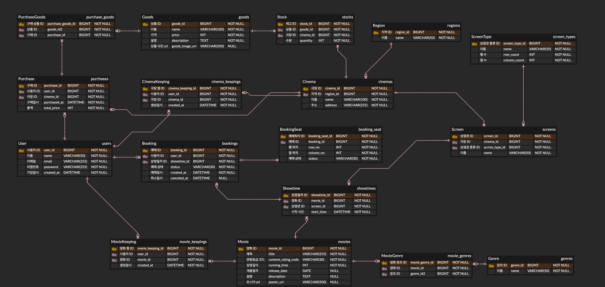
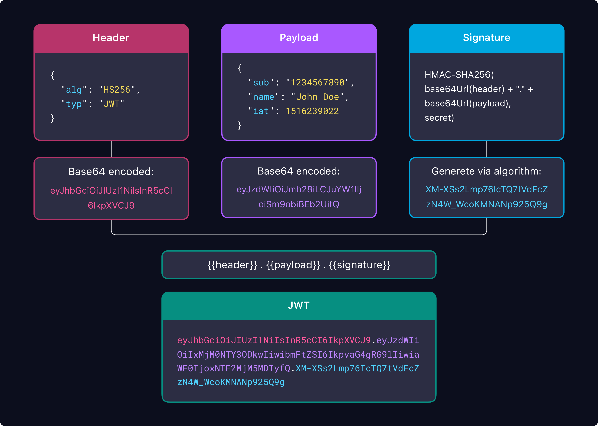

# spring-cgv-24th
CEOS 24기 백엔드 스터디 - CGV 클론 코딩 프로젝트

## ERD

[ERD Cloud 가서 보기](https://www.erdcloud.com/d/aBzYHMExGpfHZXSEE)

- 테이블들의 PK값은 변하지 않도록 별개의 단일 id를 만드는 방식으로 통일했습니다.
  - `@GeneratedValue(strategy = GenerationType.IDENTITY)`
  - 복합키도 사용할 수 있지만, 나중에 로직 단의 코드가 복잡해질 것이라 생각했는데, 리뷰어 분들은 어떻게 생각하시는지 궁금합니다!
- 테이블을 짤 때 가장 고민이 많았던 부분은 예매 관련 부분이었습니다.
  - 현재의 구조에서 예매와 관련된 테이블들은 다음과 같습니다.
    - `Booking`: 예매
    - `BookingSeat`: 예매 시 선택한 좌석(들)
    - `Showtime`: 상영일정, 즉 어떤 영화가 어떤 상영관에서 언제 상영되는지
  - 여기서 `Booking`과 `BookingSeat`가 연결되어 있고, `Booking`과 `Showtime`이 연결되어 있습니다.
  - 하지만 여기서 문제가 발생합니다!
    - 현재의 `BookingSeat`는 행과 열을 저장하지만, 상영일자(`Showtime`)를 저장하지는 않습니다. 그렇기 때문에 DB 단에서 (showtime_id, row_no, column_no)를 한번에 UNIQUE로 처리하지 못합니다.
    - 물론 로직 상으로 처리할 수는 있지만 DB 단에서는 중복예매가 가능하다는거죠.
    - 여기서 제가 생각해본 해결방법은 2가지 였습니다.
      1. `BookingSeat`와 `Showtime` 연결
         → 하지만 이 방식을 사용하면 연결이 돌고 돌아 Booking의 showtime_id와 BookingSeat의 showtime_id이 불일치 할 수 도 있는 상황이 발생합니다.
      2. `BookingSeat`와 `Showtime` 사이에 `ShowtimeSeat` 생성
         → 이 방법은 DB 상으로는 나름..? 깔끔해보이지만 ShowtimeSeat라는게 상영일자가 새로 생길때마다 모든 좌석에 대해 데이터가 생겨야 한다는 번거로움 + 불필요한 데이터 추가 라는 문제가 있습니다.
    - 코드리뷰를 통해, 1번 방식을 보충하는 방향으로 코드를 수정해보았습니다. 설계의 흐름을 정리하면 다음과 같습니다.
      1. **애플리케이션 레벨에서 불일치 방지**
         <br>: BookingSeat의 showtime을 외부에서 직접 세팅하지 않고, `Booking.addSeat()`를 통해서만 생성하도록 했습니다. 이때 `BookingSeat.showtime`은 항상 `Booking.showtime`에서 가져옵니다.
      2. **DB 레벨에서도 불일치 방지**
         <br>: 애플리케이션 코드만으로는 완전한 보장이 어렵기 때문에 `(booking_id, showtime_id)`를 복합 FK로 묶어 두 테이블의 상영 정보가 반드시 일치하도록 하였습니다.
      3. **좌석 중복 예매는 DB UNIQUE로**
         <br>: 같은 showtime + row + column에 활성 예약이 두 개 이상 생기지 못하도록 DB 제약을 두었습니다. 동시 요청이 들어와도 DB가 최종적으로 한 건만 허용하도록 합니다. 
      4. **취소 이력을 남기기 위해 상태값 사용**
      5. **MySQL에서는 active_seat generated column 사용**
         <br>: BOOKED이면 active_seat = 1, 이 외의 상태면 NULL이 되도록 DB가 자동 계산하게 하였습니다. 이후 `UNIQUE(showtime_id, row_no, column_no, active_seat)`를 걸어 현재 점유 중인 좌석만 중복을 막고, 취소/만료 이력은 여러 건 남길 수 있도록 하였습니다. 
      6. **현재 개발 단계에서는 schema.sql 사용**
         <br>: 아직 ddl-auto: create를 유지하고 있으므로 Hibernate가 테이블을 생성한 뒤 schema.sql에서 복합 FK, generated column, UNIQUE INDEX와 같이 코드 상으로 직접 추가하기 번거로운 사항들에 대해 추가 제약을 적용하고, data.sql에서는 더미 데이터만 넣도록 역할을 분리했습니다.

## 구현 코드
- 도메인 별로 개발을 해서 도메인형 구조로 코드를 짜보았습니다. 도메인 별로 개발을 하는데, `controller/`, `service/` 이런 식으로 계층형 구조를 쓰게 되면, 한 도메인과 관련된 코드를 쓰기 위해 모든 계층의 폴더를 열고 닫아야 하는것이 싫어서... 선택해보았습니다. 이 방법보다 계층형이 더 좋다! 하시는 분들의 의견도 궁금합니다.
- `createdAt` 필드가 중복되는 곳이 몇군데 있어서 `BaseEntity`로 JpaAuditing 기능을 분리하였습니다.
- 급하게 짠 코드들이 있어서... 아직 코드가 지저분합니다. 많은 잔소리와 지적... 부탁드립니다

## JWT를 활용한 인증 흐름 정리하기
### ① JWT는 무엇이고, Header·Payload·Signature는 무엇을 할까?

- **Header**
  - JWT에 사용한 서명 알고리즘과 토큰 타입 정보를 담음.
  - `alg`, `typ` 등의 값을 사용함.
  - Header의 `alg` 값을 그대로 신뢰하지 않고 서버가 허용한 알고리즘인지 검증해야 함.
- **Payload**
  - 사용자와 토큰에 대한 정보를 Claim 형태로 저장함.
  - `sub`, `iss`, `aud`, `exp`, `iat`, `role` 등의 정보를 담을 수 있음.
  - Base64URL로 인코딩될 뿐 암호화되는 것은 아니므로 비밀번호나 개인정보 같은 민감 정보는 넣지 않음.
- **Signature**
  - Header와 Payload가 발급 이후 변조되지 않았는지 확인하는 데 사용함.
  - 서버가 신뢰하는 키로 생성된 토큰인지 검증하는 역할을 함.
  - 데이터를 숨기는 암호화 기능은 아님.

### ② Access Token과 Refresh Token의 차이
- **Access Token**
  - 실제 API에 접근할 때 사용하는 토큰.
  - 일반적으로 유효기간을 짧게 설정.
  - API 요청 시 `Authorization: Bearer {token}` 형태로 전달.
- **Refresh Token**
  - 만료된 Access Token을 다시 발급받기 위해 사용하는 토큰.
  - Access Token보다 긴 유효기간을 가짐.
  - 일반 API 요청에는 사용하지 않고 토큰 재발급 요청에 사용.
  - 탈취될 경우 Access Token을 계속 발급받을 수 있으므로 더 안전하게 관리해야 함.
  - 재발급 시 Refresh Token도 새로 교체하는 Rotation 방식을 사용할 수 있음.

### ③ 쿠키, 세션, JWT의 역할
- **Cookie**
  - 브라우저가 값을 저장하고 서버 요청에 전달하는 수단.
  - 인증 방식 자체라기보다 데이터를 저장·전달하는 방법에 가까움.
- **Session**
  - 서버가 로그인한 사용자의 상태를 저장하는 방식.
  - 브라우저는 Session ID를 쿠키로 전달하고 서버는 해당 ID를 이용해 사용자를 찾음.
- **JWT**
  - 클라이언트가 서버에 제시하는 토큰의 형식 중 하나.
  - Claim을 포함하고 있으며 서버는 서명과 Claim을 검증해 사용자를 확인.
  - JWT를 `Authorization` 헤더로 전달할 수도 있고 Cookie에 저장해 전달할 수도 있음.

### 4. CGV 프로젝트의 Access Token에 필요한 Claim

- `sub`
  - 로그인한 사용자의 ID를 저장함.
  - 영화 찜, 예매 조회, 예매 취소 시 현재 사용자를 식별하는 데 사용함.
- `exp`
  - Access Token의 만료 시간을 저장함.
  - 만료된 토큰의 사용을 막음.
- `iat`
  - 토큰이 발급된 시간을 저장함.
- `role`
  - `USER`, `ADMIN` 등 사용자 권한을 구분하는 데 사용함.
  - 관리자 기능 접근 여부를 판단할 때 활용함.
- 필요에 따라 `iss`, `aud` 등을 추가해 올바른 서버가 발급한 토큰인지, CGV API용 토큰인지 확인할 수 있음.
- `movieId`, `reservationId`처럼 계속 바뀌는 데이터는 Access Token에 넣지 않음.
- 예매 취소 시에는 토큰의 `userId`와 DB의 예매 소유자를 비교해 권한을 확인함.

### 5. JWT 검증 결과가 Authentication과 SecurityContext로 연결되는 과정

- 클라이언트가 `Authorization` 헤더에 Access Token을 담아 요청
- JWT Filter가 요청에서 Bearer Token을 추출
- 토큰의 서명, 만료 여부 등을 검증
- 정상적인 토큰이면 Payload에서 `userId`, `role` 등의 정보를 꺼냄
- 해당 정보를 이용해 Spring Security의 `Authentication` 객체를 생성
- 생성한 `Authentication`을 `SecurityContext`에 저장
- `SecurityContextHolder`가 현재 요청의 인증 정보를 관리
- 이후 `AuthorizationFilter`가 `Authentication`의 권한 정보를 이용해 API 접근 가능 여부를 판단
- JWT 방식이 Stateless라면 요청마다 이 과정을 다시 수행

```
JWT 추출
→ JWT 검증
→ 사용자 정보 추출
→ Authentication 생성
→ SecurityContext 저장
→ 권한 확인
→ Controller 실행
```

### 6. 인증과 인가, 401과 403

- **인증(Authentication)**
  - 현재 요청을 보낸 사용자가 누구인지 확인하는 과정
  - 로그인이나 Access Token 검증이 인증에 해당
- **인가(Authorization)**
  - 인증된 사용자가 특정 기능을 사용할 권한이 있는지 확인하는 과정
  - 일반 사용자의 관리자 API 접근이나 다른 사용자의 예매 취소 가능 여부를 검사하는 것이 인가에 해당
- **401 Unauthorized**
  - 정상적인 인증 정보를 확인할 수 없을 때 반환
  - Access Token이 없거나, 만료되었거나, 위조된 경우 등이 해당
- **403 Forbidden**
  - 인증은 정상적으로 되었지만 해당 요청을 수행할 권한이 없을 때 반환
  - `USER`가 관리자 API에 접근하거나 다른 사용자의 예매를 취소하려는 경우 등이 해당
- 정리하면 **401은 “누구인지 확인할 수 없음”, 403은 “누구인지는 알지만 권한이 없음”으로 구분**

## 정상·실패 상황 테스트 결과

| 테스트 상황 | 요청·확인 대상 | 기대 결과 | 실행 결과 |
| --- | --- | --- | --- |
| 올바른 로그인 정보 | `POST /auth/login` | Access Token 발급 | 통과: 200, `accessToken`, `tokenType: Bearer`, `expiresIn: 1800` 반환 |
| 없는 계정 | `POST /auth/login` | 잘못된 비밀번호와 동일한 실패 응답, 토큰 미발급 | 통과: 401 `LOGIN_FAILED`, `accessToken` 없음 |
| 잘못된 비밀번호 | `POST /auth/login` | 없는 계정과 동일한 실패 응답, 토큰 미발급 | 통과: 401 `LOGIN_FAILED`, 두 실패 응답 본문 일치 |
| 토큰 없이 공개 API 호출 | `GET /movies`, `GET /cinemas` | 정상 처리 | 통과: 실제 필터 체인을 거쳐 검증용 조회 컨트롤러의 200 응답 |
| 정상 토큰으로 보호 API 호출 | `POST /bookings`, `POST /movies/10/keep`, `POST /cinemas/10/keep` | 정상 처리 | 통과: 실제 컨트롤러·서비스에서 201, 인증된 회원의 데이터 생성 요청 확인 |
| 토큰 없이 보호 API 호출 | `GET /api/admin/check` 및 찜·예매 요청 | 401 + 공통 JSON | 통과: 401 `TOKEN_NOT_EXIST` |
| 만료된 토큰 | 과거 `exp`로 정상 서명한 토큰으로 보호 API 호출 | 401 + 만료 오류 코드 | 통과: 401 `TOKEN_EXPIRED` |
| 변조된 토큰 | payload의 `ROLE_USER`를 `ROLE_ADMIN`으로 바꾸고 기존 서명 유지 | 401 + 유효하지 않은 토큰 오류 코드 | 통과: 401 `TOKEN_INVALID` |
| 다른 키로 서명한 토큰 | 설정된 검증 키와 다른 키로 서명 후 보호 API 호출 | 401 | 통과: 401 `TOKEN_INVALID` |
| 일반 사용자로 관리자 API 호출 | USER 토큰으로 `GET /api/admin/check` | 403 + 공통 JSON | 통과: 403 `ACCESS_DENIED` |
| 관리자로 관리자 API 호출 | ADMIN 로그인으로 발급받은 토큰으로 `GET /api/admin/check` | 정상 처리 | 통과: 200, 응답 본문 없음 |
| 정상 인증 직후 토큰 없는 요청 | 정상 요청 후 같은 MockMvc에서 토큰 없이 보호 API 재호출 | 이전 인증이 유지되지 않고 401 | 통과: 401 `TOKEN_NOT_EXIST`, 요청 종료 후 인증 컨텍스트 비어 있음 |
