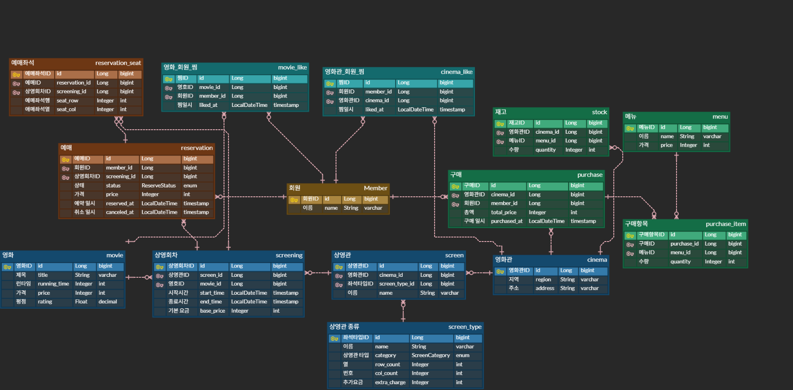

# spring-cgv-24th
CEOS 24기 백엔드 스터디 - CGV 클론 코딩 프로젝트

# 2주차 DB 모델링
<details>
<summary>CGV DB 모델링</summary>
<div markdown="1">

### 요구사항

```
1. 영화관 조회
2. 영화관 찜
3. 영화 조회
4. 영화 예매, 취소
5. 영화 찜
6. 매점 구매 (환불X)
- 기타 기능 설명
    - 모든 영화관에 특별관과 일반관이 존재해요
    - 특별관, 일반관 종류가 같다면 좌석은 동일해요
    - 좌석은 직사각형 형태로 존재해요 (중간에 비어있는 곳 없음, 통로 고려X)
    - 영화관마다 매점이 있으며 재고를 따로 관리해요 (재고는 항상 1 이상이에요)
    - 모든 영화관의 매점 메뉴는 같아요
```


### **회원 도메인 - `Member`**

모든 행위의 주체입니다. 예매, 구매, 찜  3개의 도메인이 전부 회원 테이블과 연관관계(1:N)를 가집니다. 추후 이메일, 소셜 UUID 등 컬럼을 추가할 예정입니다.

### **영화 도메인 - `Movie`, `Cinema`, `Screen`, `ScreenType`, `Screening`**

영화와 영화관의 M:N 관계를 풀기 위해 중간에 Screen(상영관), Screening(상영회차) 중간 테이블을 두었습니다.

최종적으로 **영화 -1:N - 상영회차 - N:1 - 상영관 -N:1 - 영화관** 구조를 설계했습니다.

**`Screening` 테이블**: 하나의 영화는 여러 상영관에서 상영될 수 있고, 하나의 상영관을 여러 영화가 상영될 수 있으므로 중간 테이블을 두어 N:M 관계를 해소하고자 하였습니다.

`SceenType` **테이블**: “종류가 같다면 좌석을 동일하다” → 좌석 배치가 개별 상영관이 아니라 상영관 종류에 딸린 속성입니다. 그래서 좌석을 상영관 종류 안에 넣었습니다.

### **예매 도메인: `Reservation`, `Reservation_seat`**

예매는 영화가 아닌 상영회차를 기리킵니다. 상영회차만 알면, N:1의 흐름을 따라 영화, 상영관, 영화관 정보를 알 수 있습니다.

예매 좌석을 별도 테이블로 둔 이유는 개수입니다. 한 예매에 회원과 상영회차는 하나씩이지만 좌석은 2개를 사면 2개가 되어야합니다. 아래 상품 구매와 구매 항목 테이블 관계와 같습니다.

또한 상영 회차 테이블과의 관계를 따로 추가했습니다. 그 이유는 `(screeing_id, seat_id)` 유니크 제약을 걸기 위해서입니다.

상영회차 FK가 없을 경우에 만약 A(id=7)와 B(id=8)가 동시에 예매를 했다면,

예매좌석 (id=7, 회차=2, 좌석=I행 1열), 예매 (id=8, 회차=2, 좌석=I행 1열)

→ 같은 회차에 대해 중복 좌석이 예약된다.

### **상품 도메인: `Menu`, `Stock`, `Purchase`, `Purchase_item`**

“영화관마다 매점이 있으며 재고를 따로 관리해요” → 영화관:매점을 1:1 관계이지만, “모든 영화관의 메뉴는 같다”이므로 메뉴는 전역 테이블로 설정, 재고는 따로 테이블을 두었기 때문에, 매점 테이블에 남을 컬럼이 `id`와 `cinema_id` 뿐이다. 그래서 매점이라는 개념을 영화관 테이블에 흡수시켰습니다.

상품 구매를 `Purchase`와 `Purchase_item`으로 나눈 이유도 앞선 예매 좌석을 따로 만든 이유와 같습니다.

### **좋아요 도메인 - `Movie_like`, `Cinema_like`**

두 테이블 모두 (member_id, 대상_id) 유니크가 필요합니다. (중복 예방)

</div>
</details>

<details>
<summary>테스트 환경 세팅</summary>
<div markdown="1">

### 1. 테스트 환경을 H2 DB로 세팅

→ 장점: 속도가 빠르다.

→ 단점: 동시성 테스트를 진행하면 mySQL과 H2 실행결과가 다를 수 있다.

### 2. 그래서 mySQL 테스트 스키마를 생성

→ 장점: 실제 운영 테스트와 실행 결과가 같다.

→ 단점: .env 파일을 주입시켜야지 application-test.yaml이 환경변수를 읽을 수 있는데, 현재는 gradle 러너가 테스트를 주관하므로, 환경변수를 주입할 방법이 없다.

만약 Intellij 러너로 바꾸면 환경변수를 주입할 수는 있겠지만, 다른 사람이 CLI에서 gradle test를 진행할 경우에는 테스트가 불가하다.

### 3. gradle 러너에 .env 파일 주입

결국 mySQL 테스트 스키마를 생성하고, gradle 러너가 .env 환경변수를 읽을 수 있도록 build.gradle 파일에 다음과 같은 코드로 설정하여, .env를 읽을 수 있도록 했다.

```java
tasks.named('test') {
	useJUnitPlatform()

	// .env 값을 테스트 JVM 환경변수로 주입한다.
	def envFile = file('.env')
	if (envFile.exists()) {
		envFile.readLines().each { line ->
			def matcher = line =~ /^\s*([A-Za-z_][A-Za-z0-9_]*)\s*=\s*(.*?)\s*$/
			if (matcher.matches()) {
				environment matcher.group(1), matcher.group(2).replaceAll(/^["']|["']$/, '')
			}
		}
	}
}
```

### 4. 실행과 테스트 양쪽에서 동일하게 동작하는 방법

3번 방식까지는 결국, test 태스크에만 적용돼서 bootRun으로 띄울 때는 여전히 `.env`를 못읽고 IDE Run Configuration이나 쉘 export에 의존하게 된다. `.idea`는 gitignore에 있으니 새로 클론한 사람은 실행이 안 되는 상황이 생길 수 있다.

그래서 실행과 테스트 양쪽에서 동일하게 동작할 수 있게 하는 방법 2가지가 있다.

**1. spring.config.import**

스프링 부트가 직접 `.env`를 프로퍼티 소스로 읽게한다. Gradle, IDE, java -jar 환경에 관계없이 Spring이 뜨는 곳이면 어디서나 동작한다.

```yaml
# application.yml
spring:
  config:
    import: optional:file:.env[.properties]
  datasource:
    url: ${DB_URL}
    username: ${DB_USERNAME}
    password: ${DB_PASSWORD}
```

- `.env`는 확장자가 없어서 `[.properties]`로 “properties 형식(key:value)으로 읽어라”라고 알려줘야 한다.
- `optional:`을 붙여야 `.env`가 없는 운영 서버에서도 에러 없이 뜬다.

**2. `spring-dotenv` 라이브러리**

`.env`를 읽는 전용 라이브러리로, 의존성만 추가 하면된다.

**테스트는 Testcontainers로**

로컬 MySQL로 테스트할 때 생기는 문제

1. 사람마다 DB가 다르다. H2를 버린 이유가 “운영과 결과가 다를 수 있어서”였는데, 로컬 MySQL도 버전과 설정이 다르면 같은 문제가 발생하기 때문에
2. 새로 온 사람은 MySQL 설치 → 버전 맞추기 → 스키마 생성 → `.env` 작성까지 해야 `./gradlew test`가 돈다.

테스트가 Docker로 진짜 MySQL을 띄우고, 끝나면 버린다.

```java
@SpringBootTest
@Testcontainers
class ReservationConcurrencyTest {

    @Container
    @ServiceConnection   // Boot 3.1+: 접속 정보를 자동으로 주입
    static MySQLContainer<?> mysql = new MySQLContainer<>("mysql:8.0");
}
```

이러면 테스트에서는 환경변수 자체가 필요 없어진다.

- 접속 URL 계정, 비밀번호를 컨테이너가 만들고 Spring에 직접 넘겨줌
- 버전이 코드에 고정되고 매번 새 DB이다.
- 새로 클론한 사람도 Docker만 있으면 `./gradlew test` 한 번으로 끝.
</div>
</details>


<details>
<summary>2주차 세션 학습 정리</summary>
<div markdown="1">

### 1. Proxy와 N+1 문제의 관계

프록시를 사용하는 이유는 “필요할 때까지 미뤄뒀다가, 필요해지면 가져온다”(`지연로딩`)인다.

근데, 만약 `teamRepository.findById(1L)`을 통해 Team 객체를 찾고, 해당 Team 속한 모든 Member를 조회한다면 → 왜 굳이 프록시를 사용해서 매 Member마다(`N번`) 프록시를 초기화하면서 쿼리를 날리는 거지?

그래서 결국, N+1 문제가 발생하면 지연 로딩을 선택한 이득이 사라지게 되는 것이다. N+1 문제를 원천 차단할 거라면 `fetch join`을 통해 프록시를 도입한 이점을 최대한 살려야 한다.

### 2. Hibernate Proxy와 Spring AOP Proxy의 차이?

```java
@Entity
public class Post {
	@Id
	Long id;
	
	@ManyToOne(fetch = FetchType.LAZY)
	Member author
}
```

`post.getAuthor()`를 호출하면 실제 Member가 아니라 하이버네이트가 런타임에 만든 상속 클래스가 들어있다. 이 객체는 식별자(`id`)만 갖고 있다. → 이게 하이버네이트 프록시.

**Hibernate 프록시**: 아직 안 가져온 데이터. 즉 빈 껍데기일 뿐이다.

**Spring AOP 프록시**: 원랙 객체(`빈`) + 부가 기능을 덧씌운 포장지이다.

### 3. fetch join을 사용하면서 페이징을 적용할 때 발생하는 문제

컬렉션을 fetch join하면 페이징이 메모리에서 동작한다.

→ 조인 결과는 행이 무분별하게 많아지기 때문이다. `Post`가 3개, 각각 댓글이 4, 3, 2개라면 조인 결과는 9행이 된다. 여기에 `limit 2`를 걸면 Post 2개가 아니라 Post 1번의 댓글 2개만 잘린다.

Hibernate는 이걸 하기 때문에 `limit`을 SQL에 넣지 않는다. 대신 전체를 다 읽어와서 애플리케이션 메모리에서 중복 제거 후 잘라낸다. → 결국 OOM이 발생하게 된다.(`MultipleBagFetchException`)

그래서 해결책 = **배치 사이즈**

컬렉션은 fetch join하지 말고, batch 단위로 가져온다.

```yaml
spring:
  jpa:
    properties:
      hibernate:
        default_batch_fetch_size: 100
```

```java
List<Post> posts = postRepository.findAll();  // 100건, Member는 LAZY

for (Post post : posts) {
    post.getAuthor().getName();
}
```

- Member를 in절로 해서 100건을 다 가져온다.

  `select * from Member where id in ( 100 개)`

</div>
</details>

# 3주차 JWT & Spring Security
<details>
<summary>3주차 세션 학습 정리</summary>
<div markdown="1">

## JWT
### 1. 서버가 사용자를 기억하는 방법

| Cookie | 브라우저가 값을 저장하고 요청에 실어 보내는 수단 |
| --- | --- |
| Session | 서버가 사용자 상태를 보관하고 Session ID로 찾는 방식 |
| Token | 클라이언트가 서버에 제시하는 증표 |
| JWT | Claim을 담는 토큰의 표준 형식 중 하나 |

로그인 유지 방식에는 `1. 서버에 인증 상태를 저장하는 **세션 기반 방식**`과 `2. **JWT의 서명과 내용을 검증하는 토큰 기반 방식` 두 가지가 존재한다.**

- **쿠키 보안 속성**


    | 속성 | 역할 | 비고 |
    | --- | --- | --- |
    | `HttpOnly` | JS로 접근 차단 → XSS로 쿠키 탈취 방지 |  |
    | `Secure` | HTTPS 연결에서만 전송 |  |
    | `SameSite` | 다른 사이트에서 출발한 요청에 쿠키를 붙일지 결졍 → CSRF 방어 | `Strict`, `Lax`, `None` |

**a) 쿠키는 인증 방식일까? 전달 수단일까? → 전달 수단이다.**

- 인증 방식 (무엇을 들고 다니나) → 세션 ID, JWT와 같은 토큰
- 전달 수단 (어떻게 보내나) → 쿠키, Authorization 헤더

**b) AT는 반드시 JWT여야 할까? → AT 형식은 정해져 있지 않다.**

- OAuth 2.0은 AT를 “보호된 리소스에 접근하기 위한 자격 증명 문자열”로만 정의하고, 내부 구조는 규정하지 않는다.
- 대표적인 두 가지 형식
  1. JWT (자체 포함형)

     토큰 안에 사용자 ID, 권한, 만료 시간이 들어있고 서명되어 있다. 서버는 `서명만 검증`하면 Db 조회 없이 식별한다. JWT의 단점은 **`즉시 무효화`**이다. 그래서 JWT AT는 만료 시간을 짧게 잡고, RT로 재발급하는 구조가 일반적이다.

  2. Opaque Token (참조형)

     의미 없는 랜덤 문자열. 그 자체로는 정보가 없고, `서버가 Redis나 DB에서 이 값으로 조회`해야 사용자 정보를 얻는다. 세션 ID도 구조적으로는 해당 토큰의 일종이다.


### 2. JWT란?

- **Header**: 토큰에 적용된 암호학적 처리 정보를 담는다.
  - `alg`: 서명 생성, 검증에 사용하는 알고리즘
  - `typ`: 토큰 타입 힌트

  헤더에 적인 `alg`를 아무 검증 없이 신뢰해서는 안되고, **서버가 허용할 알고리즘을 미리 제한해야 한다.**

- **Payload와 Claim**: Payload에는 전달할 Claim(정보)이 들어간다.


    | Claim | 의미 | 검증 시 질문 |
    | --- | --- | --- |
    | `iss` | 발급자 |  |
    | `sub` | 주체 | 누구를 나타내는가? |
    | `aud` | 수신 대상 |  |
    | `exp` | 만료 시각 |  |
    | `nbf` | 사용 가능 시작 시각 |  |
    | `iat` | 발급 시각 |  |
    | `jti` | 토큰 식별자 | 특정 토큰을 구별해야 하는가? |
- **Signature**: Header와 Payload가 발급 이후 변조되지 않았는지 확인한다.

  `서명은 암호화가 아니다.` Payload 내용은 디코딩으로 읽을 수 있다. 단지, 키 없이 내용을 바꾼 토큰이 정상 검증되는 것을 막는 용도이다.


**a) CGV 클론 프로젝트의 AT에 담을 Claim 정보들**

- `sub`, `exp`, `iat`, `jti`(로그아웃 블랙리스트의 키), `role`(역할), `typ`(토큰 타입)

### 3. JWT 생성과 검증

서버는 Signature만 확인하면 안된다. 토큰 형식, `exp`, nbf, 토큰 타입 모두 확인해야 한다.

**알고리즘 HS256, RS256**

| 알고리즘 | HS256(**(HMAC-SHA256)** | RS256 |
| --- | --- | --- |
| 방식 | 대칭키 | 비대칭키 |
|  | 발급과 검증에 같은 비밀키를 쓴다. 
키를 가진 쪽은 토큰을 검증할 수도, 만들 수도 있다. | 개인키로 서명하고 공개키로 검증한다. 
검증하는 쪽은 토큰을 위조할 수 없다. |
|  | 만드는 열쇠와 확인하는 열쇠가 같다. | 만드는 열쇠와 확인하는 열쇠가 다르다. |
- CGV 클론처럼 서버 하나가 발급도 하고 검증도 하는 구조라면 HS256이 적절하다.
- 여러 서비스가 토큰을 검증해야 하는 MSA 구조라면, 검증 서비스마다 비밀키를 나눠 주는 게 위험하니까 RS256을 고려하게 된다.

  즉, 인증 서버만 Private Key(개인키)를 가지고, 나머지 서버는 Public Key(공개키)를 가져서 예매 서버의 공개키가 노출되더라고 공격자는 토큰의 진위를 확인할 수 있을 뿐, 새로운 정상 JWT를 만들 수 없다.


### 4. AT 저장 위치

HTTP 헤더로 전달 `Authorization: Bearer {AT}` Bearer Token은 가진 사람이 사용할 수 있는 증표이다.

**AT를 저장하는 위치 - 단일 정답이 없다**

| 방식 | 장점 | 단점 |
| --- | --- | --- |
| 브라우저 메모리 | 새로고침 및 종료 시 사라짐.
장기 노출 감소 | 새로고침 시 복구 전략 필요
실행 중 XSS가 요청에 악용 가능 |
| localStorage | 구현과 유지가 쉬움 | JS로 접근 가능하여 XSS시 탈취 위험 |
| sessionStorage | 탭 종료 시 삭제 | JS로 접근 가능하여 XSS시 탈취 위험 |
| HttpOnly Cookie  | JS가 토큰 값을 못 읽음 | 요청에 자동 첨부되므로 CSRF 고려 |
- **CSRF** (Cross Site Request Forgery) : 사이트 간 요청 위조

    ```jsx
    <!-- evil.com 페이지 -->
    <form action="https://cgv-clone.com/api/reservations/123/cancel" method="POST">
    </form>
    <script>document.forms[0].submit();</script>
    ```

  - 사용자가 CGV 클론에 로그인된 채로 위 페이지를 열면, 브라우저가 요청에 쿠키를 자동으로 붙여 보낸다. 서버는 정상 로그인 사용자의 요청으로 보고 예매를 취소한다.
  - 핵심은 공격자가 쿠키를 볼 수 없다는 점이다. 훔치는 게 아니라 브라우저의 자동 전송(`쿠키`)을 이용하는 것.
  - 방어 방법 = SameSite 쿠키: `Lax`, CSRF 토큰 (스프링 시큐리티가 해줌)
- **XSS** (Cross Site Scripting)

  CGV 사이트에 악성 스크립트를 심어서, 다른 사용자의 브라우저에서 실행되게 하는 공격

    ```jsx
    <!-- 공격자가 리뷰 내용으로 입력 -->
    재밌어요! 
    ```

  서버가 위 코드를 그대로 저장하고, 프론트가 그대로 HTML로 렌더링하면, 리뷰를 보는 모든 사용자의 브라우저에서 스크립트가 실행된다. 스크립트는 localStorage, API 호출까지 전부 할 수 있다.


### 5. RT

- RT는 반드시 JWT일 필요는 없다.
- 로그아웃, 탈취 대응, 기기별 세션 관리가 필요하면 서버 저장 상태가 생길 수 있기에, `JWT를 사용하면 서버가 완전한 Stateless가 된다는 것은 아니다.`

**RTR (Refresh Token Totation)**

RT를 사용할 때 마다 새 RT를 발급하고, 사용한 토큰은 무효화하는 방식이다.

만약 무효화된 RT가 다시 들어온다면? → **재사용 탐지**. 탈취가 의심되면 서버는 해당 로그인에서 이어져 나온 RT들을 함께 폐기하고 다시 로그인하도록 한다. 이 토큰들의 연결을 `토큰 계열(Token Family)`라고 부른다.

재사용을 탐지하려면 토큰의 서명과 만료 시간만 확인해서는 부족하다. 서버에 토큰의 사용, 폐기 상태가 필요하다.

| 정보 | 목적 |
| --- | --- |
| 사용자 ID | 누구의 로그인인지 확인 |
| 로그인 세션 ID | 기기별 로그인을 구분 |
| jti | 제시된 토큰을 확인 |
| 만료 시각 | 사용 기간 제한 |
| 사용, 폐기 상태 | 이전 토큰 재사용 거부 |
| 토큰 계열 ID | 탈취 시 관련 토큰 함께 폐기 |

재발급 처리는 원자적으로 수행해야 한다. (`기존 토큰 유효성 검증 → 새 토큰 발급 후 저장이 한 묶음으로`)

**로그아웃 시, AT를 블랙리스트로**

RT를 폐기하면 이후 새로운 AT 발급은 막지만, 기존 AT는 만료 전까지 유효하다. AT를 무효화해야 한다면 블랙리스트 같은 추가 설계가 필요하다.

## Spring Security

### 1. 전체 흐름

1. 클라이언트 요청
2. 서블릿 컨테이너 필터 체인 → `DelegatingFilterProxy`

   서블릿 컨테이너는 스프링 빈 존재를 모른다. → `DelegatingFilterProxy`가 **서블릿 ↔ 스프링 컨텍스트를 연결하는 다리 역할**을 하여, `SpringSecurityFilterChain` 빈에게 처리를 위임한다.

3. `FilterChainProxy`가 `SecurityFilterChain` 선택
4. 선택된 체인의 필터들이 순차대로 실행

### 2. 주요 필터 순서

```jsx
... -> AnonymousAuthenticationFilter -> ExceptionTranslationFilter
-> AuthorizationFilter -> DispatcherServlet
```

`ExceptionTranslationFilter`가 `AuthorizationFilter`보다 앞에 있다. 즉, 예외처리 필터는 인증 필터를 감싸고 있는 try/catch문.

```jsx
// ExceptionTranslationFilter 구조
try {
	chain.doFilter(req, res);
} catch (AuthenticationException e) {
    // → AuthenticationEntryPoint 호출
} catch (AccessDeniedException e) {
    // → AccessDeniedHandler 호출
}
```

### 3. 인증 API

```java
@Bean
public SecurityFilterChain securityFilterChain(HttpSecurity http) ... {

	http
		.cors(Customizer.withDefaults())
		.csrf(AbstrachHttpConfigurer::disable)
		.formLogin(...)
		...
	
	return http.build();
}

@Bean
public PasswordEncoder passwordEncoder() {
	return PasswordEncoderFactories.createDelegatingPasswordEncoder();
}
```

- `Customizer.withDefaults()` → 해당 기능을 Spring Security 기본값으로 설정
- `AbstractHttpConfigurer::disable` → 해당 기능을 비활성화
- `csrf().disable()`을 해도 되는 경우 / 안되는 경우

  인증 정보가 브라우저에 의해 자동 전송되면 CSRF를 끄면 안된다.

  | 인증 정보 위치 | 자동 전송 | CSRF |
      | --- | --- | --- |
  | 세션 쿠키 | 자동 | 끄면 안됨 |
  | 쿠키에 담은 JWT | 자동 | 끄면 안됨 |
  | `Authorization: Bearer` 헤더 | 수동 | 꺼도 됨 |

  커스텀 헤더는 브라우저가 알아서 붙여주지 않으므로, 악성 사이트가 요청을 위조해도 토큰이 실리지 않는다. (RT는 앞으로 커스텀 헤더를 통해 받아야할듯)

- PasswordEncoder는 `DelegatingPasswordEncoder`를 사용해야 한다.

  `BCryptPasswordEncoder`를 쓰면 접두사가 없어 마이그레이션 경로를 잃는다.


### 4. 인가 API

```java
http
    .authorizeHttpRequests(requests -> requests
        .requestMatchers("/public/**", "/error").permitAll()
        .requestMatchers("/admin/**").hasRole("ADMIN")
        .requestMatchers(HttpMethod.GET, "/posts/**").permitAll()
        .requestMatchers(HttpMethod.POST, "/posts/**").authenticated()
        .anyRequest().authenticated()
    )
```

- `requestMatchers`는 위에서 아래로, 첫 번째 매칭만 적용. 그 뒤는 무시.

| 메서드 | 전달값 | 실제 비교 대상 |
| --- | --- | --- |
| hasRole(”ADMIN”) | 접두사 없이 | `ROLE_ADMIN` |
| hasAuthority(”ROLE_ADMIN”) | 접두사 포함 | `ROLE_ADMIN` |
- 보통 DB에는 ADMIN만 저장하고 코드에서 `ROLE_`을 붙이는 방식이 흔하다.

### 5. JWT Authentication Filter

1. 필터에 `@Component`를 붙이지 않는다.

   → 스프링이 필터 빈을 서블릿 컨테이너에도 자동 등록 → 필터가 2회 실행된다.

   해결 방법: `SecurityConfig`에서 `new`로 생성

    ```java
    http
    	.addFilterBefore(new JwtAuthenticationFilter(jwtUtil), UsernamePasswordAuthenticationFilter.class)
    ```

2. 토큰 검증을 예외 기반으로 (boolean 반환 x) → 만료와 위조를 구분할 수 없기에.
3. `createEmptyContext()`+`setContext()` -> 스프링 권장 패턴

**`JwtAuthenticationFilter`를 `UsernamePasswordAuthenticationFilter` 앞에 놓는 이유**

해당 위치가 “인증을 시도하는 자리”이기 때문이다. `SecurityContext`를 먼저 채워두면 뒤에 있는 `AnonymousAuthenticationFilter`는 이미 인증 객체가 있는 걸 보고 anonymous 토큰을 넣지 않고, `AuthorizationFilter`는 인증 객체로 권한을 판단한다.

### 6. CustomUserDetails 구현하기

```java
@Getter
@AllArgsConstructor
public class CustomUserDetails implements UserDetails {
	
	private final Long userId;
	private final Role role
	
  @Override
  public Collection<? extends GrantedAuthority> getAuthorities() {

      Collection<GrantedAuthority> collection = new ArrayList<>();
      collection.add((GrantedAuthority) () -> "ROLE_" + role.name());
      return collection;
  }
  
  @Override
  public String getUsername(){
	  return String.valueOf(userId); // authentication.getName()이 반환하는 값
  }
}
```

### 7. 로그인한 사용자 정보 가져오기

**i. @AuthenticationPrincipal**

```java
@GetMapping("/reviews")
public ApiResponse<> getReview(
	@AuthenticationPrincipal CustomUserDetails user){
		Long memberId = (user != null) ? user.getMemberId() : null;
		return ApiResponse.onSuccess(REVIEW.OK, memberId);
}
```

**ii. 커스텀 어노테이션**

```java
@Target(ElementType.PARAMETER)
@Retention(RetentionPolicy.RUNTIME)
public @interface LoginMember {
	boolean required() default true;
}
```

### 8. RBAC (Role-Based Access Control / 역할 기반 엑세스 제어)

사용자에게 Role을 부여하고, 해당 역할이 수행할 수 있는 작업에 대한 권한을 제어하는 시스템

1. **SecurityFilterChain 인가 API 기반**

```java
http.authorizeHttpRequests(requests -> requests
    .requestMatchers("/public/**").permitAll()
    .requestMatchers("/admin/**").hasRole("ADMIN")
    .requestMatchers("/manager/**").hasAnyRole("ADMIN", "MANAGER")
    .requestMatchers("/user/**").hasRole("USER")
    .anyRequest().authenticated()
);
```

1. **메서드 기반 (@PreAuhtorize)**

```java
@Configuration
@EnableMethodSecurity
public class SecurityConfig() {}

@RestController
public class AdminController {

	@PreAuthorize("hasRole('ADMIN')")
	@GetMapping
	public // 컨트롤러 메서드
}
```

### 9. 401/403을 공통 응답 포맷으로 내려보내기

기존에는 `CustomEntryPoint`와 `CustomAccessDenied` 이렇게 두 곳에서 응답을 만들어 내서 유지보수성이 떨어졌다.

**HandlerExceptionResolver에 위임**

- HandlerExceptionResolver는 원래 SpringMVC에서 컨트롤러 실행 중 발생한 예외를 HTTP 응답으로 바꿔주는 인터페이스이다.

  `ExceptionHandlerExceptionResolver` → `@RestControllerAdvice` 즉, 지금까지의 `@RestControllerAdvice`의 `@ExceptionHandler`들이 실제로 동작하는 뒷단의 엔진이 이것이었다.

  평소에는 DispatcherServlet이 호출해 주던걸, DispatcherServlet이 아직 등장하지도 않은 필터 단계에서 예외 핸들러를 부른 것이다. 즉, “빌려 쓴것” (그 결과, 포맷 관리 지점이 한 곳으로 줄어든다.)


```java
@Component // 인증 예외 처리기
@RequiredArgsConstructor
public class CustomAuthenticationEntryPoint implements AuthenticationEntryPoint {

		@Qualifier("handlerExceptionResolver")
    private final HandlerExceptionResolver resolver;

    @Override
    public void commence(HttpServletRequest request, HttpServletResponse response,
                         AuthenticationException authException) {
                         
        Object exception = request.getAttribute("exception");
        BaseErrorCode errorCode = (exception instanceof BaseErrorCode ec)
                ? ec : GeneralErrorCode.UNAUTHORIZED;
                
        resolver.resolveException(request, response, null, new ProjectException(errorCode));
    }
}

@Component // 인가 예외 처리기
@RequiredArgsConstructor
public class CustomAccessDeniedHandler implements AccessDeniedHandler {
	
		@Qualifier("handlerExceptionResolver")
    private final HandlerExceptionResolver resolver;

    @Override
    public void handle(HttpServletRequest request, HttpServletResponse response,
                       AccessDeniedException accessDeniedException) {
                       
        BaseErrorCode errorCode = GeneralErrorCode.FORBIDDEN;
        
        resolver.resolveException(request, response, null, new ProjectException(errorCode));
    }
}

// 전역 핸들러
@RestControllerAdvice
public class GlobalExceptionHandler {

    @ExceptionHandler(ProjectException.class)
    public ResponseEntity<ErrorResponse> handle(ProjectException e) {
        ErrorCode errorCode = e.getErrorCode();
        return ResponseEntity.status(errorCode.getStatus())
	        .body(ApiResponse.onFailure(...));
    }
}
```

- `@Qualifier("handlerExceptionResolver")`가 필수이다. 없으면 다른 리졸버 빈이 주입되어 아무 일도 하지 않는다.
</div>
</details>

<details>
<summary>Redis를 활용하여 AT 블랙리스트, RT 관리하기</summary>
<div markdown="1">

### 1. Redis를 사용하는 이유

1. 조회 빈도

   블랙리스트 조회는 모든 API 요청마다 필요하다. Redis는 인메모리이기 때문에 조회 latency가 RDMS보다 현저히 작아진다.

2. 수명

   만료된 블랙리스트들은 자동 삭제되어야 한다. Redis에는 TTL이 내장되어있어 자동으로 만료된 블랙리스트들이 삭제된다.


### 2. 의존성 추가

**build.gradle**

```bash
implementation 'org.springframework.boot:spring-boot-starter-data-redis'
```

`StringRedisTemplate` 빈이 자동 등록된다. (RedisConfig 설정 클래스를 따로 추가하지 않아도 된다.) → key:value를 전부 String으로 다룰거라 가능.

만약 추후, <String, Object> 형태로 Redis에 담는다면 RedisConfig 설정 클래스를 추가해야한다.

**application.yaml**

```yaml
spring:
	data:
		redis: localhost
		port: 6379
```

### 3. 프롬프트

```
이제 Redis를 활용해서 로그아웃, 회원탈퇴로 인해 만료된 AT와 계정 탈취 감지를 방지하기 위한 RT를 관리하는 기능을 개발할거야. 아래는 내가 생각하는 조건인데, 표준 실무에 맞추어 잘못된 부분은 피드백해줘.

Redis를 이용해서 블랙리스트 AT와 RT를 관리할거야. 먼저 기존 사용자가 로그아웃 혹은 회원탈퇴를 진행했을 경우 해당 회원의 AT를 만료시켜야하기 때문에, Redis에 해당 AT와 RT를 추가할거야. 그러기 위해서는 AT의 형태는 키=bl:{jti}, 값=”logout”이 될거야. 또한, TTL (AT의 남은 수명) 필드도 추가할거야. 그래서 만료된 AT를 헤더에 포함해서 요청을 보낼 경우, Redis에서 해당 토큰의 jti가 있는지 를 확인(JwtAuthenticationFiler안, parseAT 직후에)하고 만약 Redis에 해당 jti가 존재한다면, 다시 로그인하라는 에러 응답을 보내고, Redis에 해당 jti가 존재하지않는다면 다음 필터로 넘길거야.
RT는 먼저 한 회원당 하나의 RT만을 갖는다고 전제해. 그리고 RTR 방식을 사용하지. 그래서 AT가 새로 발급되면 RT도 새롭게 응답이 갈거야. 그리고 새로 발급된 RT는 Redis에 저장할거야. RT의 형태는 키=rt:{memberId}, 값={해시된 RT값}가 될거야. RT를 복원할 일은 없기 때문에 SHA-256으로 해싱 값을 저장할거야. 결국, /auth/reissue 요청이 올 때면, Redis에서 쿠키에 담긴 RT와 대조하고 일치하면 AT와 RT를 재발급하도록 할거야. 그리고 만료되지 않은 구세대 RT의 재사용 탐지도 진행할 거야. 만약 Redis에 만료되지 않은 구세대 RT(즉, Redis에 현재 저장된 RT와 다른 토큰)의 요청이 왔다면, 계정 탈취를 의심 -> 해당 회원의 RT를 삭제 및 로그인 경로로 이동하게끔 할거야.
```
- AT와 RT 모두 jti 클레임을 넣어야 한다.

  JWT는 {header}와 {payload}를 비밀키를 섞어 해싱한 값이다. 해시는 같은 입력에 항상 같은 출력을 낸다.
  이때, payload에 들어가는 ‘시간 클레임’이 초 단위이다. JWT의 `iat`, `exp`는 초 단위 정수이다. 같은 회원이 같은 초 안에 두 번 발급받으면 토큰이 완전히 같아진다.
  그래서 UUID를 이용해 Jti 클레임을 넣는다. → 그래서 AT는 레디스에서 Jti로 식별할 수 있게 된다. RT는 마찬가지로 재발급될 때, 같은 토큰이 나오지 않게 하기 위함이다.


**흐름 정리**

```java
로그인
	-> AT, RT 발급 (RT는 redis에 저장)
	
로그아웃
  → bl:{AT의 jti} 저장 (TTL = AT 잔여 수명)
  → rt:{memberId} 삭제
  → RT 쿠키 만료 지시 (maxAge=0)

회원탈퇴
  → 위와 동일 + 회원 soft delete

API 요청
  → parseAT (서명·만료)
  → bl:{jti} 존재? → 401
  → SecurityContext 설정

재발급
  → parseRT
  → rt:{memberId} 조회
      없음 → 401 (로그아웃 상태)
      불일치 → 삭제 + 401 (탈취 의심)
      일치 → 새 AT + 새 RT, 레디스·쿠키 갱신
```

### 4. AT와 RT 자료구조 정하기

```java
// **AT 블랙리스트**
키: bl:{jti}
타입: String
값: "logout"
TTL: 해당 AT의 남은 수명 (만료 시각 - 현재 시각)

// RT
키: rt:{memberId}
타입: String
값: sha256Hex (RT 원문 해시값)
TTL: RT 유효기간 (14일) - 재발급마다 갱신
```

### 5. 로그인 성공 후 발급된 RT를 Redis에 저장하기

**RefreshTokenRepository**

```java
// AuthService
// 발급된 RT는 Redis에 저장
refreshTokenRepository.save(principal.getMemberId(), RT, Duration.ofSeconds(jwtUtil.getRtValiditySeconds()));

private final StringRedisTemplate redisTemplate;

    /***
     * 함수 기능: 발급한 RT를 Redis에 저장한다.
     * @param memberId 회원 식별자
     * @param refreshToken 저장할 RT 원문
     * @param ttl 키 만료 시간
     */
    public void save(Long memberId, String refreshToken, Duration ttl){
        redisTemplate.opsForValue().set(
                "rt:" + memberId, hash(refreshToken), ttl
        );
    }

    /***
     * 함수 기능: RT 원문을 SHA-256으로 해싱한다.
     * @param token 해싱할 RT 원문
     * @return 64자 소문자 hex 문자열
     */
    private String hash(String token){
        try {
            // SHA-256 구현체를 얻는다.
            MessageDigest digest = MessageDigest.getInstance("SHA-256");

            // 토큰을 UTF-8 바이트로 바꿔 해싱한다. 결과는 항상 256비트이다.
            byte[] hashed = digest.digest(token.getBytes(StandardCharsets.UTF_8));

            // 256비트를 64자 소문자 hex로 변환한다.
            return HexFormat.of().formatHex(hashed);
        } catch (NoSuchAlgorithmException e) {
            throw new IllegalStateException("SHA-256 알고리즘을 사용할 수 없습니다." + e);
        }
    }
```

#### 5-1. AT는 응답 본문, RT는 쿠키에 담아 응답하기

```java
// TokenIssueResult
public record TokenIssueResult<T>(
        T body,
        String refreshToken
) {}

// LoginResponse
@Builder
public record LoginResponse(

        AtInfo atInfo,
        MemberInfo memberInfo
){

    public static LoginResponse of(AtInfo atInfo, MemberInfo memberInfo){
        return LoginResponse.builder()
                .atInfo(atInfo)
                .memberInfo(memberInfo).build();
    }

    @Builder
    public record AtInfo(
            String accessToken,
            String tokenType,
            Long expiresIn
    ){
        public static AtInfo of(String accessToken, String tokenType, Long expiresIn){
            return AtInfo.builder()
                    .accessToken(accessToken)
                    .tokenType(tokenType)
                    .expiresIn(expiresIn).build();
        }
    }

    @Builder
    public record MemberInfo(
            Long memberId,
            String name,
            String email
    ){
        public static MemberInfo from(Member member){
            return MemberInfo.builder()
                    .memberId(member.getId())
                    .name(member.getName())
                    .email(member.getEmail())
                    .build();
        }
    }
}

// AuthService
/***
 * 함수 기능: 로그인을 수행한다. 성공 시, AT(Response Body)와 RT(Cookie)가 반환된다.
 * @param request 로그인 요청 (이메일, pw)
 * @return TokenIssueResult AtInfo, MemberInfo, RT
 */
public TokenIssueResult<LoginResponse> login(LoginRequest request) {

    try {
        UsernamePasswordAuthenticationToken unauthenticatedToken = UsernamePasswordAuthenticationToken.unauthenticated(request.email(), request.password());

        Authentication authentication = authenticationManager.authenticate(unauthenticatedToken);
        CustomUserDetails principal = (CustomUserDetails) authentication.getPrincipal();

        // 인증 후, JwtUtil을 통해 AT, RT 발급
        String AT = jwtUtil.createAT(principal.getMemberId(), principal.getRole());
        String RT = jwtUtil.createRT(principal.getMemberId());

        // 발급된 RT는 Redis에 저장
        refreshTokenRepository.save(principal.getMemberId(), RT, Duration.ofSeconds(jwtUtil.getRtValiditySeconds()));

        // AT는 응답 형식에 맞춰 반환, RT는 컨트롤러에서 쿠키에 담아 응답함.
        LoginResponse.AtInfo atInfo = LoginResponse.AtInfo.of(AT, "AT", jwtUtil.getAtValiditySeconds());

        // 인증객체를 통해 회원 조회
        Member member = memberRepository.findById(principal.getMemberId())
                .orElseThrow(() -> new MemberException(MemberErrorCode.MEMBER_NOT_FOUND));
        LoginResponse.MemberInfo memberInfo = LoginResponse.MemberInfo.from(member);

        return new TokenIssueResult<>(LoginResponse.of(atInfo, memberInfo), RT);
    } catch (BadCredentialsException e){
        throw new AuthException(AuthErrorCode.INVALID_CREDENTIALS);
    } catch (AuthenticationException e){
        log.warn("[로그인 실패] {}", e.getMessage());
        throw new AuthException(AuthErrorCode.AUTHENTICATION_FAILED);
    }
}

// CookieUtil
@Component
public class CookieUtil {

    @Value("${jwt.rt-validity}") private long rtValidityMillis;

    /***
     * 함수 기능: RT를 담은 쿠키를 응답 헤더에 추가한다.
     * @param response 쿠키를 실을 응답 객체
     * @param refreshToken 쿠키에 담을 RT 원문
     */
    public void setRtCookie(HttpServletResponse response, String refreshToken){

        ResponseCookie cookie = ResponseCookie.from("refreshToken", refreshToken)
                .httpOnly(true)
                .secure(false)
                .sameSite("Lax")
                .path("/api/auth/reissue")
                .maxAge(Duration.ofMillis(rtValidityMillis))
                .build();

        response.addHeader(HttpHeaders.SET_COOKIE, cookie.toString());
    }
}

// AuthController
@SecurityRequirements
@Operation(summary = "로그인", description = "로그인을 진행합니다.")
@PostMapping("/login")
public ApiResponse<LoginResponse> login(
        @Valid @RequestBody LoginRequest request,
        HttpServletResponse response
        ){

    TokenIssueResult<LoginResponse> result = authService.login(request);
    cookieUtil.setRtCookie(response, result.refreshToken());

    return ApiResponse.onSuccess(AuthSuccessCode.LOGIN_OK, result.body());
}
```

### 6. /api/auth/reissue를 통해 AT, RT 재발급받기

```java
/*** RefreshTokenRepo
 * 함수 기능: 제시된 RT가 저장된 값과 일치하는지 대조한다.
 * @param memberId 회원 식별자
 * @param refreshToken 대조할 RT 원문
 * @return 일치 여부를 구분한 상태값 (NOT_FOUND, VALID, MISMATCH)
 */
public RefreshTokenStatus verify(Long memberId, String refreshToken){

    String hashedRt = redisTemplate.opsForValue().get("rt:" + memberId);

    if (hashedRt == null){
        return RefreshTokenStatus.NOT_FOUND;
    }

    return hashedRt.equals(hash(refreshToken)) ? RefreshTokenStatus.VALID : RefreshTokenStatus.MISMATCH;
}

/***
 * 함수 기능: 해당 회원의 RT를 삭제한다. 재사용 감지와 로그아웃에서 사용.
 * @param memberId 회원 식별자
 */
public void delete(Long memberId){
    redisTemplate.delete("rt:" + memberId);
}

/*** AuthService
 * 함수 기능: RT를 검증하고 AT와 RT를 재발급한다. 사용된 RT는 폐기된다. (RTR)
 * @param refreshToken 쿠키로 전달된 RT 원문
 * @return 새 AT를 담은 응답 바디와 쿠키로 내려보낼 새 RT
 */
public TokenIssueResult<ReissueResponse> reissue(String refreshToken) {

    // refreshToken 쿠키가 오지 않은 경우
    if (!StringUtils.hasText(refreshToken)){
        throw new AuthException(AuthErrorCode.RT_COOKIE_MISSING);
    }

    // 제시된 RT 검증
    Claims claims = jwtUtil.parseRT(refreshToken);
    Long memberId = Long.parseLong(claims.getSubject());

    // Redis에 담긴 RT와 제시된 RT를 비교 후 분기
    // NOT_FOUND = 로그아웃 혹은 무효화된 세션 -> 재로그인 유도
    // MISMATCH = 재사용 감지 -> RT 폐기 후 재로그인 유도
    // VALID = 정상 로직
    RefreshTokenStatus status = refreshTokenRepository.verify(memberId, refreshToken);

    if (status == RefreshTokenStatus.NOT_FOUND){
        throw new AuthException(AuthErrorCode.RT_NOT_FOUND);
    } else if (status == RefreshTokenStatus.MISMATCH){
        log.warn("[RT 재사용 감지] memberId={}", memberId);
        refreshTokenRepository.delete(memberId);
        throw new AuthException(AuthErrorCode.RT_REUSE_DETECTED);
    }

    // 새 토큰 발급 후, RT는 Redis에 저장
    Member member = memberRepository.findById(memberId)
            .orElseThrow(() -> new MemberException(MemberErrorCode.MEMBER_NOT_FOUND));

    String newAt = jwtUtil.createAT(memberId, member.getRole());
    String newRt = jwtUtil.createRT(memberId);

    refreshTokenRepository.save(memberId, newRt, Duration.ofSeconds(jwtUtil.getRtValiditySeconds()));

    // 응답 생성
    LoginResponse.AtInfo atInfo = LoginResponse.AtInfo.of(newAt, TokenType.AT, jwtUtil.getAtValiditySeconds());
    return new TokenIssueResult<>(new ReissueResponse(atInfo), newRt);
}
```

- `JwtAuthenticationFilter`에서 `parseRT()`를 수행하면 안되고, `AuthService`에서 수행한다.

  `/reissue`는 인증을 요구하지 않는다. 만약, 잘못된 RT(서명 오류, 타입 불일치 등)를 제시하여도 `attribute`에는 기록되지만 `doFilter`에 의해 체인이 계속되고 결국 컨트롤러까지 도달하게 된다.
  또한 전역 필터에 단일 엔드포인트 전용 로직이 들어가면 안된다. `JwtFilter`는 `OncePerRequestFilter`라 모든 요청에 실행된다. RT 검증이 필요한 곳은 `/reissue`하나뿐이다. 그리고 재발급은 “인증”이 아니라 “토큰 교환”이다.


### 7. 로그아웃 시, AT를 블랙리스트에 추가하고 RT를 폐기하기

```java
/*** TokenBlacklistRepo
 * 함수 기능: AT의 jti를 블랙리스트에 등록한다.
 * @param jti 차단할 AT의 jti 클레임
 * @param ttl AT의 잔여 수명
 * @param reason 차단 사유
 */
public void blacklist(String jti, Duration ttl, String reason){

    // 이미 만료된 AT는 저장 x
    if (ttl.isZero() || ttl.isNegative()){
        return;
    }
    redisTemplate.opsForValue().set(
            "bl:" + jti, reason, ttl
    );
}

/***
 * 함수 기능: 해당 jti가 블랙리스트에 등록되어있는지 확인한다.
 * @param jti 확인할 AT의 jti 클레임
 * @return 등록되어 있으면 true
 */
public boolean isBlacklisted(String jti){

    try {
        return Boolean.TRUE.equals(redisTemplate.hasKey("bl:" + jti));
    } catch (DataAccessException e){
        log.error("[블랙리스트 조회 실패] Redis 장애로 검사를 생략합니다.", e);
        return false;
    }
}

/*** AuthService
 * 함수 기능: 로그아웃을 수행한다. RT를 폐기해 재발급을 막고, 현재 AT를 bl에 등록해 무효화한다.
 * @param memberId 회원 식별자
 * @param bearerToken Authorization 헤더 원문 ("Bearer {AT}")
 */
public void logout(Long memberId, String bearerToken){

    // RT를 제거하여 재발급 경로를 먼저 끊는다.
    refreshTokenRepository.delete(memberId);

    // AT를 파싱한다.
    Claims claims = jwtUtil.parseAT(bearerToken.substring(7));

    // AT를 블랙리스트에 추가한다.
    tokenBlacklistRepository.blacklist(
            claims.getId(),
            Duration.ofMillis(jwtUtil.getRemainingMillis(claims)),
            "logout");

    log.info("[로그아웃] memberId={}", memberId);
}

// AuthController
@Operation(summary = "로그아웃", description = "로그아웃을 진행합니다.")
@PostMapping("/logout")
public ApiResponse<Void> logout(
        @AuthenticationPrincipal CustomUserDetails userDetails,
        @RequestHeader(HttpHeaders.AUTHORIZATION) String bearerToken,
        HttpServletResponse response
        ){
    authService.logout(userDetails.getMemberId(), bearerToken);
    cookieUtil.expireRtCookie(response);

    return ApiResponse.onSuccess(AuthSuccessCode.LOGOUT_OK);
}
```

### 8. API 요청 시, AT가 블랙리스트 목록인가 확인하는 과정 추가하기

```java
// JwtAuth..Filter
// 파싱한 토큰을 검증하고 payload를 추출하여 인증객체를 생성한다.
private Authentication getAuthentication(String token) {

    Claims claims = jwtUtil.parseAT(token);

    // 블랙리스트에 등록된 AT의 경우, 서명이 유효해도 거부한다.
    if (tokenBlacklistRepository.isBlacklisted(claims.getId())){
        log.warn("[블랙리스트 토큰 사용] jti={}", claims.getId());
        throw new AuthException(AuthErrorCode.BLACKLISTED_TOKEN);
    }

    CustomUserDetails userDetails = new CustomUserDetails(
            Long.valueOf(claims.getSubject()),
            Role.valueOf(claims.get("role", String.class)),
            null);

    return UsernamePasswordAuthenticationToken.authenticated(
            userDetails, null, userDetails.getAuthorities());
}
```
</div>
</details>

