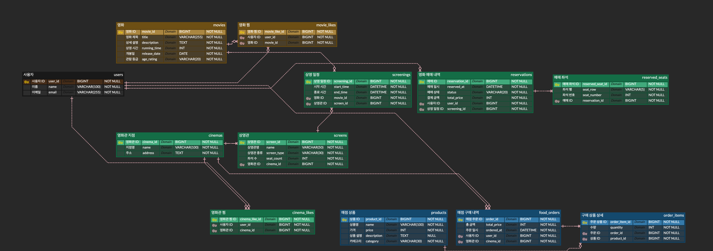

# ERD와 모델링 설계 문서

[README로 돌아가기](../README.md)



## 테이블과 책임

| 도메인 | 테이블 | 역할 |
| --- | --- | --- |
| 사용자 | `users` | 예매·찜·주문 주체. 인증/로그인은 이번 미션 범위에서 제외 |
| 영화관 | `cinemas` | 지점 이름과 주소 |
| 영화관 | `screens` | 지점 소속 상영관, 상영관 종류, 행·행당 좌석 수 |
| 영화 | `movies` | 제목, 설명, 상영 시간, 개봉일, 관람 등급 |
| 영화 | `screenings` | 영화·상영관·시작 시각으로 표현한 상영 일정 |
| 예매 | `reservations` | 사용자와 상영 일정의 예매, 상태, 생성·수정 시간 |
| 예매 | `reserved_seats` | 예약에 포함된 좌석 행·번호 |
| 찜 | `movie_likes`, `cinema_likes` | 사용자와 영화/영화관의 찜 관계 |
| 매점 | `products` | 모든 지점에서 공통으로 사용하는 상품과 가격 |
| 매점 | `inventories` | 지점·상품별 재고 수량 |
| 매점 | `food_orders` | 사용자·지점별 주문과 총액 |
| 매점 | `order_items` | 주문 상품, 수량, 주문 당시 단가 |

## 도메인별 비즈니스 규칙

ERD 이미지에서 확인할 수 있는 컬럼, 타입, PK·FK 설명은 생략하고, 테이블만으로 표현하기 어려운 규칙을 정리합니다.

### 사용자와 영화관

- `users`의 이메일은 중복될 수 없습니다.
- 한 사용자는 여러 영화 예매, 영화 찜, 영화관 찜, 매점 주문을 가질 수 있습니다.
- 한 영화관 지점은 여러 상영관을 가집니다.
- 하나의 `screens`는 반드시 하나의 영화관 지점에 소속됩니다.
- 상영관 종류는 `GENERAL`, `SPECIAL`로 분류합니다.
- 과제 문구에는 같은 종류의 상영관 좌석 배치가 같다는 규칙이 있지만, 현재 코드에서는 이를 별도로 검증하지 않습니다.

### 영화와 상영 일정

- `movies`는 영화 자체의 정보만 관리합니다.
- 영화와 상영관을 직접 연결하지 않고 `screenings`를 통해 연결합니다.
- 하나의 영화는 여러 상영 일정을 가질 수 있습니다.
- 하나의 상영관도 시간대별로 여러 영화를 상영할 수 있습니다.
- `screenings`의 `start_at`이 상영 시작 시각을 나타냅니다.
- 종료 시각은 별도 저장하지 않고 `start_at + 영화의 running_time`으로 계산할 수 있습니다.

### 예매와 좌석

- 하나의 예매는 한 사용자와 한 상영 일정에 속합니다.
- 하나의 예매에는 여러 좌석이 포함될 수 있습니다.
- 좌석은 `reservation_id`를 통해 상영 일정과 연결되므로 `reserved_seats`에 `screening_id`를 중복해서 두지 않습니다.
- 예매 취소 시 예매 행을 삭제하지 않고 상태를 `CANCELED`로 변경합니다.
- 같은 상영 일정의 같은 좌석은 중복 예매할 수 없습니다.
- 동시 예매를 막기 위해 상영 일정과 좌석 중복 조회에 비관적 잠금을 적용합니다.
- 예약·주문 조회 시 로그인 사용자와 데이터 소유자를 확인하는 기능은 인증 구현 이후의 후속 작업입니다.

### 찜

- 영화와 영화관 찜은 다대다 관계이므로 각각 `movie_likes`, `cinema_likes` 연결 테이블로 분리합니다.
- 같은 사용자가 같은 영화를 여러 번 찜할 수 없습니다.
- 같은 사용자가 같은 영화관을 여러 번 찜할 수 없습니다.
- 이를 위해 각각 `(user_id, movie_id)`, `(user_id, cinema_id)` 복합 UNIQUE 제약을 둡니다.

### 매점 상품과 재고

- `products`는 모든 영화관 지점이 공통으로 사용하는 상품 메뉴입니다.
- `inventories`는 같은 상품이라도 영화관 지점별로 따로 관리합니다.
- 하나의 영화관과 하나의 상품 조합에는 하나의 재고 행만 존재합니다.
- 재고 차감은 재고 행을 잠근 뒤 수량을 확인하고 처리합니다.
- 현재 구현은 주문 수량보다 재고가 적을 때만 거절하므로, 주문 후 재고가 0이 되는 것은 허용합니다.
- 과제 문구의 “재고는 항상 1 이상”을 주문 후에도 적용할지는 추가 결정이 필요합니다.

### 매점 주문

- 하나의 주문은 한 사용자와 한 영화관 지점에 속합니다.
- 하나의 주문에는 여러 주문 상품이 포함될 수 있습니다.
- 주문 총액은 클라이언트 값을 신뢰하지 않고 상품 가격과 수량으로 서버에서 계산합니다.
- `order_items.unit_price`는 주문 당시 가격을 보존하기 위한 값입니다.
- 상품 가격이 나중에 변경되어도 과거 주문의 단가와 총액은 유지됩니다.
- 주문 저장과 재고 차감은 하나의 트랜잭션에서 처리합니다.
- 과제 범위에 환불 기능은 포함하지 않습니다.

## 테이블 간 관계

| 관계 | 의미 |
| --- | --- |
| `cinemas` → `screens` | 한 영화관 지점이 여러 상영관을 보유합니다. |
| `movies` → `screenings` | 한 영화가 여러 상영 일정을 가질 수 있습니다. |
| `screens` → `screenings` | 한 상영관에서 시간대별 여러 상영이 발생합니다. |
| `users` → `reservations` | 한 사용자가 여러 예매를 만들 수 있습니다. |
| `screenings` → `reservations` | 하나의 상영 일정에 여러 사용자의 예매가 생길 수 있습니다. |
| `reservations` → `reserved_seats` | 하나의 예매가 여러 좌석을 포함합니다. |
| `users` ↔ `movies` | `movie_likes`가 사용자와 영화의 찜 관계를 연결합니다. |
| `users` ↔ `cinemas` | `cinema_likes`가 사용자와 영화관의 찜 관계를 연결합니다. |
| `cinemas` ↔ `products` | `inventories`가 영화관별 상품 재고를 연결합니다. |
| `users` → `food_orders` | 한 사용자가 여러 매점 주문을 만들 수 있습니다. |
| `cinemas` → `food_orders` | 주문 상품을 수령할 영화관 지점을 기록합니다. |
| `food_orders` → `order_items` | 하나의 주문이 여러 주문 상품을 포함합니다. |
| `products` → `order_items` | 하나의 상품이 여러 주문에 포함될 수 있습니다. |

## 관계 한눈에 보기

```text
Cinema 1 ── N Screen 1 ── N Screening N ── 1 Movie
User   1 ── N Reservation 1 ── N ReservedSeat
User   1 ── N MovieLike N ── 1 Movie
User   1 ── N CinemaLike N ── 1 Cinema
Cinema 1 ── N Inventory N ── 1 Product
User   1 ── N FoodOrder 1 ── N OrderItem N ── 1 Product
```
